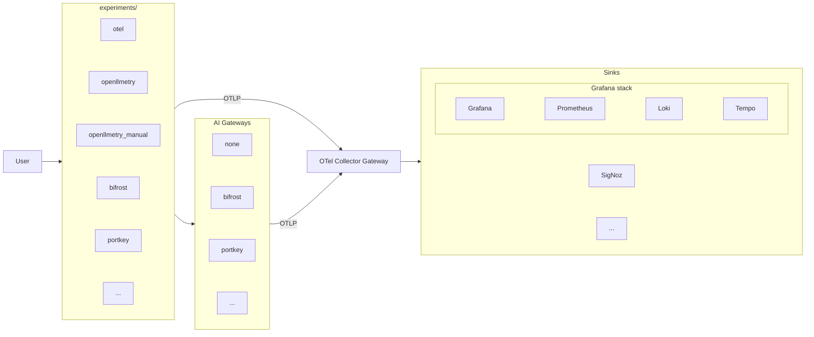

# AI Observability

Benchmarking AI observability using a minimal RAG application. Same app, different instrumentation per experiment — compare what each approach captures.

## Architecture

Each box is an independent silo. You can add a new instrumentation library, a new gateway, or a new sink without touching the others.

## Experiments

Recommended reading order:

| Order | Experiment | What it demonstrates | README |
|-------|------------|---------------------|--------|
| — | `base/` | Uninstrumented RAG app (source of truth) | [README](base/README.md) |
| 1 | `experiments/otel` | Vanilla OTel: manual spans, metrics, logs | [README](experiments/otel/README.md) |
| 2 | `experiments/openllmetry` | OpenLLMetry auto-instruments OpenAI SDK (tokens, model, prompts for free) | [README](experiments/openllmetry/README.md) |
| 3 | `experiments/openllmetry_manual` | OpenLLMetry + manual spans (retrieval quality, per-user attribution) | [README](experiments/openllmetry_manual/README.md) |
| 4 | `experiments/bifrost` | Bifrost AI gateway captures provider/model/token telemetry outside the app | [README](experiments/bifrost/README.md) |

## Infrastructure

Shared infra (pgvector, OTel collector gateway, sinks) lives in [`infra/`](infra/README.md).

Quick links:

| Topic | Link |
|-------|------|
| Central `.env` config | [infra usage](infra/README.md#usage) |
| Grafana/Loki/Tempo/Prometheus stack | [Grafana stack](infra/README.md#grafana-stack) |
| Bifrost AI gateway | [Bifrost gateway](infra/README.md#bifrost-gateway) |
| Generate Bifrost virtual key | [Virtual key instructions](infra/README.md#create-a-bifrost-virtual-key) |
| Bifrost-specific notes | [infra/bifrost README](infra/bifrost/README.md) |

## Personas

| Persona | What they care about |
|---------|---------------------|
| Platform/SRE | Is the service up? Is it slow? |
| FinOps | How much are we spending on LLMs? Per user? Per model? |
| ML/AI Engineer | Is the RAG pipeline working correctly? Are retrievals relevant? |
| Product Manager | How long do users wait for answers? |
| Security/Compliance | What data is being sent to LLMs? |

## Observable surfaces

| Layer | What's observable |
|-------|------------------|
| HTTP/API | Request latency, status codes, route-level metrics |
| RAG/Vector DB | Embedding calls, pgvector query latency, retrieval similarity scores |
| LLM | Token usage, model, prompt/completion content, generation latency |
