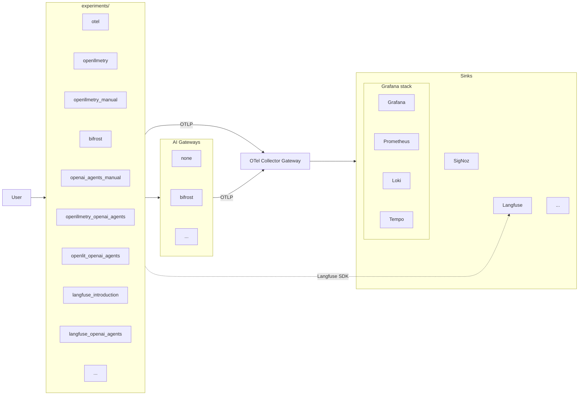

# AI Observability

Exploring AI observability across RAG pipelines and agentic workflows. Each experiment instruments the same application differently - compare what each approach captures, what it misses, and what failure modes it can detect.

## Architecture

```mermaid
graph LR
    User --> experiments

    subgraph experiments["experiments/"]
        direction TB
        otel --- openllmetry --- openllmetry_manual --- bifrost --- openai_agents_manual --- openllmetry_openai_agents --- openlit_openai_agents --- langfuse_introduction --- langfuse_openai_agents --- more_exp[...]
    end

    subgraph gateways["AI Gateways"]
        direction TB
        none_gw[none] --- bifrost_gw[bifrost] --- more_gw[...]
    end

    subgraph sinks["Sinks"]
        direction TB
        subgraph grafana_stack["Grafana stack"]
            grafana[Grafana] --- prometheus[Prometheus] --- loki[Loki] --- tempo[Tempo]
        end
        grafana_stack --- signoz[SigNoz] --- langfuse_sink[Langfuse] --- more_sink[...]
    end

    experiments --> gateways
    experiments -->|OTLP| collector[OTel Collector Gateway]
    gateways -->|OTLP| collector
    collector --> sinks
    experiments -.->|Langfuse SDK| langfuse_sink

    linkStyle 1,2,3,4,5,6,7,8,9,10,11,12,13,14,15,16,17 stroke:none
```

Each box is an independent silo. You can add a new instrumentation library, a new gateway, or a new sink without touching the others.

## Experiments

Recommended reading order:

| Order | Experiment | What it demonstrates | README |
|-------|------------|---------------------|--------|
| — | `base/` | Uninstrumented RAG app (reference) | [README](base/README.md) |
| 1 | `experiments/otel` | Vanilla OTel: manual spans, metrics, logs | [README](experiments/otel/README.md) |
| 2 | `experiments/openllmetry` | OpenLLMetry auto-instruments OpenAI SDK (tokens, model, prompts for free) | [README](experiments/openllmetry/README.md) |
| 3 | `experiments/openllmetry_manual` | OpenLLMetry + manual spans (retrieval quality, per-user attribution) | [README](experiments/openllmetry_manual/README.md) |
| 4 | `experiments/bifrost` | Bifrost AI gateway captures provider/model/token telemetry outside the app | [README](experiments/bifrost/README.md) |
| 5 | `experiments/openai_agents_manual` | Manual tool-loop agent with hand-rolled OTel — full observability baseline | [README](experiments/openai_agents_manual/README.md) |
| 6 | `experiments/openllmetry_openai_agents` | OpenLLMetry traces OpenAI Agents but misses workflow/tool metrics | [README](experiments/openllmetry_openai_agents/README.md) |
| 7 | `experiments/openlit_openai_agents` | OpenLIT emits workflow, tool, model latency, and token metrics for the same agent | [README](experiments/openlit_openai_agents/README.md) |
| 8 | `experiments/langfuse_introduction` | Langfuse feature tour: tracing, sessions, prompts, scores, datasets, one per stage | [README](experiments/langfuse_introduction/README.md) |
| 9 | `experiments/langfuse_openai_agents` | Langfuse alone on the same agent: evaluation instead of metrics, and what that costs | [README](experiments/langfuse_openai_agents/README.md) |

Experiments 6, 7 and 9 run the **same agent** with three different observability
stacks. The three-way comparison is written up in
[experiment 9's README](experiments/langfuse_openai_agents/README.md#the-three-way-comparison).

## Infrastructure

Shared infra (pgvector, OTel collector gateway, sinks) lives in [`infra/`](infra/README.md).

Quick links:

| Topic | Link |
|-------|------|
| Central `.env` config | [infra usage](infra/README.md#usage) |
| Grafana/Loki/Tempo/Prometheus stack | [Grafana stack](infra/README.md#grafana-stack) |
| Langfuse sink (traces only, no metrics) | [Langfuse sink](infra/README.md#langfuse-sink) |
| Langfuse credentials and ports | [sinks/langfuse README](infra/sinks/langfuse/README.md) |
| Bifrost AI gateway | [Bifrost gateway](infra/README.md#bifrost-gateway) |
| Generate Bifrost virtual key | [Virtual key instructions](infra/README.md#create-a-bifrost-virtual-key) |
| Bifrost-specific notes | [infra/bifrost README](infra/bifrost/README.md) |

## Personas

| Persona | What they care about |
|---------|---------------------|
| Platform/SRE | Is the service up? Is it slow? |
| FinOps | How much are we spending on LLMs? Per user? Per model? |
| ML/AI Engineer | Is the RAG pipeline working correctly? Are retrievals relevant? |
| Product Manager | How long do users wait for answers? |
| Security/Compliance | What data is being sent to LLMs? |

## Observable surfaces

| Layer | What's observable |
|-------|------------------|
| HTTP/API | Request latency, status codes, route-level metrics |
| RAG/Vector DB | Embedding calls, pgvector query latency, retrieval similarity scores |
| LLM | Token usage, model, prompt/completion content, generation latency |
| Agent | Workflow duration, tool execution latency, turn count, cost per request |
| Evaluation | Answer quality scores, prompt-version regressions, dataset run diffs (Langfuse only) |
