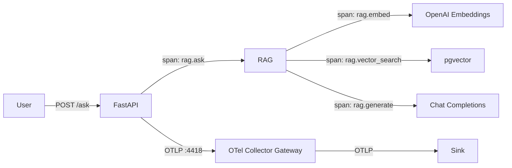

# 01_otel — Vanilla OpenTelemetry

Instruments the RAG app with plain OpenTelemetry — manual spans, metrics, and logs. No LLM-specific auto-instrumentation.

## Flow



## Example trace

A single `POST /ask` produces spans:

```
POST /ask (5.4s)
├── POST /ask http receive
├── rag.ask (5.3s)
│   ├── rag.retrieve
│   │   ├── rag.embed (670ms)
│   │   └── rag.vector_search (<1ms)
│   └── rag.generate (4.5s)
├── POST /ask http send
└── POST /ask http send
```

| # | Span | Parent | Duration | Source | Question answered | Sample attributes |
|---|------|--------|----------|--------|-------------------|-------------------|
| 1 | `POST /ask` | — | 5.4s | FastAPI auto | How long did the user wait? | `http.method=POST`, `http.target=/ask`, `http.status_code=200` |
| 2 | `rag.ask` | `POST /ask` | 5.3s | Manual | How long did the full pipeline take? | — |
| 3 | `rag.retrieve` | `rag.ask` | 680ms | Manual | How long did retrieval take? | `retrieve.top_k=5` |
| 4 | `rag.embed` | `rag.retrieve` | 670ms | Manual | How long did embedding take? | `embed.model=openai/text-embedding-3-small`, `embed.num_texts=1` |
| 5 | `rag.vector_search` | `rag.retrieve` | <1ms | Manual | Is the database the bottleneck? | — |
| 6 | `rag.generate` | `rag.ask` | 4.5s | Manual | How long did LLM generation take? | `generate.model=claude-sonnet-4`, `generate.num_context_chunks=5` |

**What you can see:** Full pipeline structure, where time is spent (embed vs DB vs LLM).

**What you can't see:** Token counts, model metadata, prompt/completion content — vanilla OTel doesn't know about LLM APIs.

## Metrics exposed

| # | Metric | Source | What it tells you | Why it's useful |
|---|--------|--------|-------------------|-----------------|
| 1 | `http.server.duration` | FastAPI auto | End-to-end request latency | User-facing performance |
| 2 | `http.server.request.size` | FastAPI auto | Request payload size | Detect large prompts |
| 3 | `http.server.response.size` | FastAPI auto | Response payload size | Monitor output sizes |
| 4 | `http.server.active_requests` | FastAPI auto | Concurrent requests | Capacity planning |

**No LLM-specific metrics.** Token usage, model info, and cost are not captured — vanilla OTel has no concept of `gen_ai.*` semantics.

## Failure modes

| # | Failure mode | Value of detecting | How to detect | Detected by | Type |
|---|---|---|---|---|---|
| 1 | App is slow | Identify bottleneck step | Check which span is longest | `rag.embed` / `rag.generate` span durations | Trace |
| 2 | Database down | Avoid silent retrieval failures | `rag.vector_search` span errors | Trace error status | Trace |
| 3 | Embedding API down | Detect upstream failures | `rag.embed` span errors | Trace error status | Trace |
| 4 | High request latency | SLA monitoring | Alert on `http.server.duration` p95 | `http.server.duration` metric | Metric |
| | **Not detectable** | | | | |
| 5 | Token budget blown | — | No token metrics | — | — |
| 6 | LLM provider slow vs app slow | — | Can't isolate LLM time from app time (no `openai.chat` span) | — | — |
| 7 | Bad retrieval quality | — | No similarity scores | — | — |
| 8 | Per-user abuse | — | No `user.id` | — | — |
| 9 | Cost runaway | — | No token/cost metrics | — | — |

## Usage

```bash
# 1. Start shared infra
cd ../../infra && make up

# 2. Configure
cp .env.example .env
# Edit .env with your keys

# 3. Run
make up

# 4. Test (from another terminal)
make ingest
make ask

# 5. View traces in your configured sink
```

## Appendix: Metric Dimensions

### `http.server.duration` / `http.server.request.size` / `http.server.response.size`

| Dimension | Example | Purpose |
|-----------|---------|---------|
| `http.method` | `POST` | Slice by HTTP method |
| `http.target` | `/ask` | Slice by endpoint path |
| `http.status_code` | `200`, `500` | Error rate = filter by 5xx |
| `http.flavor` | `1.1` | HTTP version |
| `net.host.port` | `8001` | Port |

### `http.server.active_requests`

| Dimension | Example | Purpose |
|-----------|---------|---------|
| `http.method` | `POST` | Slice by method |
| `http.scheme` | `http` | Protocol |
