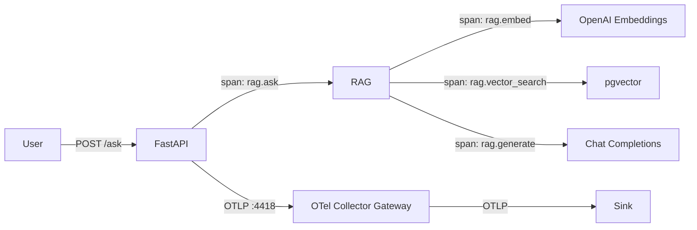

# 01_otel — Vanilla OpenTelemetry

Instruments the RAG app with plain OpenTelemetry (no LLM-specific tooling).

## Flow



## What this captures

| What | How | Visible in sink? |
|------|-----|-------------------|
| HTTP request spans | FastAPI auto-instrumentation | Yes |
| `rag.embed` span | Manual span with model + num_texts | Yes |
| `rag.vector_search` span | Manual span | Yes |
| `rag.generate` span | Manual span with model + num_chunks | Yes |
| `rag.ingest` / `rag.ask` spans | Manual parent spans | Yes |
| LLM token usage | Not captured (vanilla OTel doesn't know about LLM APIs) | No |
| Embedding token usage | Not captured | No |

## What this does NOT capture (gaps)

- Token counts (input/output/total)
- Model response metadata
- Prompt/completion content
- Cost estimation

These gaps are what `02_openllmetry` fills.

## Usage

```bash
# 1. Start shared infra
cd ../../infra && make up

# 2. Configure
cp .env.example .env
# Edit .env with your keys

# 3. Run
make up

# 4. Test (from another terminal)
make ingest
make ask

# 5. View traces in your configured sink (e.g. http://localhost:3301 for SigNoz)
```
