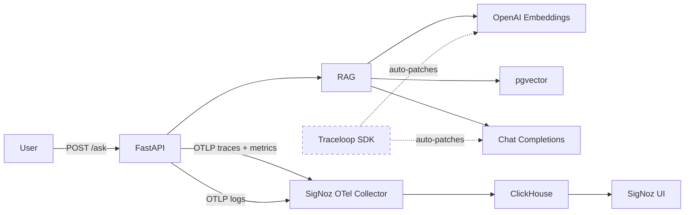

# 02_openllmetry — Traceloop / OpenLLMetry

Instruments the RAG app with OpenLLMetry (Traceloop SDK) which auto-instruments OpenAI SDK calls.

## Flow



## What this captures vs 01_otel

| What | 01_otel | 02_openllmetry |
|------|---------|----------------|
| HTTP request spans | ✅ (FastAPI auto) | ✅ (FastAPI auto) |
| Custom RAG pipeline spans | ✅ (manual) | ❌ (not added — see note) |
| LLM call spans (model, tokens, latency) | ❌ | ✅ (auto) |
| Embedding call spans (model, tokens) | ❌ | ✅ (auto) |
| Prompt/completion content | ❌ | ✅ (auto, can be disabled) |
| Logs | ✅ | ✅ |
| Metrics (HTTP) | ✅ | ✅ |

**Key difference:** OpenLLMetry auto-instruments every `openai.chat.completions.create()` and `openai.embeddings.create()` call. You get LLM-specific span attributes (model, token counts, prompt content) without writing any manual spans.

**Note:** This experiment uses the base `rag.py` without manual spans — to show what you get purely from Traceloop's auto-instrumentation. The RAG pipeline steps (embed, retrieve, generate) are visible as OpenAI SDK calls, not as named application spans.

## Usage

```bash
# 1. Start shared infra (from repo root)
make -C ../../infra up

# 2. Configure
cp .env.example .env
# Edit .env with your keys

# 3. Run
make app

# 4. Test
make ingest
make ask

# 5. View traces
# Open http://localhost:3301 (SigNoz UI)
# Look for gen_ai.* attributes on spans
```
