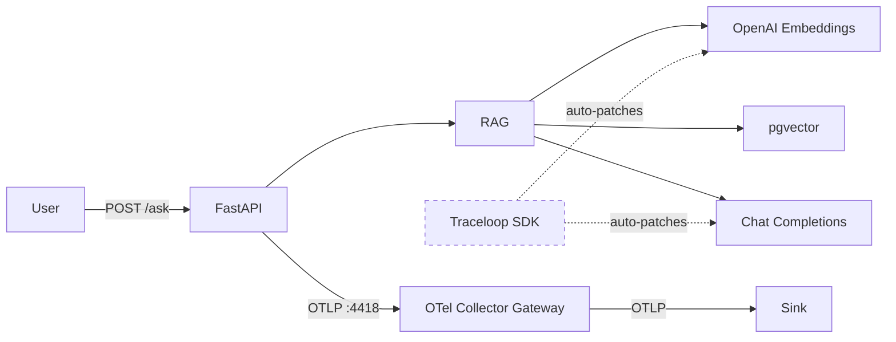

# 02_openllmetry — Traceloop / OpenLLMetry

Instruments the RAG app with OpenLLMetry (Traceloop SDK) which auto-instruments OpenAI SDK calls.

## Flow



## What this captures vs 01_otel

| What | 01_otel | 02_openllmetry |
|------|---------|----------------|
| HTTP request spans | ✅ (FastAPI auto) | ✅ (FastAPI auto) |
| Custom RAG pipeline spans | ✅ (manual) | ❌ (not added — see note) |
| LLM call spans (model, tokens, latency) | ❌ | ✅ (auto) |
| Embedding call spans (model, tokens) | ❌ | ✅ (auto) |
| Prompt/completion content | ❌ | ✅ (auto, can be disabled) |
| Logs | ✅ | ✅ |
| Metrics (HTTP) | ✅ | ✅ |

## Example trace

A single `POST /ask` produces 7 spans:

```
POST /ask (5.62s)
├── POST /ask http receive
├── openai.embeddings (590ms)
├── openai.chat (2.31s)
├── openai.chat (2.62s)
├── POST /ask http send
└── POST /ask http send
```

**Span breakdown:**

| Span | Parent | Duration | Source | Question answered | Sample attributes |
|------|--------|----------|--------|-------------------|-------------------|
| `POST /ask` | — | 5.62s | FastAPI auto | How long did the user wait? | `http.method=POST`, `http.target=/ask`, `http.status_code=200` |
| `POST /ask http receive` | `POST /ask` | — | FastAPI auto | How long to receive the request body? | `asgi.event.type=http.request` |
| `openai.embeddings` | `POST /ask` | 590ms | OpenLLMetry auto | How long did embedding take? Which model? How many tokens? | `gen_ai.operation.name=embeddings`, `gen_ai.request.model=text-embedding-3-small`, `gen_ai.usage.input_tokens=8`, `gen_ai.provider.name=openrouter` |
| `openai.chat` | `POST /ask` | 2.31s | OpenLLMetry auto | How long did LLM generation take? How many tokens consumed? | `gen_ai.operation.name=chat`, `gen_ai.response.model=claude-sonnet-4`, `gen_ai.usage.input_tokens=1250`, `gen_ai.usage.total_tokens=1490` |
| `openai.chat` | `POST /ask` | 2.62s | OpenLLMetry auto | Was there a retry or second model call? | Same as above |
| `POST /ask http send` (×2) | `POST /ask` | — | FastAPI auto | How long to send the response? | `asgi.event.type=http.response.body` |

**What you can see:** LLM call duration, which model was used, token counts — all without any manual code.

**What you can't see:** The pgvector retrieval step is invisible. There's no span between `openai.embeddings` and `openai.chat` showing what happened in the database.

## Span attributes (auto-captured)

On every `openai.embeddings` and `openai.chat` span, these attributes are set automatically:

| Attribute | Example value | What it tells you |
|-----------|--------------|-------------------|
| `gen_ai.operation.name` | `embeddings`, `chat` | Which type of LLM operation |
| `gen_ai.provider.name` | `openrouter` | Which provider handled the request |
| `gen_ai.request.model` | `text-embedding-3-small` | Model requested |
| `gen_ai.response.model` | `text-embedding-3-small` | Model actually used (may differ from request) |
| `gen_ai.response.id` | `gen-emb-1780475301-...` | Unique response ID for debugging with provider |
| `gen_ai.usage.input_tokens` | `8` | Tokens in the prompt/input |
| `gen_ai.usage.total_tokens` | `8` | Total tokens consumed (input + output) |
| `gen_ai.usage.cache_read.input_tokens` | `0` | Tokens served from cache (cost savings) |
| `gen_ai.input.messages` | `[{"role": "user", ...}]` | Full prompt content (disable for privacy) |
| `gen_ai.is_streaming` | `false` | Whether response was streamed |
| `gen_ai.openai.api_base` | `https://openrouter.ai/api/v1/` | Base URL of the API called |

**Why these matter:**
- `gen_ai.usage.*` → exact cost calculation per request
- `gen_ai.provider.name` + `gen_ai.response.model` → track model routing behavior
- `gen_ai.response.id` → correlate with provider logs for debugging
- `gen_ai.input.messages` → audit what's being sent to LLMs (security/compliance)
- `gen_ai.usage.cache_read.input_tokens` → measure cache hit rate, optimize costs

## Metrics exposed

| Metric | Source | What it tells you | Why it's useful |
|--------|--------|-------------------|-----------------|
| `gen_ai.client.token.usage` | OpenLLMetry auto | Tokens consumed per LLM call (input + output) | Cost tracking, budget alerts, anomaly detection |
| `gen_ai.client.operation.duration` | OpenLLMetry auto | LLM call latency | Detect provider slowdowns, SLA monitoring |
| `gen_ai.client.generation.choices` | OpenLLMetry auto | Number of completions returned | Proxy for LLM call count |
| `llm.openai.embeddings.vector_size` | OpenLLMetry auto | Embedding dimensions per call | Verify correct model is being used |
| `http.server.duration` | FastAPI auto | End-to-end request latency | User-facing performance |
| `http.server.request.size` | FastAPI auto | Request payload size | Detect unusually large prompts |
| `http.server.response.size` | FastAPI auto | Response payload size | Monitor output sizes |
| `http.server.active_requests` | FastAPI auto | Concurrent requests | Capacity planning |

**Value of this setup:** With zero manual instrumentation code, you get full LLM cost visibility (tokens per model), latency monitoring, and HTTP-level metrics. Enough to answer "how much are we spending?" and "is the LLM slow?" without touching application code.

## Failure modes

| # | Failure mode | Value of detecting | How to detect | Detected by | Type |
|---|---|---|---|---|---|
| 1 | LLM provider down/slow | Avoid user-facing timeouts, trigger failover | Alert when avg duration exceeds threshold | `gen_ai.client.operation.duration` metric | Metric |
| 2 | Embedding API failure | Prevent silent search degradation | Filter traces by `status=error`, span name `openai.embeddings` | `openai.embeddings` span with error status | Trace |
| 3 | Token budget blown | Control costs before bill shock | Alert when sum rate exceeds budget per hour | `gen_ai.client.token.usage` metric | Metric |
| 4 | Prompt injection / abuse | Detect misuse, protect system prompts | Unusual token spike → inspect prompt content on trace | `gen_ai.client.token.usage` spike + `gen_ai.input.messages` attribute | Metric + Trace |
| 5 | Cost runaway | Catch runaway loops or inefficient prompts | Token rate growing faster than request rate | `gen_ai.client.token.usage` rate vs `http.server.duration.count` rate | Metric |
| | **Not detectable (needs manual instrumentation)** | | | | |
| 6 | Database connection failure | Avoid silent failures in retrieval | — | No span around DB call | — |
| 7 | Bad retrieval (irrelevant docs) | Prevent poor answers reaching users | — | No similarity scores captured | — |
| 8 | Per-user abuse / cost anomaly | Identify who is abusing the system | — | No `user.id` on spans/metrics | — |
| | **Not detectable (needs eval layer)** | | | | |
| 9 | Model degradation | Catch quality regressions | — | Needs eval layer | — |
| 10 | Hallucination | Prevent incorrect answers | — | Needs eval layer | — |

## Usage

```bash
# 1. Start shared infra
cd ../../infra && make up

# 2. Configure
cp .env.example .env
# Edit .env with your keys

# 3. Run
make up

# 4. Test (from another terminal)
make ingest
make ask

# 5. View traces in your configured sink
# Look for gen_ai.* attributes on spans
```

## Appendix: Metric Dimensions

### `gen_ai.client.token.usage`

| Dimension | Example | Purpose |
|-----------|---------|---------|
| `gen_ai.operation.name` | `embeddings`, `chat` | Slice by operation type |
| `gen_ai.provider.name` | `openrouter`, `openai` | Slice by provider |
| `gen_ai.response.model` | `text-embedding-3-small`, `claude-sonnet-4` | Slice by model |
| `gen_ai.token.type` | `input`, `output` | Separate input vs output tokens |
| `server.address` | `https://openrouter.ai/api/v1/` | Which endpoint was called |
| `stream` | `false` | Streaming vs non-streaming |
| `service.name` | `ai-obs-02-openllmetry` | Which service emitted it |

### `gen_ai.client.operation.duration`

Same dimensions as `gen_ai.client.token.usage` minus `gen_ai.token.type`.

### `gen_ai.client.generation.choices`

| Dimension | Example | Purpose |
|-----------|---------|---------|
| `gen_ai.operation.name` | `chat` | Operation type |
| `gen_ai.provider.name` | `openai` | Provider |
| `gen_ai.response.model` | `claude-sonnet-4` | Model used |
| `gen_ai.response.finish_reason` | `stop` | Why generation ended (stop, length, tool_calls) |
| `server.address` | `http://host.docker.internal:8000/v1/` | Endpoint |
| `stream` | `false` | Streaming mode |

### `llm.openai.embeddings.vector_size`

| Dimension | Example | Purpose |
|-----------|---------|---------|
| `gen_ai.operation.name` | `embeddings` | Always embeddings |
| `gen_ai.provider.name` | `openrouter` | Provider |
| `gen_ai.response.model` | `text-embedding-3-small` | Model |
| `server.address` | `https://openrouter.ai/api/v1/` | Endpoint |

### `http.server.duration` / `http.server.request.size` / `http.server.response.size`

| Dimension | Example | Purpose |
|-----------|---------|---------|
| `http.method` | `POST` | Slice by HTTP method |
| `http.target` | `/ask` | Slice by endpoint path |
| `http.status_code` | `200`, `500` | Error rate = filter by 5xx |
| `http.flavor` | `1.1` | HTTP version |
| `http.scheme` | `http` | Protocol |
| `net.host.port` | `8001` | Port |

### `http.server.active_requests`

| Dimension | Example | Purpose |
|-----------|---------|---------|
| `http.method` | `POST` | Slice by method |
| `http.scheme` | `http` | Protocol |
| `http.host` | `192.168.172.2:8001` | Host |
