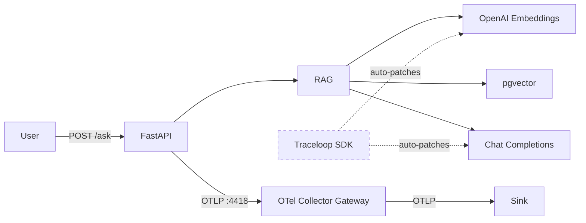
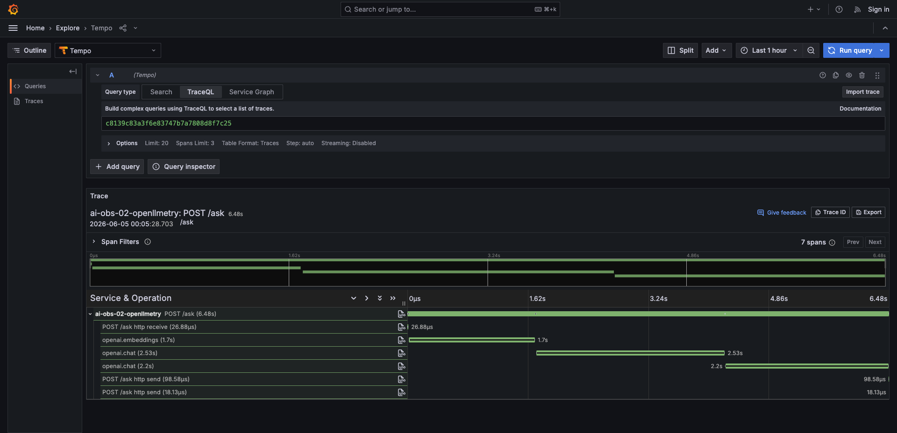
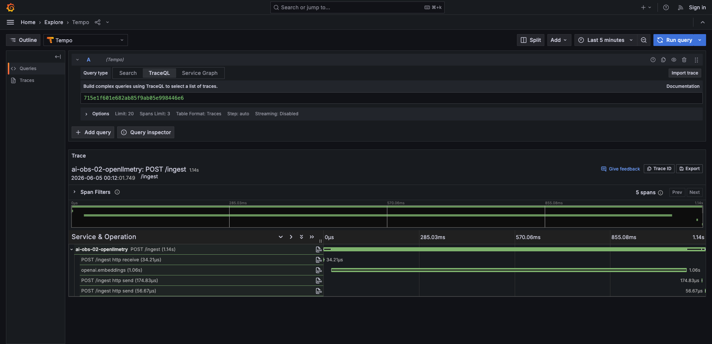
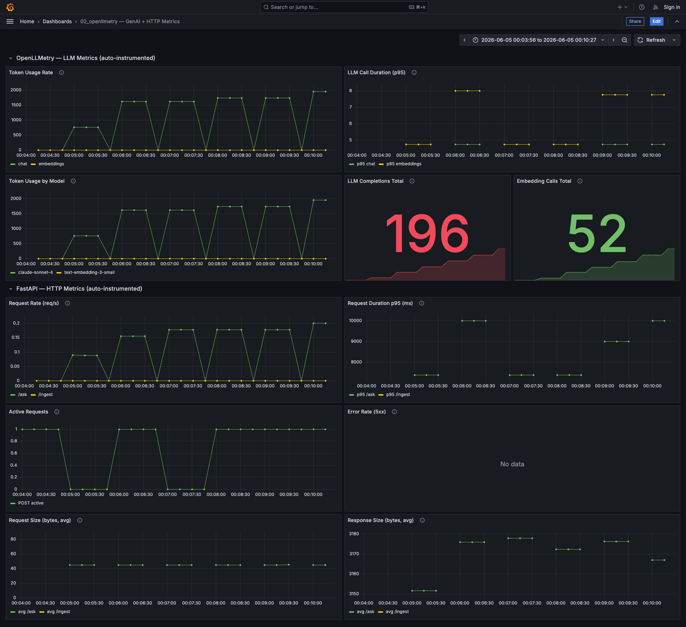

# 02_openllmetry — Traceloop / OpenLLMetry

Instruments the RAG app with OpenLLMetry (Traceloop SDK) which auto-instruments OpenAI SDK calls.

## Flow



## What this captures vs 01_otel

| What | 01_otel | 02_openllmetry |
|------|---------|----------------|
| HTTP request spans | ✅ (FastAPI auto) | ✅ (FastAPI auto) |
| Custom RAG pipeline spans | ✅ (manual) | ❌ (not added — see note) |
| LLM call spans (model, tokens, latency) | ❌ | ✅ (auto) |
| Embedding call spans (model, tokens) | ❌ | ✅ (auto) |
| Prompt/completion content | ❌ | ✅ (auto, can be disabled) |
| Logs | ✅ | ✅ |
| Metrics (HTTP) | ✅ | ✅ |

## Example traces

### POST /ask (6.48s, 7 spans)



```
POST /ask (6.48s)
├── POST /ask http receive (27µs)
├── openai.embeddings (1.7s)
├── openai.chat (2.53s)
├── openai.chat (2.2s)
├── POST /ask http send (99µs)
└── POST /ask http send (18µs)
```

| # | Span | Parent | Duration | Source | What it tells you | Sample attributes |
|---|------|--------|----------|--------|-------------------|-------------------|
| 1 | `POST /ask` | — | 6.48s | FastAPI auto | How long did the user wait? | `http.method=POST`, `http.target=/ask`, `http.status_code=200` |
| 2 | `POST /ask http receive` | `POST /ask` | 27µs | FastAPI auto | How long to receive the request? | — |
| 3 | `openai.embeddings` | `POST /ask` | 1.7s | OpenLLMetry auto | How long did embedding take? How many tokens? | `gen_ai.operation.name=embeddings`, `gen_ai.request.model=text-embedding-3-small`, `gen_ai.usage.input_tokens=8`, `gen_ai.provider.name=openrouter` |
| 4 | `openai.chat` | `POST /ask` | 2.53s | OpenLLMetry auto | How long did LLM generation take? How many tokens? | `gen_ai.operation.name=chat`, `gen_ai.response.model=claude-sonnet-4`, `gen_ai.usage.input_tokens=1250`, `gen_ai.usage.total_tokens=1490` |
| 5 | `openai.chat` | `POST /ask` | 2.2s | OpenLLMetry auto | Second chat call (gateway retry or streaming chunk) | Same as above |
| 6 | `POST /ask http send` (×2) | `POST /ask` | ~99µs | FastAPI auto | How long to send the response? | — |

### POST /ingest (1.14s, 5 spans)



```
POST /ingest (1.14s)
├── POST /ingest http receive (34µs)
├── openai.embeddings (1.06s)
├── POST /ingest http send (175µs)
└── POST /ingest http send (57µs)
```

| # | Span | Parent | Duration | Source | What it tells you | Sample attributes |
|---|------|--------|----------|--------|-------------------|-------------------|
| 1 | `POST /ingest` | — | 1.14s | FastAPI auto | How long did ingestion take? | `http.method=POST`, `http.target=/ingest`, `http.status_code=200` |
| 2 | `POST /ingest http receive` | `POST /ingest` | 34µs | FastAPI auto | How long to receive the upload? | — |
| 3 | `openai.embeddings` | `POST /ingest` | 1.06s | OpenLLMetry auto | How long to embed all chunks? How many tokens? | `gen_ai.operation.name=embeddings`, `gen_ai.request.model=text-embedding-3-small`, `gen_ai.usage.input_tokens=350` |
| 4 | `POST /ingest http send` (×2) | `POST /ingest` | ~175µs | FastAPI auto | How long to send the response? | — |

**What you can see:** LLM and embedding call durations, model used, token counts — all auto-captured without any manual code.

**What you can't see:** The pgvector retrieval/store step is invisible. There's no span showing the DB query or chunk storage.

## Span attributes (auto-captured)

On every `openai.embeddings` and `openai.chat` span, these attributes are set automatically:

| Attribute | Example value | What it tells you |
|-----------|--------------|-------------------|
| `gen_ai.operation.name` | `embeddings`, `chat` | Which type of LLM operation |
| `gen_ai.provider.name` | `openrouter` | Which provider handled the request |
| `gen_ai.request.model` | `text-embedding-3-small` | Model requested |
| `gen_ai.response.model` | `text-embedding-3-small` | Model actually used (may differ from request) |
| `gen_ai.response.id` | `gen-emb-1780475301-...` | Unique response ID for debugging with provider |
| `gen_ai.usage.input_tokens` | `8` | Tokens in the prompt/input |
| `gen_ai.usage.total_tokens` | `8` | Total tokens consumed (input + output) |
| `gen_ai.usage.cache_read.input_tokens` | `0` | Tokens served from cache (cost savings) |
| `gen_ai.input.messages` | `[{"role": "user", ...}]` | Full prompt content (disable for privacy) |
| `gen_ai.is_streaming` | `false` | Whether response was streamed |
| `gen_ai.openai.api_base` | `https://openrouter.ai/api/v1/` | Base URL of the API called |

**Why these matter:**
- `gen_ai.usage.*` → exact cost calculation per request
- `gen_ai.provider.name` + `gen_ai.response.model` → track model routing behavior
- `gen_ai.response.id` → correlate with provider logs for debugging
- `gen_ai.input.messages` → audit what's being sent to LLMs (security/compliance)
- `gen_ai.usage.cache_read.input_tokens` → measure cache hit rate, optimize costs

## Metrics dashboard



### OpenLLMetry — LLM Metrics (auto-instrumented)

| Panel | Metric | PromQL | What it tells you |
|-------|--------|--------|-------------------|
| Token Usage Rate | `gen_ai_client_token_usage_sum` | `sum(rate(gen_ai_client_token_usage_sum[1m])) by (gen_ai_operation_name)` | Tokens consumed per second, split by chat vs embeddings. Directly correlates to cost. |
| LLM Call Duration (p95) | `gen_ai_client_operation_duration_seconds_bucket` | `histogram_quantile(0.95, sum(rate(..._bucket[1m])) by (le, gen_ai_operation_name))` | 95th percentile LLM call latency. Spikes indicate provider slowdowns. |
| Token Usage by Model | `gen_ai_client_token_usage_sum` | `sum(rate(gen_ai_client_token_usage_sum[1m])) by (gen_ai_response_model)` | Which model is consuming the most tokens (cost attribution by model). |
| LLM Completions Total | `gen_ai_client_generation_choices_choice_total` | `sum(gen_ai_client_generation_choices_choice_total)` | Cumulative LLM completions generated. One per /ask request. |
| Embedding Calls Total | `llm_openai_embeddings_vector_size_element_total` | `sum(...) / 1536` | Total embedding API calls made. |

### FastAPI — HTTP Metrics (auto-instrumented)

| Panel | Metric | PromQL | What it tells you |
|-------|--------|--------|-------------------|
| Request Rate (req/s) | `http_server_duration_milliseconds_count` | `sum(rate(..._count[1m])) by (http_target)` | Requests per second by endpoint. Shows traffic volume. |
| Request Duration p95 (ms) | `http_server_duration_milliseconds_bucket` | `histogram_quantile(0.95, sum(rate(..._bucket[1m])) by (le, http_target))` | Worst-case latency per endpoint. What the user experiences. |
| Active Requests | `http_server_active_requests` | `http_server_active_requests` | Concurrent in-flight requests. High = saturated or waiting on LLM. |
| Error Rate (5xx) | `http_server_duration_milliseconds_count` | `sum(rate(..._count{http_status_code=~"5.."}[1m])) by (http_target)` | Rate of server errors. Non-zero = failures reaching users. |
| Request Size (bytes, avg) | `http_server_request_size_bytes_sum/count` | `sum(rate(..._sum[1m])) / sum(rate(..._count[1m]))` | Average request payload. Large values may indicate abuse. |
| Response Size (bytes, avg) | `http_server_response_size_bytes_sum/count` | `sum(rate(..._sum[1m])) / sum(rate(..._count[1m]))` | Average response payload. Large /ask responses = verbose LLM output. |

**Value of this setup:** With zero manual instrumentation code, you get full LLM cost visibility (tokens per model), latency monitoring, and HTTP-level metrics. Enough to answer "how much are we spending?" and "is the LLM slow?" without touching application code.

## Failure modes

| # | Failure mode | Why? | How? | Where? | What? |
|---|---|---|---|---|---|
| 1 | LLM provider down/slow | Avoid user-facing timeouts, trigger failover | Alert when p95 duration exceeds threshold | OpenLLMetry → LLM Call Duration (p95) | `gen_ai.client.operation.duration` metric |
| 2 | Embedding API failure | Prevent silent search degradation | Filter traces by `status=error`, span name `openai.embeddings` | Trace explorer | `openai.embeddings` span with error status |
| 3 | Token budget blown | Control costs before bill shock | Alert when token rate exceeds budget | OpenLLMetry → Token Usage Rate | `gen_ai.client.token.usage` metric |
| 4 | Prompt injection / abuse | Detect misuse, protect system prompts | Token spike → inspect prompt content on trace | OpenLLMetry → Token Usage Rate + Trace explorer | `gen_ai.client.token.usage` + `gen_ai.input.messages` |
| 5 | Cost runaway | Catch runaway loops or inefficient prompts | Token rate growing faster than request rate | OpenLLMetry → Token Usage Rate vs FastAPI → Request Rate | `gen_ai.client.token.usage` vs `http.server.duration.count` |
| 6 | App is slow | Identify if latency is app-side or LLM-side | Compare request p95 with LLM duration p95 | FastAPI → Request Duration p95 vs OpenLLMetry → LLM Call Duration (p95) | `http.server.duration` vs `gen_ai.client.operation.duration` |
| 7 | App errors (5xx) | Detect crashes, unhandled exceptions | Alert when 5xx rate > 0 | FastAPI → Error Rate (5xx) | `http.server.duration{http_status_code=~"5.."}` |
| 8 | App saturation | Prevent request queuing, scale up | Alert when active requests stays high | FastAPI → Active Requests | `http.server.active_requests` |
| 9 | Large request payloads | Detect abuse or prompt stuffing | Alert when avg request size spikes | FastAPI → Request Size (bytes, avg) | `http.server.request.size` |
| | **Not detectable (needs manual instrumentation)** | | | | |
| 10 | Database connection failure | Avoid silent failures in retrieval | — | — | No span around DB call |
| 11 | Bad retrieval (irrelevant docs) | Prevent poor answers reaching users | — | — | No similarity scores captured |
| 12 | Per-user abuse / cost anomaly | Identify who is abusing the system | — | — | No `user.id` on spans/metrics |
| | **Not detectable (needs eval layer)** | | | | |
| 13 | Model degradation | Catch quality regressions | — | — | Needs eval layer |
| 14 | Hallucination | Prevent incorrect answers | — | — | Needs eval layer |

## Usage

```bash
# 1. Start shared infra
cd ../../infra && make up

# 2. Configure
cp .env.example .env
# Edit .env with your keys

# 3. Run
make up

# 4. Test (from another terminal)
make ingest
make ask

# 5. View traces in your configured sink
# Look for gen_ai.* attributes on spans
```

## Appendix: Metric Dimensions

### `gen_ai.client.token.usage`

| Dimension | Example | Purpose |
|-----------|---------|---------|
| `gen_ai.operation.name` | `embeddings`, `chat` | Slice by operation type |
| `gen_ai.provider.name` | `openrouter`, `openai` | Slice by provider |
| `gen_ai.response.model` | `text-embedding-3-small`, `claude-sonnet-4` | Slice by model |
| `gen_ai.token.type` | `input`, `output` | Separate input vs output tokens |
| `server.address` | `https://openrouter.ai/api/v1/` | Which endpoint was called |
| `stream` | `false` | Streaming vs non-streaming |
| `service.name` | `ai-obs-02-openllmetry` | Which service emitted it |

### `gen_ai.client.operation.duration`

Same dimensions as `gen_ai.client.token.usage` minus `gen_ai.token.type`.

### `gen_ai.client.generation.choices`

| Dimension | Example | Purpose |
|-----------|---------|---------|
| `gen_ai.operation.name` | `chat` | Operation type |
| `gen_ai.provider.name` | `openai` | Provider |
| `gen_ai.response.model` | `claude-sonnet-4` | Model used |
| `gen_ai.response.finish_reason` | `stop` | Why generation ended (stop, length, tool_calls) |
| `server.address` | `http://host.docker.internal:8000/v1/` | Endpoint |
| `stream` | `false` | Streaming mode |

### `llm.openai.embeddings.vector_size`

| Dimension | Example | Purpose |
|-----------|---------|---------|
| `gen_ai.operation.name` | `embeddings` | Always embeddings |
| `gen_ai.provider.name` | `openrouter` | Provider |
| `gen_ai.response.model` | `text-embedding-3-small` | Model |
| `server.address` | `https://openrouter.ai/api/v1/` | Endpoint |

### `http.server.duration` / `http.server.request.size` / `http.server.response.size`

| Dimension | Example | Purpose |
|-----------|---------|---------|
| `http.method` | `POST` | Slice by HTTP method |
| `http.target` | `/ask` | Slice by endpoint path |
| `http.status_code` | `200`, `500` | Error rate = filter by 5xx |
| `http.flavor` | `1.1` | HTTP version |
| `http.scheme` | `http` | Protocol |
| `net.host.port` | `8001` | Port |

### `http.server.active_requests`

| Dimension | Example | Purpose |
|-----------|---------|---------|
| `http.method` | `POST` | Slice by method |
| `http.scheme` | `http` | Protocol |
| `http.host` | `192.168.172.2:8001` | Host |
