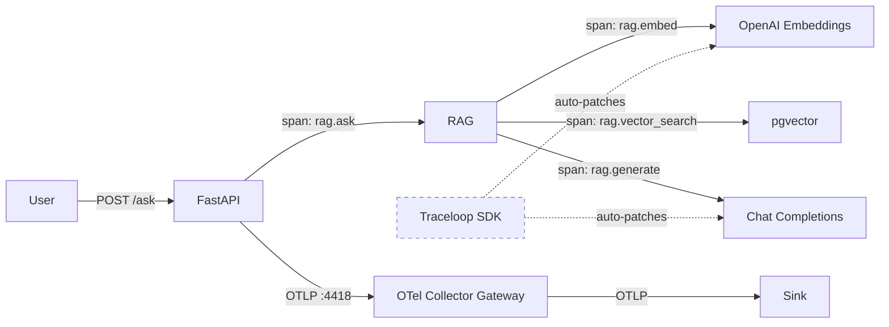

# 03_openllmetry_manual — OpenLLMetry + Manual Spans

Builds on `02_openllmetry` by adding manual spans to close the instrumentable gaps.

## Flow



## What this adds over 02_openllmetry

| What | 02_openllmetry | 03_openllmetry_manual |
|------|----------------|----------------------|
| LLM call spans (tokens, model) | ✅ auto | ✅ auto |
| Embedding call spans | ✅ auto | ✅ auto |
| RAG pipeline spans (ask, ingest, retrieve, generate) | ❌ | ✅ manual |
| Vector search span (pgvector query) | ❌ | ✅ manual |
| Retrieval similarity scores (min/max/avg) | ❌ | ✅ span attributes |
| Per-user attribution | ❌ | ✅ user.id on rag.ask span |
| Logs | ✅ | ✅ |
| Metrics (HTTP + gen_ai) | ✅ | ✅ |

## Example trace (SigNoz)

A single `POST /ask` produces 11 spans:

```
POST /ask (5.06s)
├── POST /ask http receive
├── rag.ask (5.00s)
│   ├── rag.retrieve (680ms)
│   │   ├── rag.embed (669ms)
│   │   │   └── openai.embeddings (661ms)
│   │   └── rag.vector_search
│   └── rag.generate (4.30s)
│       └── openai.chat (4.30s)
├── POST /ask http send
└── POST /ask http send
```

**Span breakdown:**

| Span | Parent | Duration | Source | Question answered | Sample attributes |
|------|--------|----------|--------|-------------------|-------------------|
| `POST /ask` | — | 5.06s | FastAPI auto | How long did the user wait? | `http.method=POST`, `http.target=/ask`, `http.status_code=200` |
| `POST /ask http receive` | `POST /ask` | — | FastAPI auto | How long to receive the request body? | `asgi.event.type=http.request` |
| `rag.ask` | `POST /ask` | 5.00s | Manual | Who asked? What did they ask? | `user.id=saurabh`, `ask.query=What does the kube-scheduler do?` |
| `rag.retrieve` | `rag.ask` | 680ms | Manual | How relevant were the retrieved chunks? | `retrieve.top_k=5`, `retrieve.num_results=5`, `retrieve.similarity_avg=0.485`, `retrieve.similarity_min=0.308`, `retrieve.similarity_max=0.574` |
| `rag.embed` | `rag.retrieve` | 669ms | Manual | How long did query embedding take? | `embed.model=openai/text-embedding-3-small`, `embed.num_texts=1` |
| `openai.embeddings` | `rag.embed` | 661ms | OpenLLMetry auto | How many tokens did embedding consume? | `gen_ai.usage.input_tokens=8`, `gen_ai.request.model=text-embedding-3-small`, `gen_ai.provider.name=openrouter` |
| `rag.vector_search` | `rag.retrieve` | <1ms | Manual | Is the database the bottleneck? | — |
| `rag.generate` | `rag.ask` | 4.30s | Manual | How many context chunks were sent to the LLM? | `generate.model=claude-sonnet-4`, `generate.num_context_chunks=5` |
| `openai.chat` | `rag.generate` | 4.30s | OpenLLMetry auto | How many tokens consumed? Which model responded? | `gen_ai.usage.input_tokens=1250`, `gen_ai.usage.total_tokens=1490`, `gen_ai.response.model=claude-sonnet-4` |
| `POST /ask http send` (×2) | `POST /ask` | — | FastAPI auto | How long to send the response? | `asgi.event.type=http.response.body` |

## Span attributes

### Auto-captured (OpenLLMetry) — on `openai.embeddings` and `openai.chat` spans

| Attribute | Example value | What it tells you |
|-----------|--------------|-------------------|
| `gen_ai.operation.name` | `embeddings`, `chat` | Which type of LLM operation |
| `gen_ai.provider.name` | `openrouter` | Which provider handled the request |
| `gen_ai.request.model` | `text-embedding-3-small` | Model requested |
| `gen_ai.response.model` | `text-embedding-3-small` | Model actually used |
| `gen_ai.response.id` | `gen-emb-1780475301-...` | Unique response ID for provider debugging |
| `gen_ai.usage.input_tokens` | `8` | Tokens in the prompt/input |
| `gen_ai.usage.total_tokens` | `8` | Total tokens consumed |
| `gen_ai.usage.cache_read.input_tokens` | `0` | Tokens served from cache |
| `gen_ai.input.messages` | `[{"role": "user", ...}]` | Full prompt content |
| `gen_ai.is_streaming` | `false` | Whether response was streamed |
| `gen_ai.openai.api_base` | `https://openrouter.ai/api/v1/` | API base URL |

### Manual (added in 03) — on `rag.*` spans

| Attribute | Span | Example value | What it tells you |
|-----------|------|--------------|-------------------|
| `user.id` | `rag.ask` | `saurabh` | Who made the request (per-user cost/audit) |
| `ask.query` | `rag.ask` | `What does the kube-scheduler do?` | The user's question |
| `retrieve.top_k` | `rag.retrieve` | `5` | How many chunks requested |
| `retrieve.num_results` | `rag.retrieve` | `5` | How many chunks returned |
| `retrieve.similarity_avg` | `rag.retrieve` | `0.485` | Average relevance of retrieved chunks |
| `retrieve.similarity_min` | `rag.retrieve` | `0.308` | Worst chunk relevance |
| `retrieve.similarity_max` | `rag.retrieve` | `0.574` | Best chunk relevance |
| `embed.model` | `rag.embed` | `openai/text-embedding-3-small` | Embedding model used |
| `embed.num_texts` | `rag.embed` | `1` | Number of texts embedded |
| `generate.model` | `rag.generate` | `claude-sonnet-4` | Chat model used |
| `generate.num_context_chunks` | `rag.generate` | `5` | Chunks sent as context to LLM |
| `ingest.source` | `rag.ingest` | `kubernetes.txt` | File being ingested |
| `store.source` | `rag.store` | `kubernetes.txt` | Source stored |
| `store.num_chunks` | `rag.store` | `7` | Chunks written to DB |

**Why the manual attributes matter:**
- `retrieve.similarity_avg` → alert when retrieval quality drops below threshold
- `user.id` → per-user cost breakdown, abuse detection
- `generate.num_context_chunks` → correlate answer quality with context size
- `embed.num_texts` → batch size visibility for embedding calls

## Metrics exposed

| Metric | Source | What it tells you | Why it's useful |
|--------|--------|-------------------|-----------------|
| `gen_ai.client.token.usage` | OpenLLMetry auto | Tokens consumed per LLM call | Cost tracking, budget alerts |
| `gen_ai.client.operation.duration` | OpenLLMetry auto | LLM call latency | Detect provider slowdowns |
| `gen_ai.client.generation.choices` | OpenLLMetry auto | Number of completions returned | LLM call count |
| `http.server.duration` | FastAPI auto | End-to-end request latency | User-facing SLA |
| `http.server.active_requests` | FastAPI auto | Concurrent requests | Capacity planning |
| `rag.retrieve.similarity` | **Custom (manual)** | Cosine similarity of each retrieved chunk | Alert on bad retrievals (similarity < threshold) |
| `rag.retrieve.count` | **Custom (manual)** | Total retrieval operations | Track RAG usage volume |
| `rag.retrieve.empty` | **Custom (manual)** | Retrievals returning zero results | Detect missing documents, index gaps |

**Value of this setup:** Everything from 02 (LLM cost, latency) PLUS retrieval quality monitoring. You can now answer:
- "Are retrievals finding relevant documents?" → `rag.retrieve.similarity` p50 dropping
- "Is the knowledge base incomplete?" → `rag.retrieve.empty` count increasing
- "Which user is burning tokens?" → `user.id` attribute on traces
- "Is the vector search the bottleneck?" → `rag.vector_search` span duration

## Dashboard

A pre-built SigNoz dashboard is included in `dashboard.json`. Import it via:
```bash
curl -X POST http://localhost:3301/api/v1/dashboards \
  -H "SIGNOZ-API-KEY: <your-key>" \
  -H "Content-Type: application/json" \
  -d @dashboard.json
```

## Failure modes

| # | Failure mode | Value of detecting | How to detect | Detected by | Type |
|---|---|---|---|---|---|
| 1 | LLM provider down/slow | Avoid user-facing timeouts, trigger failover | Alert when avg duration exceeds threshold | `gen_ai.client.operation.duration` metric | Metric |
| 2 | Embedding API failure | Prevent silent search degradation | Filter traces by `status=error`, span name `openai.embeddings` | `openai.embeddings` span with error status | Trace |
| 3 | Token budget blown | Control costs before bill shock | Alert when sum rate exceeds budget per hour | `gen_ai.client.token.usage` metric | Metric |
| 4 | Prompt injection / abuse | Detect misuse, identify abuser | Token spike → identify user via `user.id` attribute | `gen_ai.client.token.usage` spike + `user.id` on `rag.ask` span | Metric + Trace |
| 5 | Cost runaway | Catch runaway loops or inefficient prompts | Token rate growing faster than request rate | `gen_ai.client.token.usage` rate vs `http.server.duration.count` rate | Metric |
| 6 | Database connection failure | Avoid silent failures in retrieval | Span errors before `rag.retrieve` starts | `rag.ask` span with error status | Trace |
| 7 | Bad retrieval (irrelevant docs) | Prevent poor answers reaching users | Alert when p50 similarity drops below threshold | `rag.retrieve.similarity` metric + `retrieve.similarity_avg` span attribute | Metric + Trace |
| 8 | Per-user abuse / cost anomaly | Identify who is abusing the system | Group traces by `user.id`, sum token usage per user | `user.id` attribute on `rag.ask` span | Trace |
| | **Not detectable (needs eval layer)** | | | | |
| 9 | Model degradation | Catch quality regressions | — | Needs LLM-as-judge or human scoring | — |
| 10 | Hallucination | Prevent incorrect answers | — | Needs ground truth comparison | — |
| 11 | Bad chunking | Fix knowledge base gaps | — | Needs retrieval precision/recall metrics | — |

## Usage

```bash
# 1. Start shared infra
cd ../../infra && make up

# 2. Configure
cp .env.example .env
# Edit .env with your keys

# 3. Run
make up

# 4. Test (from another terminal)
make ingest
make ask

# 5. View traces in your configured sink (e.g. http://localhost:3301 for SigNoz)
# Look for rag.* spans with similarity attributes
```

## Appendix: Metric Dimensions

### `gen_ai.client.token.usage`

| Dimension | Example | Purpose |
|-----------|---------|---------|
| `gen_ai.operation.name` | `embeddings`, `chat` | Slice by operation type |
| `gen_ai.provider.name` | `openrouter`, `openai` | Slice by provider |
| `gen_ai.response.model` | `text-embedding-3-small`, `claude-sonnet-4` | Slice by model |
| `gen_ai.token.type` | `input`, `output` | Separate input vs output tokens |
| `server.address` | `https://openrouter.ai/api/v1/` | Which endpoint was called |
| `stream` | `false` | Streaming vs non-streaming |
| `service.name` | `ai-obs-03-openllmetry-manual` | Which service emitted it |

### `gen_ai.client.operation.duration`

Same dimensions as `gen_ai.client.token.usage` minus `gen_ai.token.type`.

### `gen_ai.client.generation.choices`

| Dimension | Example | Purpose |
|-----------|---------|---------|
| `gen_ai.operation.name` | `chat` | Operation type |
| `gen_ai.provider.name` | `openai` | Provider |
| `gen_ai.response.model` | `claude-sonnet-4` | Model used |
| `gen_ai.response.finish_reason` | `stop` | Why generation ended (stop, length, tool_calls) |
| `server.address` | `http://host.docker.internal:8000/v1/` | Endpoint |
| `stream` | `false` | Streaming mode |

### `http.server.duration` / `http.server.request.size` / `http.server.response.size`

| Dimension | Example | Purpose |
|-----------|---------|---------|
| `http.method` | `POST` | Slice by HTTP method |
| `http.target` | `/ask` | Slice by endpoint path |
| `http.status_code` | `200`, `500` | Error rate = filter by 5xx |
| `http.flavor` | `1.1` | HTTP version |
| `net.host.port` | `8001` | Port |

### `http.server.active_requests`

| Dimension | Example | Purpose |
|-----------|---------|---------|
| `http.method` | `POST` | Slice by method |
| `http.scheme` | `http` | Protocol |

### `rag.retrieve.similarity` (custom)

No additional dimensions beyond `service.name`. Each histogram record is one chunk's similarity score. Aggregate with p50/p95 to track retrieval quality over time.

To add dimensions (e.g. per-user), pass attributes when recording: `similarity_histogram.record(s, {"user.id": user_id})`.

### `rag.retrieve.count` / `rag.retrieve.empty` (custom)

No additional dimensions beyond `service.name`. Counts total retrievals and empty retrievals respectively.
