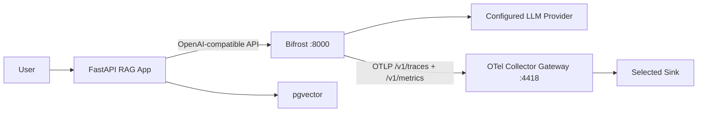

# 04_bifrost - Bifrost AI Gateway

Routes the uninstrumented RAG app through Bifrost. The app itself does not emit GenAI spans; Bifrost is responsible for provider-level request, model, token, routing, and gateway telemetry.

## Flow



## Usage

Start infra with Bifrost enabled from `infra/.enc`:

```text
gateway: true
sink: grafana
bifrost_provider: openai
bifrost_api_key: sk-...
```

Then:

```bash
cd ../../infra
make up
```

Create a Bifrost virtual key in http://localhost:8000 and put it in this experiment's `.env`:

```bash
CHAT_API_KEY=<bifrost-virtual-key>
CHAT_BASE_URL=http://host.docker.internal:8000/v1
CHAT_MODEL=openai/gpt-4o-mini

EMBED_API_KEY=<bifrost-virtual-key>
EMBED_BASE_URL=http://host.docker.internal:8000/v1
EMBED_MODEL=openai/text-embedding-3-small
```

Run the app:

```bash
cp .env.example .env
make up
make ingest
make ask
```

## What This Experiment Shows

| Question | Visibility |
|----------|------------|
| Which provider/model handled the request? | Bifrost gateway telemetry |
| Token usage and request latency | Bifrost gateway telemetry |
| Gateway routing/key failures | Bifrost logs and traces |
| App RAG stage timings | Not visible unless app is manually instrumented |
| Retrieval quality | Not visible unless app emits retrieval spans/metrics |

## Span Attributes

Expected Bifrost/GenAI attributes depend on provider and request type, but should include provider/model/request metadata and token usage when available.

## Metrics

Bifrost exposes gateway process/request metrics at `http://localhost:8000/metrics` and pushes OTel metrics to the configured OTLP metrics endpoint.

## Failure Modes

| Failure mode | Detectable? | Where |
|--------------|-------------|-------|
| Invalid provider token | Yes | Bifrost logs/traces |
| Invalid virtual key | Yes | Bifrost logs/UI |
| Provider timeout/5xx | Yes | Bifrost traces/metrics |
| Wrong model name | Yes | Bifrost/provider error |
| Bad retrieval context | No | Needs app spans/evals |
