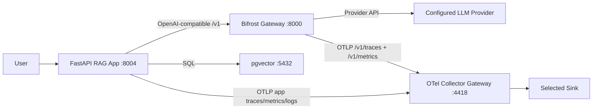

# 04_bifrost - Bifrost AI Gateway

Routes a fully instrumented RAG app through Bifrost. This experiment combines:

- OpenLLMetry auto-instrumentation for OpenAI SDK and FastAPI
- Manual RAG spans and retrieval metrics
- Bifrost gateway telemetry for provider/model/key/routing behavior

## Flow



## Usage

Start shared infra with Bifrost enabled. From `infra/.enc`:

```text
gateway: true
sink: grafana
bifrost_provider: openai
bifrost_api_key: sk-...
otel_exporter_otlp_endpoint: http://host.docker.internal:4418
```

Then run:

```bash
cd ../../infra
make up
```

Open http://localhost:8000 and create a Bifrost virtual key:

1. Go to **Virtual Keys**.
2. Create a key for the provider configured in `.enc`.
3. Allow the models used by this experiment.
4. Copy the generated virtual key.

Configure this experiment:

```bash
cp .env.example .env
```

Set both API keys in `.env` to the Bifrost virtual key:

```bash
CHAT_API_KEY=<bifrost-virtual-key>
CHAT_BASE_URL=http://host.docker.internal:8000/v1
CHAT_MODEL=openai/gpt-4o-mini

EMBED_API_KEY=<bifrost-virtual-key>
EMBED_BASE_URL=http://host.docker.internal:8000/v1
EMBED_MODEL=openai/text-embedding-3-small

OTEL_SERVICE_NAME=ai-obs-04-bifrost
OTEL_EXPORTER_OTLP_ENDPOINT=http://host.docker.internal:4418
```

Run the app:

```bash
make up
make ingest
make ask
```

Generate varied demo traffic:

```bash
make random-ingest        # ingest one random sample_data/*.txt document
make random-ask           # ask one random question with a random user_id
make random-traffic       # mix random asks and ingests; default COUNT=5
make random-traffic COUNT=25
```

Random traffic uses `scripts/random_rag.sh`, `sample_questions.txt`, `sample_users.txt`, and the documents in `sample_data/`. The script samples from `/dev/urandom`, so repeated runs naturally vary routes, documents, users, retrieved context, token usage, and Bifrost provider calls.

## Example Trace

Expected trace shape for `make ask` when the app is instrumented and model traffic passes through Bifrost:

| # | Span | Parent | Example duration | Source | What it answers |
|---|------|--------|------------------|--------|-----------------|
| 1 | `POST /ask` | root | 2-9s | OTel FastAPI | End-to-end app request latency |
| 2 | `rag.ask` | `POST /ask` | 2-9s | Manual | User/query-level RAG workflow |
| 3 | `rag.retrieve` | `rag.ask` | 250-1200ms | Manual | Retrieval stage timing and quality attributes |
| 4 | `rag.embed` | `rag.retrieve` | 200-900ms | Manual | Query embedding timing |
| 5 | `openai.embeddings` | `rag.embed` | 200-900ms | OpenLLMetry | OpenAI SDK embedding call metadata/tokens |
| 6 | `POST /v1/embeddings` | gateway/root | 200-900ms | Bifrost | Gateway/provider handling for embedding call |
| 7 | `rag.vector_search` | `rag.retrieve` | 5-100ms | Manual | pgvector search timing |
| 8 | `rag.generate` | `rag.ask` | 1-8s | Manual | Generation stage timing/context size |
| 9 | `openai.chat` | `rag.generate` | 1-8s | OpenLLMetry | OpenAI SDK chat call metadata/tokens |
| 10 | `POST /v1/chat/completions` | gateway/root | 1-8s | Bifrost | Gateway/provider handling for chat call |

Depending on trace-context propagation through the OpenAI-compatible client and Bifrost, Bifrost spans may appear as separate traces. They are still correlated by timestamp, route, model, provider, and virtual-key/provider-key metadata.

## Span Attributes

### Auto-captured by OpenLLMetry

| Attribute | Example | Meaning |
|-----------|---------|---------|
| `gen_ai.operation.name` | `chat`, `embeddings` | LLM operation type |
| `gen_ai.provider.name` | `openai` | Provider inferred by OpenLLMetry/Bifrost path |
| `gen_ai.request.model` | `openai/gpt-4o-mini` | Model requested by the app |
| `gen_ai.response.model` | `gpt-4o-mini` | Model returned by upstream provider |
| `gen_ai.usage.input_tokens` | `850` | Prompt/input tokens when reported |
| `gen_ai.usage.output_tokens` | `120` | Completion/output tokens when reported |
| `gen_ai.usage.total_tokens` | `970` | Total tokens when reported |
| `gen_ai.openai.api_base` | `http://host.docker.internal:8000/v1` | Confirms SDK is calling Bifrost |
| `http.request.method` | `POST` | FastAPI/SDK HTTP method |
| `http.route` | `/ask`, `/ingest` | FastAPI route |

### Captured by Bifrost

| Attribute | Example | Meaning |
|-----------|---------|---------|
| `gen_ai.provider.name` | `openai` | Upstream provider selected by Bifrost |
| `gen_ai.request.model` | `openai/gpt-4o-mini` | Model requested by the app |
| `gen_ai.response.model` | `gpt-4o-mini` | Model reported by the provider |
| `gen_ai.operation.name` | `chat`, `embeddings` | LLM operation type |
| `gen_ai.usage.input_tokens` | `850` | Prompt/input tokens when provider reports them |
| `gen_ai.usage.output_tokens` | `120` | Completion/output tokens when provider reports them |
| `gen_ai.usage.total_tokens` | `970` | Total token usage |
| `http.request.method` | `POST` | Gateway request method |
| `url.path` | `/v1/chat/completions` | Gateway route |
| `http.response.status_code` | `200`, `401`, `429`, `500` | Gateway/provider outcome |
| `bifrost.virtual_key.id` | `vk_...` | Virtual key used, when emitted |
| `bifrost.selected_key.id` | `...` | Provider key selected, when emitted |

### Manual app attributes

| Attribute | Span | Example | Meaning |
|-----------|------|---------|---------|
| `user.id` | `rag.ask` | `anonymous` | Per-user attribution |
| `ask.query` | `rag.ask` | `What does the kube-scheduler do?` | Input question |
| `embed.model` | `rag.embed` | `openai/text-embedding-3-small` | Embedding model routed through Bifrost |
| `embed.num_texts` | `rag.embed` | `1`, `4` | Number of texts embedded |
| `retrieve.top_k` | `rag.retrieve` | `5` | Requested retrieval count |
| `retrieve.num_results` | `rag.retrieve` | `5` | Returned retrieval count |
| `retrieve.similarity_max` | `rag.retrieve` | `0.83` | Best similarity score |
| `retrieve.similarity_min` | `rag.retrieve` | `0.42` | Worst returned similarity score |
| `retrieve.similarity_avg` | `rag.retrieve` | `0.61` | Mean returned similarity score |
| `generate.model` | `rag.generate` | `openai/gpt-4o-mini` | Chat model routed through Bifrost |
| `generate.num_context_chunks` | `rag.generate` | `5` | Chunks sent to generation |
| `store.source` | `rag.store` | `kubernetes.txt` | Ingested source |
| `store.num_chunks` | `rag.store` | `4` | Stored chunk count |

## Metrics

Bifrost pushes OTel metrics to the configured OTLP metrics endpoint. The app emits OpenLLMetry, FastAPI, and manual RAG metrics to the OTel gateway.

Prometheus normalizes OTel metric names such as `rag.retrieve.count` to names such as `rag_retrieve_count_total`. The dashboard queries below were checked against Prometheus on `localhost:9091`.

| Metric | Source | Purpose | Example dimensions |
|--------|--------|---------|--------------------|
| `bifrost_upstream_requests_total` | Bifrost | Upstream provider request volume | `provider`, `model`, `method`, `virtual_key_name` |
| `bifrost_success_requests_total` | Bifrost | Successful upstream request volume | `provider`, `model`, `method`, `virtual_key_name` |
| `bifrost_upstream_latency_seconds_bucket` | Bifrost | Upstream provider latency histogram | `provider`, `model`, `method`, `le` |
| `bifrost_request_retries_bucket` | Bifrost | Retry-count distribution | `method`, `le` |
| `bifrost_request_retries_count` | Bifrost | Retry metric sample count | `method` |
| `bifrost_request_retries_sum` | Bifrost | Total retries observed | `method` |
| `bifrost_input_tokens_total` | Bifrost | Input token volume | `provider`, `model`, `method`, `virtual_key_name` |
| `bifrost_output_tokens_total` | Bifrost | Output token volume | `provider`, `model`, `method`, `virtual_key_name` |
| `bifrost_cost_USD_total` | Bifrost | Estimated provider cost | `provider`, `model`, `method`, `virtual_key_name` |
| `gen_ai_client_token_usage_bucket` | OpenLLMetry | Token usage distribution | `gen_ai_operation_name`, `gen_ai_response_model`, `gen_ai_token_type`, `le` |
| `gen_ai_client_token_usage_count` | OpenLLMetry | Token usage sample count | `gen_ai_operation_name`, `gen_ai_response_model`, `gen_ai_token_type` |
| `gen_ai_client_token_usage_sum` | OpenLLMetry | App-side LLM token usage | `gen_ai_operation_name`, `gen_ai_response_model`, `gen_ai_token_type` |
| `gen_ai_client_operation_duration_seconds_bucket` | OpenLLMetry | App-side SDK operation duration | `gen_ai_operation_name`, `gen_ai_response_model`, `le` |
| `gen_ai_client_operation_duration_seconds_count` | OpenLLMetry | SDK operation sample count | `gen_ai_operation_name`, `gen_ai_response_model` |
| `gen_ai_client_operation_duration_seconds_sum` | OpenLLMetry | Total SDK operation duration | `gen_ai_operation_name`, `gen_ai_response_model` |
| `gen_ai_client_generation_choices_choice_total` | OpenLLMetry | Chat completion choices | `gen_ai_response_model`, `gen_ai_response_finish_reason` |
| `llm_openai_embeddings_vector_size_element_total` | OpenLLMetry | Embedding vector element volume | `gen_ai_response_model` |
| `http_server_duration_milliseconds_bucket` | OTel FastAPI | App route latency | `http_target`, `http_method`, `http_status_code`, `le` |
| `http_server_duration_milliseconds_count` | OTel FastAPI | App route request count | `http_target`, `http_method`, `http_status_code` |
| `http_server_duration_milliseconds_sum` | OTel FastAPI | Total app route duration | `http_target`, `http_method`, `http_status_code` |
| `http_server_request_size_bytes_bucket` | OTel FastAPI | Request size distribution | `http_target`, `http_method`, `le` |
| `http_server_response_size_bytes_bucket` | OTel FastAPI | Response size distribution | `http_target`, `http_method`, `le` |
| `http_server_active_requests` | OTel FastAPI | In-flight app requests | `http_method` |
| `rag_retrieve_count_total` | Manual | Retrieval operation count | `service_name` |
| `rag_retrieve_empty_total` | Manual | Empty retrieval count, emitted after an empty retrieval | `service_name` |
| `rag_retrieve_similarity_score_bucket` | Manual | Similarity score histogram | `le`, `service_name` |
| `rag_retrieve_similarity_score_count` | Manual | Similarity sample count | `service_name` |
| `rag_retrieve_similarity_score_sum` | Manual | Total similarity score | `service_name` |

A Grafana dashboard for these metrics is included in `dashboard.grafana.json`.

## Metric Dimensions Appendix

| Metric | Dimension | Examples | Notes |
|--------|-----------|----------|-------|
| `bifrost_upstream_requests_total` | `provider` | `openrouter` | Upstream provider selected by Bifrost |
| `bifrost_upstream_requests_total` | `model` | `openai/gpt-4o-mini`, `openai/text-embedding-3-small` | Requested model |
| `bifrost_upstream_requests_total` | `method` | `chat_completion`, `embedding` | Bifrost operation |
| `bifrost_upstream_requests_total` | `virtual_key_name` | `test api key` | Virtual key name when configured |
| `bifrost_upstream_latency_seconds_bucket` | `le` | `0.5`, `1`, `5`, `+Inf` | Prometheus histogram bucket |
| `bifrost_request_retries_bucket` | `method` | `/v1/chat/completions`, `/v1/embeddings` | Bifrost route path for retry metric |
| `bifrost_request_retries_bucket` | `le` | `0`, `1`, `2`, `+Inf` | Retry histogram bucket |
| `bifrost_cost_USD_total` | `selected_key_name` | `openrouter-primary` | Provider key used by Bifrost |
| `gen_ai_client_token_usage_sum` | `gen_ai_operation_name` | `chat`, `embeddings` | SDK operation |
| `gen_ai_client_token_usage_sum` | `gen_ai_response_model` | `openai/gpt-4o-mini`, `text-embedding-3-small` | Response model |
| `gen_ai_client_token_usage_sum` | `gen_ai_token_type` | `input`, `output` | Token type |
| `gen_ai_client_operation_duration_seconds_bucket` | `le` | `0.5`, `1`, `5`, `+Inf` | Prometheus histogram bucket |
| `gen_ai_client_generation_choices_choice_total` | `gen_ai_response_finish_reason` | `stop`, empty | Finish reason when reported |
| `llm_openai_embeddings_vector_size_element_total` | `gen_ai_response_model` | `text-embedding-3-small` | Embedding model |
| `http_server_duration_milliseconds_bucket` | `http_target` | `/ask`, `/ingest` | FastAPI target path |
| `http_server_duration_milliseconds_bucket` | `http_method` | `POST` | HTTP method |
| `http_server_duration_milliseconds_bucket` | `http_status_code` | `200`, `500` | Response code |
| `http_server_request_size_bytes_bucket` | `le` | `100`, `500`, `1000`, `+Inf` | Request size histogram bucket |
| `http_server_response_size_bytes_bucket` | `le` | `100`, `500`, `1000`, `+Inf` | Response size histogram bucket |
| `rag_retrieve_count_total` | `service_name` | `ai-obs-04-bifrost` | Counter has no custom dimensions |
| `rag_retrieve_empty_total` | `service_name` | `ai-obs-04-bifrost` | Appears after an empty retrieval |
| `rag_retrieve_similarity_score_bucket` | `le` | `0.5`, `0.75`, `+Inf` | Histogram bucket |

## Failure Modes

| Failure mode | Detectable? | Signal | What you see | Gap |
|--------------|-------------|--------|--------------|-----|
| Invalid provider API token | Yes | Bifrost logs/traces | Provider auth error during model list or inference | App only sees gateway failure |
| Invalid Bifrost virtual key | Yes | Bifrost logs/UI/traces | `401` or auth middleware error | Requires virtual-key auth enabled/configured |
| Provider timeout or 5xx | Yes | Trace + latency/error metrics | Slow/error span and non-2xx status | Does not explain app-side retry behavior |
| Wrong model name | Yes | Trace/log | Provider/model error from Bifrost | Model aliasing can hide the original requested model |
| Provider routing/key selection issue | Yes | Bifrost trace/log | Selected key/routing metadata, if emitted | Requires Bifrost metadata in spans/logs |
| DB connection failure | Yes | Manual app spans/logs | `rag.ask` or `rag.ingest` errors before model call | Bifrost alone cannot see it |
| Bad chunking or bad retrieval | Partially | Manual retrieval metrics | Low `rag.retrieve.similarity` or empty retrieval count | Needs evals to prove quality |
| Hallucination/model quality regression | No | None | Gateway sees request and tokens, not correctness | Needs evals or human review |

## What You Can See

| Surface | Visible through Bifrost? |
|---------|--------------------------|
| Provider/model used | Yes |
| Token usage | Yes, when provider reports usage |
| Gateway request latency | Yes |
| Provider failures | Yes |
| Virtual key/provider key failures | Yes |
| App route latency | Yes |
| RAG retrieval similarity | Yes |
| Chunk count and context size | Yes |
| Answer correctness | No |

## Effort

| Work | Effort |
|------|--------|
| App code changes | Medium: OpenLLMetry setup plus manual RAG spans/metrics |
| Infra setup | Medium: Bifrost plus OTel sink |
| Dashboard setup | Low: import `dashboard.grafana.json` |
| Operational overhead | Medium: virtual keys, provider keys, routing config |

## Personas

| Persona | Value |
|---------|-------|
| Platform engineer | Central provider keys, routing, gateway-level reliability |
| FinOps | Token and request volume visibility by provider/model |
| Security/compliance | Virtual-key control point and audit trail |
| App developer | App route, RAG stage, DB, and provider-call visibility |
| ML/RAG engineer | Retrieval similarity and context-size visibility alongside provider telemetry |
