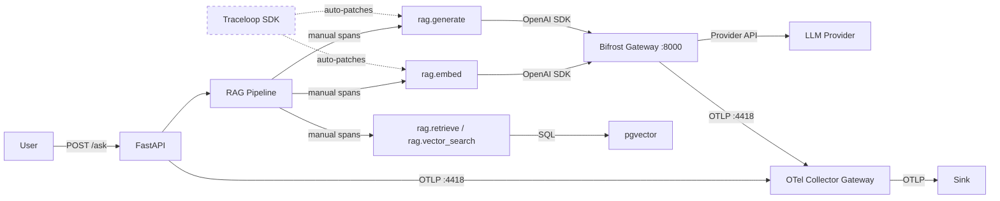
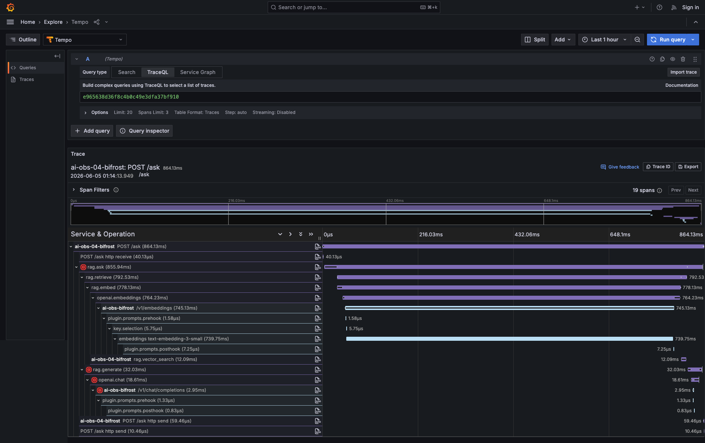
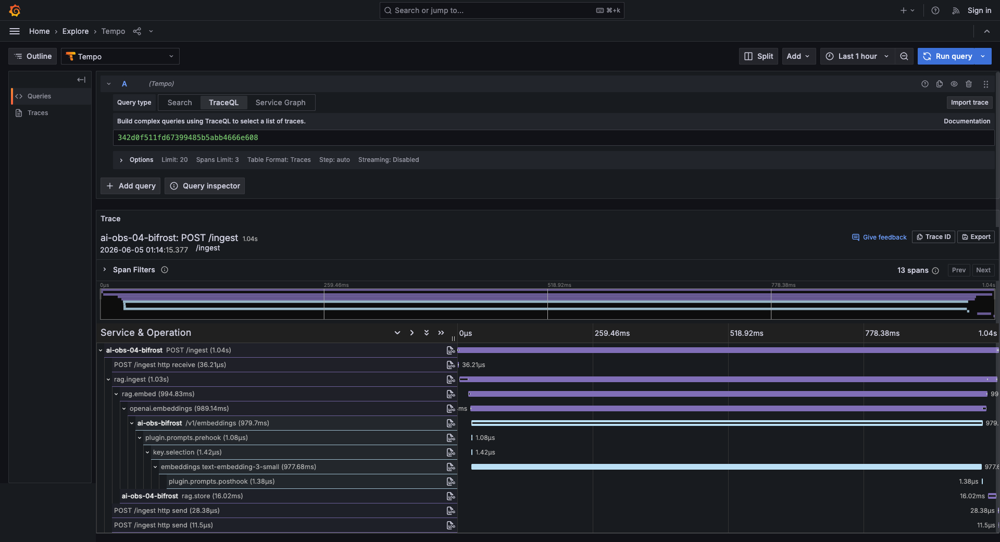
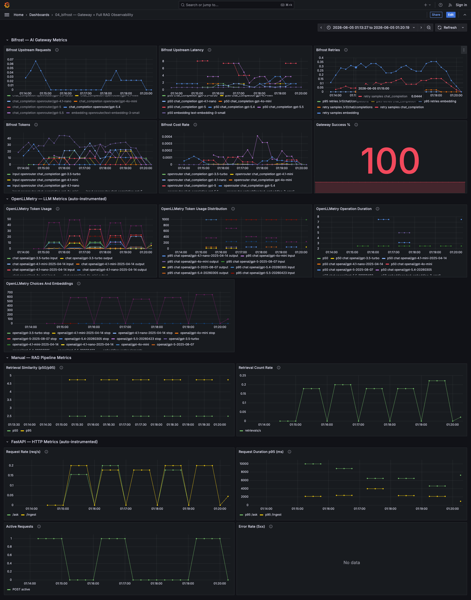

# bifrost — Bifrost AI Gateway + OpenLLMetry + Manual Spans

Routes a fully instrumented RAG app through Bifrost AI gateway. Combines OpenLLMetry auto-instrumentation, manual RAG spans with retrieval metrics, and Bifrost gateway telemetry — showing what you get when app-side observability meets gateway-side observability.

## Flow



## What this captures vs other experiments

| What | otel | openllmetry | openllmetry_manual | bifrost |
|------|---------|----------------|----------------------|------------|
| HTTP request spans | ✅ (FastAPI auto) | ✅ (FastAPI auto) | ✅ (FastAPI auto) | ✅ (FastAPI auto) |
| Custom RAG pipeline spans | ✅ (manual) | ❌ | ✅ (manual) | ✅ (manual) |
| LLM call spans (model, tokens, latency) | ❌ | ✅ (auto) | ✅ (auto) | ✅ (auto) |
| Embedding call spans (model, tokens) | ❌ | ✅ (auto) | ✅ (auto) | ✅ (auto) |
| Prompt/completion content | ❌ | ✅ (auto) | ✅ (auto) | ✅ (auto) |
| Retrieval similarity metrics | ❌ | ❌ | ✅ (manual) | ✅ (manual) |
| Gateway routing/key selection | ❌ | ❌ | ❌ | ✅ (Bifrost) |
| Gateway token/cost tracking | ❌ | ❌ | ❌ | ✅ (Bifrost) |
| Gateway provider latency | ❌ | ❌ | ❌ | ✅ (Bifrost) |
| Gateway retry visibility | ❌ | ❌ | ❌ | ✅ (Bifrost) |
| Logs | ✅ | ✅ | ✅ | ✅ |
| Metrics (HTTP) | ✅ | ✅ | ✅ | ✅ |

## Example traces

### POST /ask (864.13ms, 19 spans)



```
POST /ask (864.13ms)
├── POST /ask http receive (40.13µs)
├── rag.ask (855.94ms) ⚠️
│   ├── rag.retrieve (792.53ms)
│   │   ├── rag.embed (778.13ms)
│   │   │   └── openai.embeddings (764.23ms)
│   │   │       └── ai-obs-bifrost /v1/embeddings (745.13ms)
│   │   │           ├── plugin.prompts.prehook (1.58µs)
│   │   │           ├── key.selection (5.75µs)
│   │   │           ├── embeddings text-embedding-3-small (739.75ms)
│   │   │           └── plugin.prompts.posthook (7.25µs)
│   │   └── ai-obs-bifrost rag.vector_search (12.09ms)
│   └── rag.generate (32.03ms) ⚠️
│       └── openai.chat (18.61ms) ⚠️
│           └── ai-obs-bifrost /v1/chat/completions (2.95ms) ⚠️
│               ├── plugin.prompts.prehook (1.33µs)
│               └── plugin.prompts.posthook (0.83µs)
├── ai-obs-bifrost POST /ask http send (59.46µs)
└── POST /ask http send (10.46µs)
```

| # | Span | Parent | Duration | Source | What it tells you | Sample attributes |
|---|------|--------|----------|--------|-------------------|-------------------|
| 1 | `POST /ask` | — | 864.13ms | FastAPI auto | End-to-end user-facing request latency | `http.method=POST`, `http.target=/ask`, `http.status_code=200` |
| 2 | `POST /ask http receive` | `POST /ask` | 40.13µs | FastAPI auto | Request body receive time | — |
| 3 | `rag.ask` | `POST /ask` | 855.94ms | Manual | Full RAG pipeline — user/query context | `user.id=anonymous`, `ask.query=...`, `ask.chat_model=openrouter/gpt-4o-mini` |
| 4 | `rag.retrieve` | `rag.ask` | 792.53ms | Manual | Retrieval stage — embed + vector search | `retrieve.top_k=5`, `retrieve.num_results=5`, `retrieve.similarity_avg=0.61` |
| 5 | `rag.embed` | `rag.retrieve` | 778.13ms | Manual | Embedding timing, model, batch size | `embed.model=openai/text-embedding-3-small`, `embed.num_texts=1` |
| 6 | `openai.embeddings` | `rag.embed` | 764.23ms | OpenLLMetry auto | SDK-level embedding call with token counts | `gen_ai.operation.name=embeddings`, `gen_ai.request.model=openai/text-embedding-3-small`, `gen_ai.usage.input_tokens=8` |
| 7 | `/v1/embeddings` | `openai.embeddings` | 745.13ms | **Bifrost** | Gateway routing — provider, key selection, upstream latency | `gen_ai.provider.name=openrouter`, `url.path=/v1/embeddings` |
| 8 | `plugin.prompts.prehook` | `/v1/embeddings` | 1.58µs | **Bifrost** | Pre-request plugin processing | — |
| 9 | `key.selection` | `/v1/embeddings` | 5.75µs | **Bifrost** | Virtual key → provider key resolution | — |
| 10 | `embeddings text-embedding-3-small` | `/v1/embeddings` | 739.75ms | **Bifrost** | Actual upstream provider call latency | `model=text-embedding-3-small` |
| 11 | `plugin.prompts.posthook` | `/v1/embeddings` | 7.25µs | **Bifrost** | Post-response plugin processing | — |
| 12 | `rag.vector_search` | `rag.retrieve` | 12.09ms | Manual | pgvector cosine similarity search | — |
| 13 | `rag.generate` | `rag.ask` | 32.03ms | Manual | LLM generation stage with context | `generate.model=openrouter/gpt-4o-mini`, `generate.num_context_chunks=5` |
| 14 | `openai.chat` | `rag.generate` | 18.61ms | OpenLLMetry auto | SDK-level chat call with token counts | `gen_ai.operation.name=chat`, `gen_ai.request.model=openrouter/gpt-4o-mini` |
| 15 | `/v1/chat/completions` | `openai.chat` | 2.95ms | **Bifrost** | Gateway routing for chat completion | `gen_ai.provider.name=openrouter`, `url.path=/v1/chat/completions` |
| 16 | `plugin.prompts.prehook` | `/v1/chat/completions` | 1.33µs | **Bifrost** | Pre-request plugin | — |
| 17 | `plugin.prompts.posthook` | `/v1/chat/completions` | 0.83µs | **Bifrost** | Post-response plugin | — |
| 18 | `POST /ask http send` | `POST /ask` | 59.46µs | FastAPI auto | Response send time | — |
| 19 | `POST /ask http send` | `POST /ask` | 10.46µs | FastAPI auto | Response send time | — |

### POST /ingest (1.04s, 13 spans)



```
POST /ingest (1.04s)
├── POST /ingest http receive (36.21µs)
├── rag.ingest (1.03s)
│   ├── rag.embed (994.83ms)
│   │   └── openai.embeddings (989.14ms)
│   │       └── ai-obs-bifrost /v1/embeddings (979.7ms)
│   │           ├── plugin.prompts.prehook (1.08µs)
│   │           ├── key.selection (1.42µs)
│   │           ├── embeddings text-embedding-3-small (977.68ms)
│   │           └── plugin.prompts.posthook (1.38µs)
│   └── ai-obs-bifrost rag.store (16.02ms)
├── POST /ingest http send (28.38µs)
└── POST /ingest http send (11.5µs)
```

| # | Span | Parent | Duration | Source | What it tells you | Sample attributes |
|---|------|--------|----------|--------|-------------------|-------------------|
| 1 | `POST /ingest` | — | 1.04s | FastAPI auto | End-to-end ingestion latency | `http.method=POST`, `http.target=/ingest`, `http.status_code=200` |
| 2 | `POST /ingest http receive` | `POST /ingest` | 36.21µs | FastAPI auto | Upload receive time | — |
| 3 | `rag.ingest` | `POST /ingest` | 1.03s | Manual | Full ingest pipeline | `ingest.source=kubernetes.txt` |
| 4 | `rag.embed` | `rag.ingest` | 994.83ms | Manual | Batch embedding of all chunks | `embed.model=openai/text-embedding-3-small`, `embed.num_texts=4` |
| 5 | `openai.embeddings` | `rag.embed` | 989.14ms | OpenLLMetry auto | SDK embedding call with token count | `gen_ai.operation.name=embeddings`, `gen_ai.usage.input_tokens=350` |
| 6 | `/v1/embeddings` | `openai.embeddings` | 979.7ms | **Bifrost** | Gateway handling for batch embedding | `gen_ai.provider.name=openrouter` |
| 7 | `plugin.prompts.prehook` | `/v1/embeddings` | 1.08µs | **Bifrost** | Pre-request plugin | — |
| 8 | `key.selection` | `/v1/embeddings` | 1.42µs | **Bifrost** | Key resolution | — |
| 9 | `embeddings text-embedding-3-small` | `/v1/embeddings` | 977.68ms | **Bifrost** | Upstream provider call | `model=text-embedding-3-small` |
| 10 | `plugin.prompts.posthook` | `/v1/embeddings` | 1.38µs | **Bifrost** | Post-response plugin | — |
| 11 | `rag.store` | `rag.ingest` | 16.02ms | Manual | pgvector chunk storage | `store.source=kubernetes.txt`, `store.num_chunks=4` |
| 12 | `POST /ingest http send` | `POST /ingest` | 28.38µs | FastAPI auto | Response send | — |
| 13 | `POST /ingest http send` | `POST /ingest` | 11.5µs | FastAPI auto | Response send | — |

**What you can see:** The full request path from user → app → RAG pipeline → Bifrost gateway → upstream provider. Every layer is visible: app pipeline stages, OpenAI SDK calls, gateway routing (key selection, plugin hooks), and actual provider latency.

**What you can't see:** Answer correctness, hallucination, whether retrieved chunks are actually relevant to the question (similarity scores are captured but quality evaluation requires an eval layer).

## Span attributes

### Auto-captured by OpenLLMetry

| Attribute | Example value | What it tells you |
|-----------|--------------|-------------------|
| `gen_ai.operation.name` | `embeddings`, `chat` | Which type of LLM operation |
| `gen_ai.provider.name` | `openai`, `openrouter` | Provider inferred by OpenLLMetry |
| `gen_ai.request.model` | `openai/text-embedding-3-small` | Model requested |
| `gen_ai.response.model` | `text-embedding-3-small` | Model actually used |
| `gen_ai.usage.input_tokens` | `8` | Tokens in the prompt/input |
| `gen_ai.usage.output_tokens` | `120` | Completion/output tokens |
| `gen_ai.usage.total_tokens` | `970` | Total tokens consumed |
| `gen_ai.openai.api_base` | `http://host.docker.internal:8000/v1` | Confirms SDK is calling Bifrost |
| `gen_ai.response.id` | `gen-emb-...` | Provider response ID for debugging |
| `gen_ai.input.messages` | `[{"role": "user", ...}]` | Full prompt content (disable for privacy) |
| `gen_ai.is_streaming` | `false` | Whether response was streamed |

### Captured by Bifrost gateway

| Attribute | Example value | What it tells you |
|-----------|--------------|-------------------|
| `gen_ai.provider.name` | `openrouter` | Upstream provider selected by Bifrost |
| `gen_ai.request.model` | `openrouter/gpt-4o-mini` | Model requested by the app |
| `gen_ai.response.model` | `gpt-4o-mini` | Model reported by provider |
| `gen_ai.usage.input_tokens` | `850` | Provider-reported input tokens |
| `gen_ai.usage.output_tokens` | `120` | Provider-reported output tokens |
| `url.path` | `/v1/chat/completions` | Gateway route |
| `http.response.status_code` | `200`, `401`, `429` | Gateway/provider outcome |
| `bifrost.virtual_key.id` | `vk_...` | Virtual key used |
| `bifrost.selected_key.id` | `...` | Provider key selected |

### Manual app attributes

| Attribute | Span | Example value | What it tells you |
|-----------|------|--------------|-------------------|
| `user.id` | `rag.ask` | `platform-oncall` | Per-user cost/abuse attribution |
| `ask.query` | `rag.ask` | `What does the kube-scheduler do?` | Input question for debugging |
| `ask.chat_model` | `rag.ask` | `openrouter/gpt-4.1-mini` | Request-time model override |
| `embed.model` | `rag.embed` | `openai/text-embedding-3-small` | Embedding model |
| `embed.num_texts` | `rag.embed` | `1`, `4` | Batch size |
| `retrieve.top_k` | `rag.retrieve` | `5` | Requested retrieval count |
| `retrieve.num_results` | `rag.retrieve` | `5` | Actual results returned |
| `retrieve.similarity_max` | `rag.retrieve` | `0.83` | Best match quality |
| `retrieve.similarity_min` | `rag.retrieve` | `0.42` | Worst match quality |
| `retrieve.similarity_avg` | `rag.retrieve` | `0.61` | Average retrieval quality |
| `generate.model` | `rag.generate` | `openrouter/gpt-4o-mini` | Chat model used |
| `generate.num_context_chunks` | `rag.generate` | `5` | Chunks fed to LLM |
| `store.source` | `rag.store` | `kubernetes.txt` | Ingested file |
| `store.num_chunks` | `rag.store` | `4` | Stored chunk count |

**Why these matter:**
- `user.id` → per-user cost attribution and abuse detection
- `retrieve.similarity_*` → retrieval quality monitoring, detect degradation
- `gen_ai.openai.api_base` → confirms traffic flows through Bifrost (not direct)
- `bifrost.virtual_key.id` → audit which key was used, rate-limit per key
- `url.path` on Bifrost spans → distinguish embedding vs chat at gateway level

## Metrics dashboard



A Grafana dashboard is included in `dashboard.grafana.json`. It covers four metric sources across 16 panels:

### Bifrost — AI Gateway Metrics

| Panel | Metric | PromQL | What it tells you |
|-------|--------|--------|-------------------|
| Bifrost Upstream Requests | `bifrost_upstream_requests_total` | `sum(rate(bifrost_upstream_requests_total[1m])) by (provider, method, model)` | Request volume per provider/model/operation. In the screenshot: multiple models (`gpt-4o-mini`, `gpt-4.1-nano`, `gpt-5`, `gpt-3.5-turbo`, `gpt-5.4`, `text-embedding-3-small`) show traffic from `make random-traffic`. |
| Bifrost Upstream Latency | `bifrost_upstream_latency_seconds_bucket` | `histogram_quantile(0.50, sum(rate(..._bucket[1m])) by (le, method, model))` | p50 provider latency by model. Screenshot shows `gpt-5` at ~8s, `gpt-4.1-nano` at ~4s, `text-embedding-3-small` at ~1s — validates model selection impacts latency. |
| Bifrost Retries | `bifrost_request_retries_bucket` | `histogram_quantile(0.95, sum(rate(..._bucket[1m])) by (le, method))` | p95 retry count + retry sample rate. Non-zero = provider instability. Screenshot shows low retry activity with occasional spikes. |
| Bifrost Tokens | `bifrost_input_tokens_total` | `sum(rate(bifrost_input_tokens_total[1m])) by (provider, method, model)` | Input token rate by model. Screenshot shows `gpt-3.5-turbo` and `gpt-4.1-mini` consuming most tokens — cost attribution visible by model. |
| Bifrost Cost Rate | `bifrost_cost_USD_total` | `sum(rate(bifrost_cost_USD_total[1m])) by (provider, method, model)` | USD/second by model. Screenshot shows cost concentrated on chat_completion models, with `gpt-4o-mini` and `gpt-4.1-nano` driving most spend. |
| Gateway Success % | `bifrost_success_requests_total` / `bifrost_upstream_requests_total` | `sum(bifrost_success_requests_total) / sum(bifrost_upstream_requests_total) * 100` | Overall gateway reliability. Screenshot shows **100%** — all requests succeeded during the test window. |

### OpenLLMetry — LLM Metrics (auto-instrumented)

| Panel | Metric | PromQL | What it tells you |
|-------|--------|--------|-------------------|
| OpenLLMetry Token Usage | `gen_ai_client_token_usage_sum` | `sum(rate(gen_ai_client_token_usage_sum[1m])) by (gen_ai_operation_name, gen_ai_response_model, gen_ai_token_type)` | App-side token rate by operation/model/direction. Screenshot shows input tokens dominating (large prompts with RAG context). |
| OpenLLMetry Token Usage Distribution | `gen_ai_client_token_usage_bucket` | `histogram_quantile(0.95, sum(rate(..._bucket[1m])) by (le, gen_ai_operation_name, gen_ai_response_model, gen_ai_token_type))` | p95 token count per call. Screenshot shows chat input p95 at ~1000 tokens (RAG context), output p95 at ~200-600 tokens depending on model. |
| OpenLLMetry Operation Duration | `gen_ai_client_operation_duration_seconds_bucket` | `histogram_quantile(0.50, sum(rate(..._bucket[1m])) by (le, gen_ai_operation_name, gen_ai_response_model))` | p50 LLM call duration by model. Screenshot shows `gpt-5` at ~8s, `gpt-4.1-mini` at ~3s, faster models at ~2s — confirms model choice drives latency. |
| OpenLLMetry Choices And Embeddings | `gen_ai_client_generation_choices_choice_total` + `llm_openai_embeddings_vector_size_element_total` | `sum(rate(gen_ai_client_generation_choices_choice_total[1m])) by (gen_ai_response_model, gen_ai_response_finish_reason)` | Completion rate by model + embedding element volume. Screenshot shows all completions finished with `stop` — no truncations. |

### Manual — RAG Pipeline Metrics

| Panel | Metric | PromQL | What it tells you |
|-------|--------|--------|-------------------|
| Retrieval Similarity (p50/p95) | `rag_retrieve_similarity_score_bucket` | `histogram_quantile(0.50, sum(rate(..._bucket[1m])) by (le))` | Retrieval quality over time. Screenshot shows p50 at ~5, p95 slightly higher — stable retrieval quality throughout random traffic. |
| Retrieval Count Rate | `rag_retrieve_count_total` | `sum(rate(rag_retrieve_count_total[1m]))` | Retrieval operations per second. Screenshot shows ~0.2 req/s matching the random traffic pattern. |

### FastAPI — HTTP Metrics (auto-instrumented)

| Panel | Metric | PromQL | What it tells you |
|-------|--------|--------|-------------------|
| Request Rate (req/s) | `http_server_duration_milliseconds_count` | `sum(rate(..._count[1m])) by (http_target)` | Traffic volume by endpoint. Screenshot shows `/ask` and `/ingest` traffic interleaved from `make random-traffic`. |
| Request Duration p95 (ms) | `http_server_duration_milliseconds_bucket` | `histogram_quantile(0.95, sum(rate(..._bucket[1m])) by (le, http_target))` | User-facing latency. Screenshot shows `/ask` p95 at 2000-10000ms (varies with model), `/ingest` consistently ~1000ms. |
| Active Requests | `http_server_active_requests` | `http_server_active_requests` | Concurrent in-flight requests. Screenshot shows max 1 active — sequential random traffic, no concurrency. |
| Error Rate (5xx) | `http_server_duration_milliseconds_count` | `sum(rate(..._count{http_status_code=~"5.."}[1m])) by (http_target)` | Server errors. Screenshot shows **No data** — zero 5xx errors during test window (matches 100% gateway success). |

**Value of this setup:** Four observability layers in one dashboard — gateway economics (cost/tokens/success), LLM behavior (latency/token distribution by model), RAG quality (similarity scores), and app health (HTTP errors/latency). You can answer "which model costs most?", "is retrieval degrading?", "is the gateway reliable?", and "what's the user-facing latency?" from a single view.

## Failure modes

| # | Failure mode | Why? | How? | Where? | What? |
|---|---|---|---|---|---|
| 1 | Invalid Bifrost virtual key | Prevent unauthorized access | Alert on 401 from gateway; Gateway Success % drops below 100 | Bifrost → Gateway Success % | `bifrost_success_requests_total` / `bifrost_upstream_requests_total` < 100% |
| 2 | Invalid provider API token | Detect provider auth failure | Gateway Success % drops; Bifrost traces show provider 401/403 | Bifrost → Gateway Success % + trace explorer | `http.response.status_code=401` on Bifrost spans |
| 3 | Provider timeout or 5xx | Avoid user-facing errors, trigger failover | Bifrost Upstream Latency spikes + Gateway Success % drops | Bifrost → Upstream Latency + Gateway Success % | `bifrost_upstream_latency_seconds` p50 spikes, success % < 100 |
| 4 | Wrong/blocked model name | Prevent silent routing failures | Gateway Success % drops; trace shows `model_blocked` | Bifrost → Gateway Success % + trace explorer | Virtual key doesn't allow requested model |
| 5 | Token budget blown | Control costs before bill shock | Bifrost Cost Rate exceeds threshold | Bifrost → Bifrost Cost Rate | `sum(rate(bifrost_cost_USD_total[1m]))` > budget |
| 6 | Provider cost runaway | Catch runaway loops or expensive models | Bifrost Tokens rate growing faster than Upstream Requests rate | Bifrost → Bifrost Tokens vs Bifrost Upstream Requests | Token/request ratio increasing |
| 7 | LLM provider slow | Identify latency source (gateway vs provider) | Compare Bifrost Upstream Latency with OpenLLMetry Operation Duration | Bifrost → Upstream Latency vs OpenLLMetry → Operation Duration | If both high = provider slow; if only OpenLLMetry high = gateway overhead |
| 8 | Gateway retry storms | Detect provider instability causing retries | Bifrost Retries p95 increases or retry sample rate spikes | Bifrost → Bifrost Retries | `bifrost_request_retries` histogram non-zero |
| 9 | Model selection driving cost | Identify which model is most expensive | Bifrost Cost Rate by model shows outlier | Bifrost → Bifrost Cost Rate | `bifrost_cost_USD_total` by model label — screenshot shows per-model cost breakdown |
| 10 | Token-heavy prompts (RAG context too large) | Optimize cost by reducing context | OpenLLMetry Token Usage Distribution p95 shows input tokens growing | OpenLLMetry → Token Usage Distribution | p95 input tokens per call increasing over time |
| 11 | App is slow | Identify if latency is app-side or LLM-side | Compare Request Duration p95 with OpenLLMetry Operation Duration | FastAPI → Request Duration p95 vs OpenLLMetry → Operation Duration | Screenshot: `/ask` p95 at 2-10s, `gpt-5` at ~8s — model choice explains latency |
| 12 | App errors (5xx) | Detect crashes, unhandled exceptions | Error Rate (5xx) panel shows non-zero | FastAPI → Error Rate (5xx) | Screenshot shows "No data" = zero errors. Non-zero = investigate traces. |
| 13 | App saturation | Prevent request queuing | Active Requests stays high | FastAPI → Active Requests | Screenshot shows max 1 — no saturation. High values = scale up. |
| 14 | Database connection failure | Avoid silent retrieval failures | `rag.ask` span errors before LLM call; retrieval count drops | Manual spans + Manual → Retrieval Count Rate | Retrieval count drops to 0 while request rate stays high |
| 15 | Bad retrieval (irrelevant docs) | Prevent poor answers | Retrieval Similarity p50 drops | Manual → Retrieval Similarity (p50/p95) | Screenshot shows stable p50 ~5. Dropping = degradation. |
| 16 | Empty retrievals | Detect missing/bad ingestion | `rag_retrieve_empty_total` rate > 0 | Manual metrics (not on dashboard — add alert) | `rag_retrieve_empty_total` counter increasing |
| 17 | Per-user abuse | Identify who is overusing | Filter traces by `user.id`; token rate per user | Trace explorer | `user.id` on `rag.ask` spans — correlate with Bifrost token metrics |
| | **Not detectable (needs eval layer)** | | | | |
| 18 | Model degradation | Catch quality regressions | — | — | Gateway sees tokens and latency, not correctness |
| 19 | Hallucination | Prevent incorrect answers | — | — | Needs eval or human review |
| 20 | Bad chunking | Detect structural retrieval issues | — | — | Similarity scores may look fine but chunks may be wrong granularity |

## Usage

> **Note:** The Bifrost virtual key is stored in the gateway's SQLite DB (`infra/bifrost/data/config.db`).
> If the gateway container is recreated (e.g. after `make clean` or `docker rm`), the virtual key is lost
> and you must regenerate it via the UI at http://localhost:8800 → Virtual Keys → Create.
> There is no API to automate this in Bifrost v1.5.7.

```bash
# 1. Start shared infra with Bifrost enabled
cd ../../infra
make up AI_GATEWAY=bifrost

# 2. Create Bifrost virtual key
# Open http://localhost:8800 → Virtual Keys → Create
# Allow models: openrouter/text-embedding-3-small, openrouter/gpt-4o-mini (or "*")
# Copy the key

# 3. Configure experiment
cp .env.example .env
# Set CHAT_API_KEY and EMBED_API_KEY to the Bifrost virtual key

# 4. Run
make up

# 5. Test (from another terminal)
make ingest
make ask

# 6. Generate varied traffic
cp experiment_data/sample_chat_models.yaml.example experiment_data/sample_chat_models.yaml
# Uncomment the models you want to use
make random-traffic COUNT=10

# 7. View in Grafana at http://localhost:3000 (admin/admin)
# Explore → Tempo → service name = ai-obs-bifrost
# Explore → Prometheus → bifrost_upstream_requests_total
# Dashboards → import dashboard.grafana.json
```

Override the chat model at request time:

```bash
curl -s -X POST http://localhost:8004/ask \
  -H "Content-Type: application/json" \
  -d '{"query": "What does the kube-scheduler do?", "user_id": "platform-oncall", "chat_model": "openrouter/gpt-4.1-mini"}' | python3 -m json.tool
```

## Appendix: Metric Dimensions

### `bifrost_upstream_requests_total` / `bifrost_success_requests_total`

| Dimension | Example | Purpose |
|-----------|---------|---------|
| `provider` | `openrouter` | Upstream provider |
| `model` | `openrouter/gpt-4o-mini`, `openai/text-embedding-3-small` | Requested model |
| `method` | `chat_completion`, `embedding` | Bifrost operation type |
| `virtual_key_name` | `test api key` | Which virtual key |

### `bifrost_upstream_latency_seconds`

| Dimension | Example | Purpose |
|-----------|---------|---------|
| `provider` | `openrouter` | Provider |
| `model` | `openrouter/gpt-4o-mini` | Model |
| `method` | `chat_completion`, `embedding` | Operation |
| `le` | `0.5`, `1`, `5`, `+Inf` | Histogram bucket |

### `bifrost_input_tokens_total` / `bifrost_output_tokens_total` / `bifrost_cost_USD_total`

| Dimension | Example | Purpose |
|-----------|---------|---------|
| `provider` | `openrouter` | Provider |
| `model` | `openrouter/gpt-4o-mini` | Model |
| `method` | `chat_completion`, `embedding` | Operation |
| `virtual_key_name` | `test api key` | Key attribution |
| `selected_key_name` | `openrouter-primary` | Provider key used |

### `bifrost_request_retries`

| Dimension | Example | Purpose |
|-----------|---------|---------|
| `method` | `/v1/chat/completions`, `/v1/embeddings` | Gateway route |
| `le` | `0`, `1`, `2`, `+Inf` | Retry count bucket |

### `gen_ai_client_token_usage`

| Dimension | Example | Purpose |
|-----------|---------|---------|
| `gen_ai_operation_name` | `embeddings`, `chat` | Operation type |
| `gen_ai_response_model` | `text-embedding-3-small`, `gpt-4o-mini` | Model |
| `gen_ai_token_type` | `input`, `output` | Token direction |
| `server_address` | `http://host.docker.internal:8000/v1/` | Confirms Bifrost routing |
| `service_name` | `ai-obs-bifrost` | Service |

### `gen_ai_client_operation_duration_seconds`

Same dimensions as `gen_ai_client_token_usage` minus `gen_ai_token_type`.

### `rag_retrieve_similarity_score`

| Dimension | Example | Purpose |
|-----------|---------|---------|
| `service_name` | `ai-obs-bifrost` | Service |
| `le` | `0.5`, `0.75`, `+Inf` | Similarity bucket |

### `rag_retrieve_count_total` / `rag_retrieve_empty_total`

| Dimension | Example | Purpose |
|-----------|---------|---------|
| `service_name` | `ai-obs-bifrost` | Counter per service |

### `http_server_duration_milliseconds`

| Dimension | Example | Purpose |
|-----------|---------|---------|
| `http_target` | `/ask`, `/ingest` | Endpoint |
| `http_method` | `POST` | Method |
| `http_status_code` | `200`, `500` | Response code |
| `le` | `100`, `500`, `1000`, `+Inf` | Latency bucket |

### `http_server_active_requests`

| Dimension | Example | Purpose |
|-----------|---------|---------|
| `http_method` | `POST` | Method |
| `http_scheme` | `http` | Protocol |
