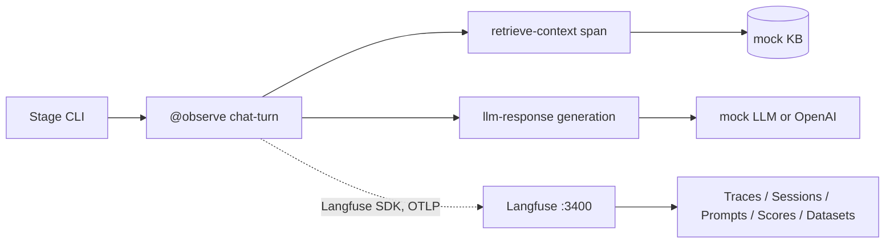

# Langfuse hello world

A tour of Langfuse, one feature per stage, against the self-hosted Langfuse
stack in [`infra/sinks/langfuse/`](../../infra/sinks/langfuse/README.md). Each
stage is a runnable file that adds exactly one thing to the same small support
chatbot, so you can feel why the feature exists before moving on.

This is the orientation experiment, not a benchmark. It deliberately does **not**
use the shared RAG app or the OTel collector gateway — it exists so the Langfuse
concepts (traces, sessions, prompts, scores, datasets) are familiar before you
read [`langfuse_openai_agents`](../langfuse_openai_agents/README.md), which does
run the same agent as experiments 5–7 and is directly comparable.

Runs with **no LLM API key** — a deterministic mock model is built in, which also
makes traces reproducible. Set `OPENAI_API_KEY` for real calls.

For the theory behind each Langfuse feature and the exact trace/span data shape,
read [Langfuse features and trace structure](docs/langfuse_features.md).

> Written against Langfuse Python SDK **v4**. Guides showing
> `langfuse.decorators` or `CallbackHandler`-only patterns are v2/v3 and will not
> match this code.

## Flow



Note the dotted line: the SDK exports **straight to Langfuse**, not to the OTel
gateway on `:4418`. That is a real departure from this repo's usual rule that
apps don't know about sinks, and it's the price of the Langfuse-native features.
See [Why not the gateway?](#why-not-the-gateway) below.

## The stages

| Stage | File | Feature it adds | Where to look in the UI |
|------:|------|-----------------|-------------------------|
| 0 | `src/stage_0_plain_bot.py` | none — baseline blindness | (nothing) |
| 1 | `src/stage_1_tracing.py` | Tracing (`@observe` + generation) | Tracing |
| 2 | `src/stage_2_sessions.py` | Sessions + Users | Sessions, Users |
| 3 | `src/stage_3_nested_spans.py` | Nested spans (retrieve → generate) | a trace's tree view |
| 4 | `src/stage_4_prompt_mgmt.py` | Prompt Management (versioned, linked) | Prompts |
| 5 | `src/stage_5_user_feedback.py` | Scores (thumbs up/down) | scores on traces, Dashboards |
| 6 | *(UI only)* | LLM-as-a-Judge | Evaluators |
| 7 | `src/stage_7_datasets_experiments.py` | Datasets + Experiments | Datasets → Runs |
| 8 | *(UI only)* | Playground | Playground |

Stages 0–5 are chat-interactive (`quit` to exit). Stage 7 runs an experiment and
exits. All of them call `langfuse.flush()` before exiting, because the SDK
buffers in a background thread and short-lived scripts otherwise lose spans.

### Stage 0 — Plain bot
No instrumentation. You see only what you `print`. This is the problem the rest
of the tour solves.

### Stage 1 — Tracing
`@observe(name="chat-turn")` creates a trace per turn; inside it,
`start_as_current_observation(as_type="generation")` records model, input
messages, output and token usage. Latency and cost show up per trace.

### Stage 2 — Sessions + Users
Isolated traces aren't enough for a multi-turn bot.
`propagate_attributes(session_id=..., user_id=...)` tags every observation in
the turn, so Sessions replays a whole conversation and traces filter by user.

### Stage 3 — Nested spans
Adds a fake retrieval step as a child span before the generation, so the trace
becomes a tree: `chat-turn → retrieve-context → llm-response`. This is how you
find which step is slow or where a bad answer originated.

### Stage 4 — Prompt Management
The system prompt moves out of code and into Langfuse. `get_prompt(...)` fetches
it (cached, so no added latency) and passing `prompt=` to the generation links
the trace to the prompt **version**. Run once, edit the prompt in the UI, save a
new version, run again — no code change.

### Stage 5 — Scores
Rate each reply; a BOOLEAN score attaches to that trace via
`create_score(trace_id=...)`. Scores show on traces and aggregate in Dashboards.

### Stage 6 — LLM-as-a-Judge (UI only)
No code. In **Evaluators**, add a managed LLM-as-a-judge evaluator and point it
at the project's traces; it auto-scores production traces as they arrive. Re-run
any earlier stage to generate traffic. Needs an LLM provider key configured in
Langfuse settings for the judge model.

### Stage 7 — Datasets + Experiments
The offline eval loop, and the payoff stage. Creates a `support-qa` dataset,
defines a `task()` that runs one item through the bot and two evaluators
(expected-keyword match, conciseness), then `run_experiment(...)` runs the whole
set and uploads scored results. Change the prompt or `MODEL_NAME`, run again, and
compare runs side by side in **Datasets → support-qa → Runs**.

### Stage 8 — Playground (UI only)
When a trace looks bad, open it and jump into the Playground to iterate on
prompt and model without leaving Langfuse. Self-hosted includes it; the Cloud
free tier is what omits it.

## Example trace (stage 3)

| # | Span | Parent | Duration | Source | What it tells you | Sample attributes |
|---|---|---|---|---|---|---|
| 1 | `chat-turn` | — | ~200ms | `@observe` | One user turn end to end | `session_id`, `user_id`, `tags=[stage-3, rag]` |
| 2 | `retrieve-context` | `chat-turn` | ~50ms | manual span | Retrieval cost and whether it hit | `input.query`, `output.hits`, `output.n` |
| 3 | `llm-response` | `chat-turn` | ~150ms | manual generation | Model, messages, tokens, cost | `model`, `input`, `output`, `usage_details` |

Durations are from the mock backend, which sleeps 150ms for the model and 50ms
for retrieval, so the tree shape is stable across runs.

## Observation attributes

All of these are set by our code — there is no auto-instrumentation in this
experiment.

| Attribute | Set by | Example | What it tells you |
|---|---|---|---|
| `name` | `@observe` / `start_as_current_observation` | `chat-turn`, `llm-response` | Step identity |
| `session_id` | `propagate_attributes` | `chat-a1b2c3d4` | Groups turns into a conversation |
| `user_id` | `propagate_attributes` | `demo-user` | Per-user attribution |
| `tags` | `propagate_attributes` | `["stage-3", "rag"]` | Filtering in the UI |
| `model` | generation kwarg | `gpt-4o-mini` | Which model was asked |
| `input` / `output` | generation kwarg / `update()` | message list / reply text | Exact prompt and completion |
| `usage_details` | `update()` | `{"input": 42, "output": 18}` | Token counts, which drive cost |
| `prompt` | generation kwarg (stage 4) | `support-system-prompt` v2 | Links the trace to a prompt version |
| score `user-feedback` | `create_score` (stage 5) | `1` / `0`, BOOLEAN | Human quality signal |

## Metrics dashboard

**Not applicable, and that's the finding.** Langfuse has no metrics store, no
PromQL, and no importable dashboard JSON, so this experiment ships none — unlike
every other experiment in the repo. Langfuse's built-in Dashboards aggregate
*traces and scores* (cost over time, average score, latency percentiles by
model) rather than OTel metrics, and they are not importable as code.

If you want RED-style metrics alongside Langfuse, run a metrics sink at the same
time:

```bash
cd ../../infra
make up SINK=grafana     # metrics + logs
make langfuse-up         # traces, prompts, scores, datasets
```

The three-way comparison in
[`langfuse_openai_agents`](../langfuse_openai_agents/README.md#the-three-way-comparison)
covers what this costs you in practice.

## Failure modes

| # | Failure mode | Why? | How? | Where? | What? |
|---|---|---|---|---|---|
| 1 | Slow retrieval | Vector search degrades and users wait | Compare child span durations within a trace | Trace tree view | `retrieve-context` span duration |
| 2 | Slow model | Provider latency | Same, on the generation | Trace tree view | `llm-response` span duration |
| 3 | Retrieval returns nothing | Bad answers from missing context | Filter traces where `output.n = 0` | Tracing, filtered | `retrieve-context` output `n` |
| 4 | Token/cost spike | A prompt change blew up input size | Cost per trace, and cost over time | Langfuse Dashboards | `usage_details`, derived cost |
| 5 | Bad answer quality | Users are unhappy but nothing errors | Human scores, then LLM-as-a-judge | Scores on traces | `user-feedback` score |
| 6 | A prompt edit made things worse | New prompt version regressed | Compare traces grouped by prompt version | Prompts → version detail | linked `prompt` version + scores |
| 7 | A model swap made things worse | Cheaper model, worse answers | Run the dataset experiment twice, diff | Datasets → Runs | `contains-expected`, `concise` |
| 8 | Broken conversation flow | Turn 4 contradicts turn 2 | Replay the whole session | Sessions | `session_id` |
| 9 | Process died before flush | Traces silently missing | Every stage calls `flush()` on exit | — | absence of traces |
| 10 | Wrong instance's keys | 401s, no data, looks like an outage | Keys are per-instance | startup `auth_check()` | `auth_check()` returns false |

Failure modes 5–7 are the ones no other experiment in this repo can detect at
all. Failure modes 1–2 are detectable here but only per-trace — there is no
percentile alert to hang off them.

## Usage

Start Langfuse (once):

```bash
cd ../../infra
make langfuse-up
make langfuse-keys        # prints the credentials below
```

Then:

```bash
cd ../experiments/langfuse_introduction
cp .env.example .env      # defaults already match the bootstrapped keys
make up                   # builds the image, checks Langfuse is reachable
```

Run the stages in order:

```bash
make stage-0    # plain bot — no observability
make stage-1    # tracing
make stage-2    # sessions + users
make stage-3    # nested spans
make stage-4    # prompt management
make stage-5    # scores
make stage-7    # datasets + experiments

make ask        # non-interactive smoke turn through stage 3
make run-all    # every stage end to end, non-interactive
make down
```

Open http://localhost:3400. UI login for the bootstrapped instance is
`local@example.com` / `localpassword`.

### Suggested demo order

1. Stage 0, then stage 1 — the before/after in one minute.
2. Stages 2–3 — open Sessions, then a nested trace.
3. Stage 4, edit the prompt live in the UI, re-run.
4. Stage 5, rate a couple of replies, show the score on the trace.
5. Configure the stage 6 evaluator, re-run stage 5, watch auto-scoring.
6. Stage 7 twice with different prompts, compare runs.
7. Open the Playground from a bad trace.

## Why not the gateway?

Everything else in this repo sends OTLP to `host.docker.internal:4418` and stays
ignorant of the sink. This experiment talks to Langfuse directly, for a concrete
reason: prompt management, scores, datasets and experiments are Langfuse **API**
features, not OTel signals. There is no OTLP span you can emit that creates a
prompt version or uploads an experiment run.

You *can* route traces through the gateway instead —
`make up SINK=langfuse` in `infra/` does exactly that, and any of the other seven
experiments will then land their traces in Langfuse with zero code changes. What
you get that way is traces only. The trade-off is documented in the
[sink README](../../infra/sinks/langfuse/README.md#two-ways-experiments-reach-it).

## Gotchas

- **Mock vs real LLM:** leave `OPENAI_API_KEY` unset for the deterministic mock. Set it for real answers.
- **`host.docker.internal`, not `localhost`:** these stages run in containers; `LANGFUSE_HOST=http://localhost:3400` will fail from inside one.
- **401 Unauthorized:** keys are per-instance. Confirm with `cd ../../infra && make langfuse-keys`.
- **Short scripts must flush:** the SDK buffers in the background; every stage calls `langfuse.flush()`.
- **Interactive stages need a TTY:** `make stage-N` uses `docker compose run` without `-T`. Run from a real terminal.
- **`LANGFUSE_INIT_*` only applies to an empty database:** changing the keys after first boot means rotating them in the UI, or `docker compose down -v` in `infra/sinks/langfuse/`.
