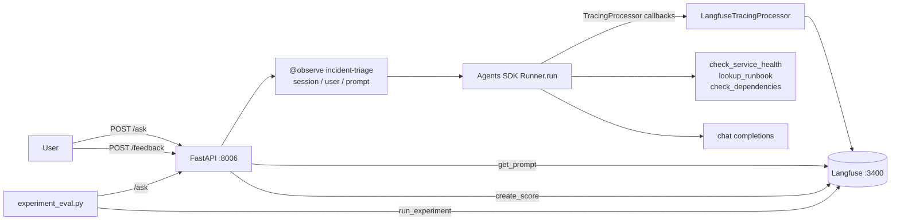

# Langfuse + OpenAI Agents: evaluation, not telemetry

## Context: from OpenLIT to Langfuse

Experiments 6 and 7 ran the same incident-triage agent through OpenLLMetry and
then OpenLIT, and the question each time was *which metrics show up*. OpenLIT won
that round: workflow, agent, tool and chat operations, plus TTFT and cost in USD.

This experiment keeps the agent identical — `src/agent.py` is byte-for-byte the
same file as in `openlit_openai_agents` — and swaps in **Langfuse, on its own**.
No OpenLIT, no OpenLLMetry, no OTel collector gateway. `langfuse` is the only
observability dependency in [`pyproject.toml`](pyproject.toml).

That constraint surfaces two things immediately:

1. **Langfuse has no auto-instrumentor for the OpenAI Agents SDK.** Its docs point
   you at third-party OTel instrumentors — which are experiments 6 and 7. To keep
   this arm pure we go through the Agents SDK's *own* tracing interface instead
   and translate its spans into Langfuse observations ourselves.
2. **Langfuse has no metrics store.** No histograms, no PromQL, no Alertmanager
   path. Every dashboard panel from experiments 5–7 is unavailable here.

**The finding:** Langfuse is strictly worse than OpenLIT at "is the agent slow or
expensive right now", costs real integration effort on the Agents SDK, and is the
only one of the three that can answer "is the agent any *good*, and did my last
change make it worse". Those are different jobs. See the
[model-swap case study](#case-study-prompt-iteration-after-a-model-swap) and
the [three-way comparison](#the-three-way-comparison).

## How it is instrumented

| Layer | What it covers | Mechanism |
|---|---|---|
| Spans | agent, tool, generation, handoff, guardrail | Agents SDK `TracingProcessor` → Langfuse observations, [`src/langfuse_tracing.py`](src/langfuse_tracing.py) |
| Trace root | request boundary, session, user, prompt link | `@observe` + `propagate_attributes`, [`app.py`](app.py) |
| Not-telemetry | prompt versions, scores, datasets, experiments | `langfuse` REST client, [`src/langfuse_native.py`](src/langfuse_native.py) |
| Metrics | — | **nothing.** Langfuse has nowhere to put them |

### The span bridge

`set_trace_processors([LangfuseTracingProcessor()])` replaces the processor the
Agents SDK would otherwise use to upload traces to OpenAI's own dashboard. After
that call nothing leaves for OpenAI, and every span the SDK emits arrives as a
callback we translate.

The translation is close to 1:1, because Langfuse's observation types line up
with the SDK's span-data classes:

| Agents SDK `span_data` | Langfuse `as_type` | Carries |
|---|---|---|
| `AgentSpanData` | `agent` | agent name, tools, handoffs, output type |
| `FunctionSpanData` | `tool` | tool name, input args, return value |
| `GenerationSpanData` | `generation` | model, messages, `model_config`, token usage |
| `ResponseSpanData` | `generation` | Responses-API equivalent |
| `GuardrailSpanData` | `guardrail` | name, whether it triggered |
| `HandoffSpanData` | `span` | from-agent → to-agent |

Parenting is explicit, not context-based. The SDK tracks its hierarchy through
`span.parent_id`, which has no relationship to the OTel context Langfuse would
otherwise use, so the processor keeps an id → observation map and creates each
child off its resolved parent.

Two honest caveats about the bridge:

- **Timings come from when the callbacks fire**, not from the SDK's recorded `started_at`/`ended_at`, because Langfuse's `start_observation()` takes no start-time argument. The callbacks are synchronous with span start and end, so the gap is callback overhead — fine for comparing latency, not for sub-millisecond work.
- **It is ~200 lines you now own.** `openlit.init()` is one line. This is the single biggest hidden cost of the Langfuse-only path and it does not show up in any feature matrix.

## Flow



One backend, one arrow. Compare with experiments 5–7, where telemetry fans out
through the collector gateway to a swappable sink — there is no gateway here at
all, and that is the coupling cost discussed below.

## Expected trace

| # | Observation | Type | Parent | Source | What it tells you | Sample fields |
|---|---|---|---|---|---|---|
| 1 | `incident-triage` | span | — | `@observe` | Request boundary, session/user/prompt attribution | `session_id`, `user_id`, `tags`, linked prompt version |
| 2 | `Agent workflow` | chain | 1 | SDK `on_trace_start` | The whole `Runner.run()` | workflow name, metadata |
| 3 | `incident-triage-agent` | agent | 2 | `AgentSpanData` | One agent invocation | `tools`, `handoffs`, `output_type` |
| 4 | `generation` | generation | 3 | `GenerationSpanData` | Model call | `model`, messages, `usage_details` |
| 5 | `check_service_health` | tool | 3 | `FunctionSpanData` | Tool call and its return value | `input`, `output` |
| 6 | `check_dependencies` | tool | 3 | `FunctionSpanData` | Tool with simulated latency | `input`, `output` |
| 7 | `generation` | generation | 3 | `GenerationSpanData` | Subsequent turn | `usage_details` |

Because observations 4 and 7 are typed `generation`, Langfuse computes token
counts and **cost per trace** from them, and renders the prompt and completion
inline. That is Langfuse doing the arithmetic in the backend rather than the
instrumentor doing it in-process, which is why cost shows up here without
OpenLIT's `gen_ai.usage.cost` metric.

## Case study

The screenshot-backed walkthrough lives in
[Model swap case study: prompt iteration with Langfuse](docs/model_swap_case_study.md).
It follows `gpt-4.1 + prompt v1` scoring well, `qwen3.6 + prompt v1` returning an
empty user-facing output even though the generation contained reasoning, and
`qwen3.6 + prompt v2` recovering after the output contract was fixed in Langfuse.

## Attributes

### On the trace root, from `propagate_attributes`

These stamp every observation created inside the block, including the ones the
bridge creates from SDK callbacks.

| Attribute | Example | What it enables |
|---|---|---|
| `session_id` | `triage-a1b2c3d4` | Sessions view stitches multi-question conversations |
| `user_id` | `demo-user`, `eval-harness` | Per-user filtering and cost attribution |
| `tags` | `["agent", "incident-triage"]` | Filtering in the trace list |
| `trace_name` | `incident-triage` | Stable grouping in the UI |
| `prompt` | `incident-triage-instructions` v3 | Links the run to the prompt version that produced it |

### On observations, from the bridge

| Field | Set from | Example |
|---|---|---|
| `model` | `GenerationSpanData.model` | `gpt-4o-mini` |
| `model_parameters` | `GenerationSpanData.model_config` | temperature, top_p |
| `usage_details` | `GenerationSpanData.usage` | `{"input": 418, "output": 96}` |
| `input` / `output` | `FunctionSpanData.input` / `.output` | tool args / return JSON |
| `level` + `status_message` | `span.error` | `ERROR`, exception message |

### Scores (no OTel equivalent at all)

| Score | Type | Set by | What it tells you |
|---|---|---|---|
| `user-feedback` | BOOLEAN | `POST /feedback` with `helpful` | Human thumbs up/down on a run |
| `user-rating` | NUMERIC | `POST /feedback` with `value` | Graded 0..1 rating |
| `names-service` | NUMERIC | `experiment_eval.py` | Did the report name the affected service |
| `traces-dependency` | NUMERIC | `experiment_eval.py` | Did it follow the dependency chain |
| `cites-evidence` | NUMERIC | `experiment_eval.py` | Did it quote telemetry rather than assert |
| `concise` | NUMERIC | `experiment_eval.py` | Report under 300 words |

Scores attach by trace ID, which is why `/ask` returns a `trace_id` and
`/feedback` takes one.

## Metrics dashboard

**There isn't one, and that is the finding.** Langfuse stores no metrics, so this
experiment ships no dashboard JSON — the only experiment in the repo that
doesn't. `make metrics` and `make dashboard` don't exist here; `make traces`
replaces them.

Langfuse's built-in dashboards aggregate *traces and scores* rather than metrics:
cost over time, average score by name, latency percentiles by model, tokens by
user. Useful, but not importable as code, not alertable, not PromQL. Treat them as
an exploration surface, not a monitoring one.

If you want both, run a metrics sink next to Langfuse and point a *different*
experiment at the gateway:

```bash
cd ../../infra
make up SINK=grafana     # metrics, logs, alerting for experiments 5-7
make langfuse-up         # traces, prompts, scores, datasets for this one
```

## Failure modes

| # | Failure mode | Why? | How? | Where? | What? |
|---|---|---|---|---|---|
| 1 | Slow tool | One tool dominates latency | Compare child observation durations | a trace's tree | `tool` observation duration |
| 2 | Slow model | Provider degradation | Same, on generations | a trace's tree | `generation` duration |
| 3 | Token/cost spike | Prompt or loop blowup | Cost per trace, cost over time | Langfuse Dashboards | `usage_details` → computed cost |
| 4 | Runaway turns | Agent loops until `max_turns` | Count generations in the tree | a trace's tree | number of `generation` observations |
| 5 | Tool failure | Tool raises | Filter observations by level | trace list, filtered | `level=ERROR` + `status_message` |
| 6 | **Agent answers badly without erroring** | Nothing fires; latency and cost are normal | Human scores, then LLM-as-a-judge on live traces | Scores, Evaluators | `user-feedback` |
| 7 | **A prompt edit regressed quality** | New instructions, worse reports | Group traces by linked prompt version, compare scores | Prompts → version | linked prompt + scores |
| 8 | **A model swap regressed quality** | Cheaper model, worse triage | Run the dataset twice, diff | Datasets → Runs | all four evaluators |
| 9 | **Agent stops following the dependency chain** | Reports look fine but skip the root cause | Evaluator asserts the dependency is named | Datasets → Runs | `traces-dependency` |
| 10 | Bad answers for one user only | Averages hide it | Filter traces by user | Users | `user_id` |
| 11 | Broken multi-turn flow | Turn 2 contradicts turn 1 | Replay the conversation | Sessions | `session_id` |
| 12 | Langfuse itself is down | Observability outage | `fetch_prompt()` falls back to hardcoded instructions | app logs | `status=prompt_fetch_failed falling_back=true` |
| 13 | **Latency SLO / alerting** | — | **Not detectable.** No metrics, no percentiles, no alert rules | — | needs a second backend |
| 14 | **Error-rate SLO** | — | **Not detectable.** Per-trace error flags only | — | needs a second backend |

Rows 1–5 are detectable but only **per trace** — you can see that *this* run was
slow, not that p95 crossed a threshold. Rows 6–11 are new and are the reason to
run this experiment. Rows 13–14 are hard regressions against experiments 5–7.

## The three-way comparison

Same agent, same tools, same dependency graph, same `max_turns=3`, three
observability stacks.

### Setup cost

| | OpenLLMetry (exp 6) | OpenLIT (exp 7) | Langfuse (this) |
|---|---|---|---|
| Instrumentation code | `Traceloop.init()` | `openlit.init()` | ~200-line `TracingProcessor` bridge you maintain |
| Agent code changes | none | none | none (`clone()` for the managed prompt) |
| Backend deps | collector + any OTel sink | collector + any OTel sink | Langfuse (Postgres + ClickHouse + Redis + MinIO) |
| App knows the backend | no | no | **yes** |

### Coverage

| Capability | OpenLLMetry | OpenLIT | Langfuse |
|---|---|---|---|
| Agent / tool / model spans | Yes | Yes | Yes (via the bridge) |
| Prompt + completion text readable | Optional | Optional | Yes, first-class |
| Token usage visible | Yes | Yes | Yes |
| Cost | No | Yes (metric) | Yes (per trace, backend-computed) |
| `invoke_workflow` duration **metric** | No | Yes | **No** |
| `execute_tool` duration **metric** | No | Yes | **No** |
| Time to first token | No | Yes | No |
| PromQL / alerting on GenAI signals | Yes | Yes | **No** |
| Latency percentiles | Yes | Yes | Per-model charts only, not alertable |
| Logs | Yes (gateway) | Yes (gateway) | **No** |
| Session grouping of multi-turn runs | No | No | Yes |
| Per-user attribution | No | No | Yes |
| Prompt versioning, trace ↔ version link | No | No | Yes |
| Human feedback scores | No | No | Yes |
| LLM-as-a-judge on production traces | No | No | Yes |
| Datasets + repeatable experiment runs | No | No | Yes |
| Regression diff between two runs | No | No | Yes |
| Sink-agnostic app code | Yes | Yes | **No** |

The table splits cleanly in half. Everything above "Session grouping" is
monitoring, and Langfuse loses or ties. Everything below is evaluation, and
Langfuse is the only one that has any of it.

### What each is actually for

**OpenLLMetry** is the weakest arm for agents, for the reason experiment 6
documented: the Agents instrumentor allocates workflow and tool duration
instruments but never calls `.record()`, so those panels stay empty and you close
the latency gap by opening a trace. It does emit
`gen_ai.client.generation.choices`, a decent proxy for tool-calling behaviour, and
it threads distributed tracing through Bifrost cleanly.

**OpenLIT** is the best pure-monitoring answer. Every latency, token and cost
question is answerable from metrics without opening a trace — what you want on a
dashboard someone watches at 3am. One line to install. It tells you nothing about
whether the agent is correct.

**Langfuse** is an evaluation tool that also stores traces. Sessions, prompt
versioning, scores, LLM-as-a-judge, datasets and run diffs have no equivalent in
either of the others, and they are what you need when the agent is *up, fast,
cheap, and wrong*. For an agent that matters more than it would for a plain RAG
endpoint: "up and fast" is table stakes, and "correct" is the actual product risk.

### The three real costs

**1. No metrics, no alerts.** Not something you can instrument around. Anything
resembling an SLO needs a second backend.

**2. The app stops being sink-agnostic.** Every other experiment sends OTLP to
`:4418` and knows nothing about the backend — AGENTS.md principle 1. This one
imports `langfuse`, calls `get_prompt()` on the request path, and installs a
Langfuse-specific trace processor. Swapping Langfuse out means deleting code, not
editing a collector config.

That coupling isn't avoidable by being cleverer. You *can* keep an app pure and
route traces through the gateway with `make up SINK=langfuse` — any of the other
seven experiments will land traces in Langfuse with zero code changes. What you
get that way is traces only: no prompt linkage, no scores, no datasets. The
features *are* the coupling.

**3. You own the instrumentation.** No Agents SDK auto-instrumentor means the
bridge is yours to maintain against two moving APIs. It is the cost least visible
in a feature comparison and the one most likely to bite on an upgrade.

### Recommendation

| If you need | Use |
|---|---|
| Dashboards and alerts on agent latency, tokens, cost | OpenLIT → gateway → Grafana/SigNoz |
| To know whether answer quality regressed after a change | Langfuse |
| Both — the usual honest answer for an agent in production | OpenLIT to the gateway **and** spans to Langfuse, accepting two backends |
| One vendor, already on Traceloop | OpenLLMetry, accepting the workflow/tool metric gap |

Do not read this as "Langfuse replaces OpenLIT". It replaces the part of your
workflow that is currently a spreadsheet of hand-checked answers.

## Usage

Start Langfuse:

```bash
cd ../../infra
make langfuse-up
make langfuse-keys        # prints the credentials for .env
```

Then the app:

```bash
cd ../experiments/langfuse_openai_agents
cp .env.example .env
# Set OPENAI_API_KEY (and OPENAI_BASE_URL if going through Bifrost)

make up
make langfuse-health      # confirm Langfuse is reachable before generating load
```

Generate traffic:

```bash
make auth-ask           # 2 turns - no dependencies
make payments-ask       # 3 turns - checks ledger
make catalog-ask        # 3 turns - checks search-index, inventory
make checkout-ask       # 4 turns - hits max_turns=3, gets cut off
make random-ask         # random service each time
make session-ask        # two questions sharing one session_id
make traces             # confirm spans landed
```

Then the Langfuse-only features:

```bash
make feedback           # ask, then score the returned trace_id thumbs-up
make eval               # run the dataset and upload scored results
```

Verify from `infra/`:

```bash
make check-langfuse     # health, key validity, ingested trace count
```

### Where to look

| What | Where |
|---|---|
| Nested agent trace, readable prompts, per-trace cost | Langfuse → Tracing → a trace |
| Multi-question conversation | Langfuse → Sessions (after `make session-ask`) |
| Editable agent instructions | Langfuse → Prompts → `incident-triage-instructions` |
| Thumbs-up score on a run | the trace from `make feedback` |
| Run-over-run quality diff | Langfuse → Datasets → `agent-triage-qa` → Runs |

### Proving the eval loop works

Regression detection is the whole point, so exercise it:

```bash
make eval                                    # baseline run
# edit the prompt in Langfuse -> Prompts, save a new production version
make eval                                    # second run
```

Both runs appear under **Datasets → agent-triage-qa → Runs** with per-evaluator
scores side by side. If `traces-dependency` drops, the new instructions stopped
the agent from following the dependency chain — a regression that is completely
invisible in every other experiment here.

## Gotchas

- **`host.docker.internal`, not `localhost`:** the app runs in a container; `LANGFUSE_HOST=http://localhost:3400` fails from inside one.
- **No metrics anywhere.** If you are looking for Prometheus panels, you want experiment 7. `make metrics` and `make dashboard` deliberately do not exist here.
- **401 from Langfuse:** keys are per-instance. Confirm with `cd ../../infra && make langfuse-keys`. The app logs `status=langfuse_auth_failed` at startup rather than crashing, so traces go missing silently — check the logs.
- **`set_trace_processors` replaces, not appends.** That is intentional: the default processor uploads to OpenAI's dashboard. If you switch to `add_trace_processor`, you will start shipping traces to OpenAI too.
- **Prompts and completions are sent to Langfuse.** Fine for this synthetic agent; think before pointing it at anything carrying real user data.
- **Prompt fetch is on the request path.** SDK-cached, and `fetch_prompt()` falls back to the hardcoded instructions if Langfuse is unreachable, but it is a dependency `agent.py` alone does not have.
- **`agent.py` is intentionally unmodified** — byte-identical to experiments 6 and 7, so the comparison stays fair. The managed prompt is applied with `agent.clone(instructions=...)` in `app.py`.
- **Short-lived processes must flush.** The SDK buffers in a background thread; the app flushes on shutdown and `experiment_eval.py` flushes before exit.
