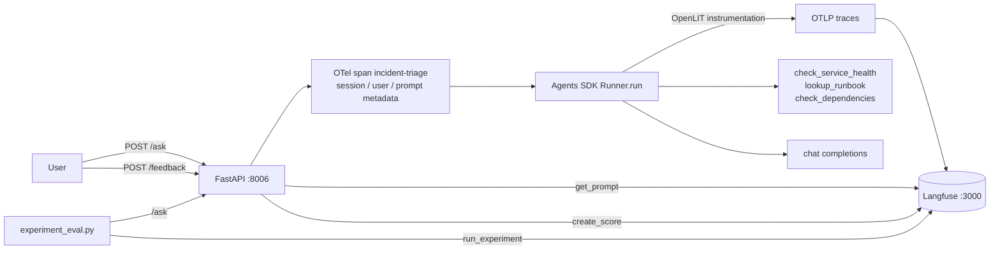

# OpenLIT + Langfuse + OpenAI Agents

## Context: OpenLIT traces, Langfuse workflows

Experiments 6 and 7 ran the same incident-triage agent through OpenLLMetry and
then OpenLIT, and the question each time was *which metrics show up*. OpenLIT won
that round: workflow, agent, tool and chat operations, plus TTFT and cost in USD.

This experiment keeps the agent identical — `src/agent.py` is byte-for-byte the
same file as in `openlit_openai_agents` — and sends **OpenLIT traces directly to
Langfuse**. There is no OTel collector gateway in this experiment: the app is
intentionally coupled to Langfuse so it can also use prompts, scores, datasets
and experiments.

That setup surfaces two things immediately:

1. **OpenLIT owns the Agents SDK instrumentation.** It exports OTLP traces
   straight to Langfuse's `/api/public/otel` endpoint.
2. **Langfuse has no metrics store.** OpenLIT metrics are disabled here because
   there is nowhere useful to send them in Langfuse. No histograms, no PromQL, no Alertmanager
   path. Every dashboard panel from experiments 5–7 is unavailable here.

**The finding:** direct OpenLIT-to-Langfuse keeps Langfuse's evaluation workflow,
but it still does not give you Prometheus metrics or alerting. Langfuse remains
the place to answer "is the agent any *good*, and did my last change make it
worse". See the
[model-swap case study](docs/model_swap_case_study.md) and the
[three-way comparison](docs/three_way_comparison.md).

## How it is instrumented

| Layer | What it covers | Mechanism |
|---|---|---|
| Spans | agent, tool, generation, handoff, guardrail | `openlit.init()` exporting OTLP directly to Langfuse, [`src/instrument.py`](src/instrument.py) |
| Trace root | request boundary, session, user, prompt metadata | manual OTel span around `Runner.run()`, [`app.py`](app.py) |
| Not-telemetry | prompt versions, scores, datasets, experiments | `langfuse` REST client, [`src/langfuse_native.py`](src/langfuse_native.py) |
| Metrics | — | disabled; Langfuse has nowhere to put OpenLIT metric streams |

### OpenLIT direct export

[`src/instrument.py`](src/instrument.py) builds the Langfuse OTLP endpoint from
`LANGFUSE_HOST`, passes HTTP Basic auth from the Langfuse public/secret keys via
`otlp_headers`, and calls `openlit.init(...)` before the agent module is
imported. That gives the app OpenLIT's Agents SDK spans in Langfuse.

## Flow



One backend, one telemetry arrow. Compare with experiments 5–7, where telemetry
fans out through the collector gateway to a swappable sink — there is no gateway
here, and that is the coupling cost discussed below.

## Expected trace

| # | Observation | Type | Parent | Source | What it tells you | Sample fields |
|---|---|---|---|---|---|---|
| 1 | `incident-triage` | span | — | manual OTel span | Request boundary, session/user/prompt metadata | `session.id`, `user.id`, `input.value`, `output.value` |
| 2 | agent workflow span | span | 1 | OpenLIT | The whole `Runner.run()` | workflow/span kind, service name |
| 3 | `incident-triage-agent` | span | 2 | OpenLIT | One agent invocation | agent name, tools |
| 4 | model generation | span | 3 | OpenLIT | Model call | model, prompt/completion when enabled, token usage |
| 5 | `check_service_health` | span | 3 | OpenLIT | Tool call | tool name, input/output |
| 6 | `check_dependencies` | span | 3 | OpenLIT | Tool with simulated latency | tool name, duration |
| 7 | model generation | span | 3 | OpenLIT | Subsequent turn | token usage |

Because OpenLIT emits GenAI attributes on the model spans, Langfuse can render
LLM trace details from the OTLP payload. OpenLIT's metric instruments are still
disabled in this experiment because Langfuse does not store metric streams.

## Case study

The screenshot-backed walkthrough lives in
[Model swap case study: prompt iteration with Langfuse](docs/model_swap_case_study.md).
It follows `gpt-4.1 + prompt v1` scoring well, `qwen3.6 + prompt v1` returning an
empty user-facing output even though the generation contained reasoning, and
`qwen3.6 + prompt v2` recovering after the output contract was fixed in Langfuse.

## Attributes

### On the trace root, from OTel attributes

These are set on the manual `incident-triage` span in `app.py`.

| Attribute | Example | What it enables |
|---|---|---|
| `session.id` | `triage-a1b2c3d4` | Session correlation metadata |
| `user.id` | `demo-user`, `eval-harness` | Per-user filtering metadata |
| `langfuse.tags` | `agent,incident-triage` | Trace filtering metadata |
| `langfuse.trace.name` | `incident-triage` | Stable trace grouping metadata |
| `langfuse.prompt.name` | `incident-triage-instructions` | Prompt version context |

### On observations, from OpenLIT

| Field | Set from | Example |
|---|---|---|
| model attributes | OpenAI/Agents SDK calls | `gpt-4o-mini` |
| token usage attributes | provider response usage | input/output tokens |
| prompt/completion content | OpenLIT content capture | enabled by `OPENLIT_CAPTURE_MESSAGE_CONTENT=true` |
| tool span attributes | Agents SDK tool calls | tool args / return JSON |
| error status | exception or failed SDK span | `ERROR`, exception message |

### Scores (no OTel equivalent at all)

| Score | Type | Set by | What it tells you |
|---|---|---|---|
| `user-feedback` | BOOLEAN | `POST /feedback` with `helpful` | Human thumbs up/down on a run |
| `user-rating` | NUMERIC | `POST /feedback` with `value` | Graded 0..1 rating |
| `names-service` | NUMERIC | `experiment_eval.py` | Did the report name the affected service |
| `traces-dependency` | NUMERIC | `experiment_eval.py` | Did it follow the dependency chain |
| `cites-evidence` | NUMERIC | `experiment_eval.py` | Did it quote telemetry rather than assert |
| `concise` | NUMERIC | `experiment_eval.py` | Report under 300 words |

Scores attach by trace ID, which is why `/ask` returns a `trace_id` and
`/feedback` takes one.

## Metrics dashboard

**There isn't one, and that is the finding.** Langfuse stores no metrics, so this
experiment ships no dashboard JSON — the only experiment in the repo that
doesn't. `make metrics` and `make dashboard` don't exist here; `make traces`
replaces them.

Langfuse's built-in dashboards aggregate *traces and scores* rather than metrics:
cost over time, average score by name, latency percentiles by model, tokens by
user. Useful, but not importable as code, not alertable, not PromQL. Treat them as
an exploration surface, not a monitoring one.

If you want both, run a metrics sink next to Langfuse and point a *different*
experiment at the gateway:

```bash
cd ../../infra
make up SINK=grafana     # metrics, logs, alerting for experiments 5-7
make langfuse-up         # traces, prompts, scores, datasets for this one
```

## Failure modes

| # | Failure mode | Why? | How? | Where? | What? |
|---|---|---|---|---|---|
| 1 | Slow tool | One tool dominates latency | Compare child observation durations | a trace's tree | `tool` observation duration |
| 2 | Slow model | Provider degradation | Same, on generations | a trace's tree | `generation` duration |
| 3 | Token/cost spike | Prompt or loop blowup | Cost per trace, cost over time | Langfuse Dashboards | `usage_details` → computed cost |
| 4 | Runaway turns | Agent loops until `max_turns` | Count generations in the tree | a trace's tree | number of `generation` observations |
| 5 | Tool failure | Tool raises | Filter observations by level | trace list, filtered | `level=ERROR` + `status_message` |
| 6 | **Agent answers badly without erroring** | Nothing fires; latency and cost are normal | Human scores, then LLM-as-a-judge on live traces | Scores, Evaluators | `user-feedback` |
| 7 | **A prompt edit regressed quality** | New instructions, worse reports | Group traces by linked prompt version, compare scores | Prompts → version | linked prompt + scores |
| 8 | **A model swap regressed quality** | Cheaper model, worse triage | Run the dataset twice, diff | Datasets → Runs | all four evaluators |
| 9 | **Agent stops following the dependency chain** | Reports look fine but skip the root cause | Evaluator asserts the dependency is named | Datasets → Runs | `traces-dependency` |
| 10 | Bad answers for one user only | Averages hide it | Filter traces by user | Users | `user_id` |
| 11 | Broken multi-turn flow | Turn 2 contradicts turn 1 | Replay the conversation | Sessions | `session_id` |
| 12 | Langfuse itself is down | Observability outage | `fetch_prompt()` falls back to hardcoded instructions | app logs | `status=prompt_fetch_failed falling_back=true` |
| 13 | **Latency SLO / alerting** | — | **Not detectable.** No metrics, no percentiles, no alert rules | — | needs a second backend |
| 14 | **Error-rate SLO** | — | **Not detectable.** Per-trace error flags only | — | needs a second backend |

Rows 1–5 are detectable but only **per trace** — you can see that *this* run was
slow, not that p95 crossed a threshold. Rows 6–11 are new and are the reason to
run this experiment. Rows 13–14 are hard regressions against experiments 5–7.

## The three-way comparison

The full OpenLLMetry vs OpenLIT vs Langfuse breakdown lives in
[Three-way comparison: OpenLLMetry vs OpenLIT vs Langfuse](docs/three_way_comparison.md).

## Prerequisites

- **Docker and Docker Compose.** The agent API and eval runner both run in
  containers.
- **Self-hosted Langfuse from `infra/`.** Start it with `make langfuse-up`.
  This experiment sends OpenLIT OTLP traces directly to Langfuse and uses the
  Langfuse SDK for prompts, scores and datasets.
- **`.env` copied from `.env.example`.** The example Langfuse keys match a fresh
  local stack. Run `cd ../../infra && make langfuse-keys` if the stack has been
  recreated or keys changed.
- **An OpenAI-compatible model endpoint.** This experiment does not include a
  mock model. Configure one of:
  - Direct OpenAI: `OPENAI_API_KEY=sk-...`, `OPENAI_MODEL=gpt-4o-mini`, optional
    `OPENAI_AGENTS_API=responses`.
  - Bifrost: `OPENAI_API_KEY=<bifrost-virtual-key>`,
    `OPENAI_BASE_URL=http://host.docker.internal:8000/v1`,
    `OPENAI_AGENTS_API=chat_completions`, and a model Bifrost can route.
  - Another OpenAI-compatible provider: set `OPENAI_API_KEY`, `OPENAI_BASE_URL`
    with the `/v1` path, `OPENAI_MODEL`, and `OPENAI_AGENTS_API=chat_completions`.
- **`python3` on the host** for the Makefile targets that pipe responses through
  `python3 -m json.tool`.

## Usage

Start Langfuse:

```bash
cd ../../infra
make langfuse-up
make langfuse-keys        # prints the credentials for .env
```

Then the app:

```bash
cd ../experiments/langfuse_openai_agents
cp .env.example .env
# Edit .env:
# - keep LANGFUSE_HOST=http://host.docker.internal:3000 for the container
# - set OPENAI_API_KEY and OPENAI_MODEL
# - set OPENAI_BASE_URL only when using Bifrost or another compatible gateway

make up
make langfuse-health      # confirm Langfuse is reachable before generating load
make health               # confirm the agent API is reachable on :8006
```

Generate traffic:

```bash
make auth-ask           # 2 turns - no dependencies
make payments-ask       # 3 turns - checks ledger
make catalog-ask        # 3 turns - checks search-index, inventory
make checkout-ask       # 4 turns - hits max_turns=3, gets cut off
make random-ask         # random service each time
make session-ask        # two questions sharing one session_id
make traces             # confirm spans landed
```

Then the Langfuse-only features:

```bash
make feedback           # ask, then score the returned trace_id thumbs-up
make eval               # run the dataset and upload scored results
```

Verify from `infra/`:

```bash
make check-langfuse     # health, key validity, ingested trace count
```

Open the Langfuse UI at http://localhost:3000. The bootstrapped local login is
`local@example.com` / `localpassword`.

### Where to look

| What | Where |
|---|---|
| Nested agent trace, readable prompts, per-trace cost | Langfuse → Tracing → a trace |
| Multi-question conversation | Langfuse → Sessions (after `make session-ask`) |
| Editable agent instructions | Langfuse → Prompts → `incident-triage-instructions` |
| Thumbs-up score on a run | the trace from `make feedback` |
| Run-over-run quality diff | Langfuse → Datasets → `agent-triage-qa` → Runs |

### Proving the eval loop works

Regression detection is the whole point, so exercise it:

```bash
make eval                                    # baseline run
# edit the prompt in Langfuse -> Prompts, save a new production version
make eval                                    # second run
```

Both runs appear under **Datasets → agent-triage-qa → Runs** with per-evaluator
scores side by side. If `traces-dependency` drops, the new instructions stopped
the agent from following the dependency chain — a regression that is completely
invisible in every other experiment here.

## Gotchas

- **`host.docker.internal`, not `localhost`:** the app runs in a container; `LANGFUSE_HOST=http://localhost:3000` fails from inside one.
- **No metrics anywhere.** If you are looking for Prometheus panels, you want experiment 7. `make metrics` and `make dashboard` deliberately do not exist here.
- **401 from Langfuse:** keys are per-instance. Confirm with `cd ../../infra && make langfuse-keys`. The app logs `status=langfuse_auth_failed` at startup rather than crashing, so traces go missing silently — check the logs.
- **OpenLIT talks directly to Langfuse.** This experiment intentionally skips the repo gateway, so changing sinks means changing app config/code.
- **Prompts and completions are sent to Langfuse.** Fine for this synthetic agent; think before pointing it at anything carrying real user data.
- **Prompt fetch is on the request path.** SDK-cached, and `fetch_prompt()` falls back to the hardcoded instructions if Langfuse is unreachable, but it is a dependency `agent.py` alone does not have.
- **`agent.py` is intentionally unmodified** — byte-identical to experiments 6 and 7, so the comparison stays fair. The managed prompt is applied with `agent.clone(instructions=...)` in `app.py`.
- **Short-lived processes must flush.** The SDK buffers in a background thread; the app flushes on shutdown and `experiment_eval.py` flushes before exit.
