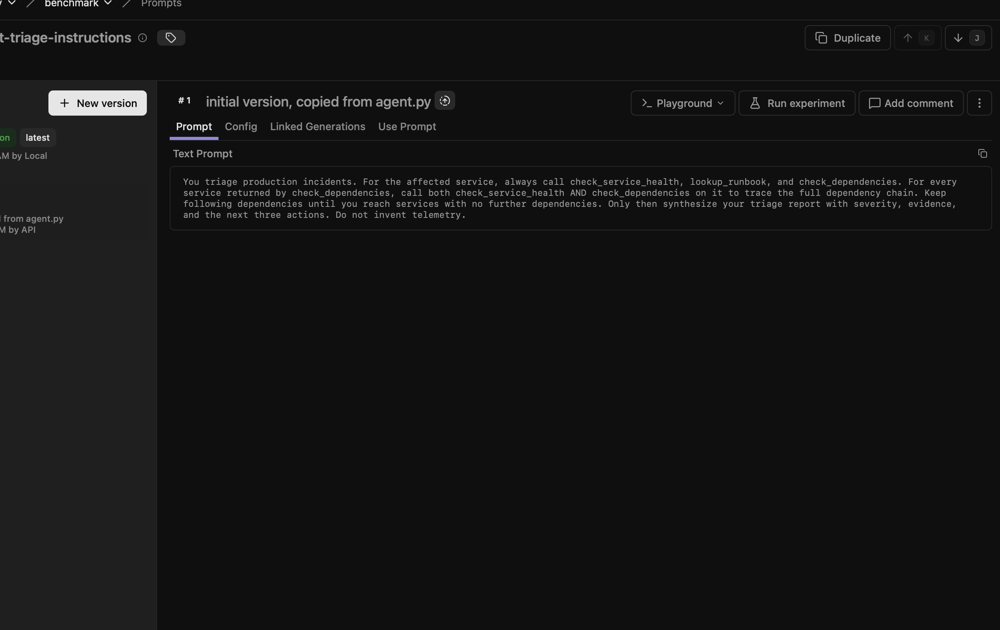
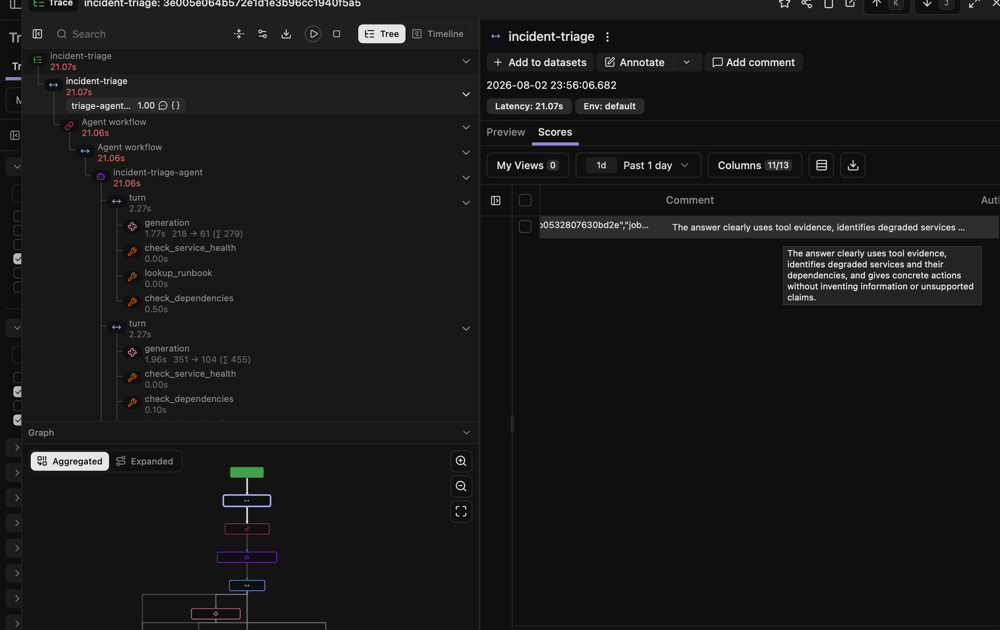
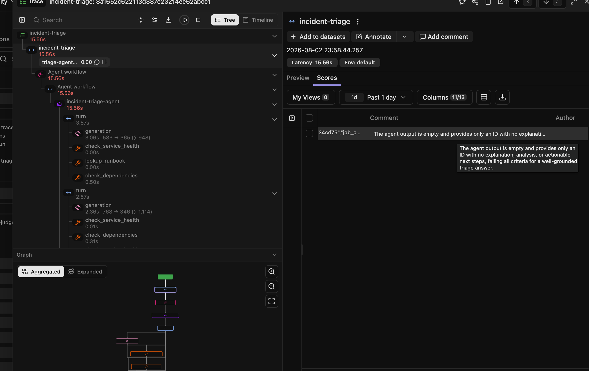
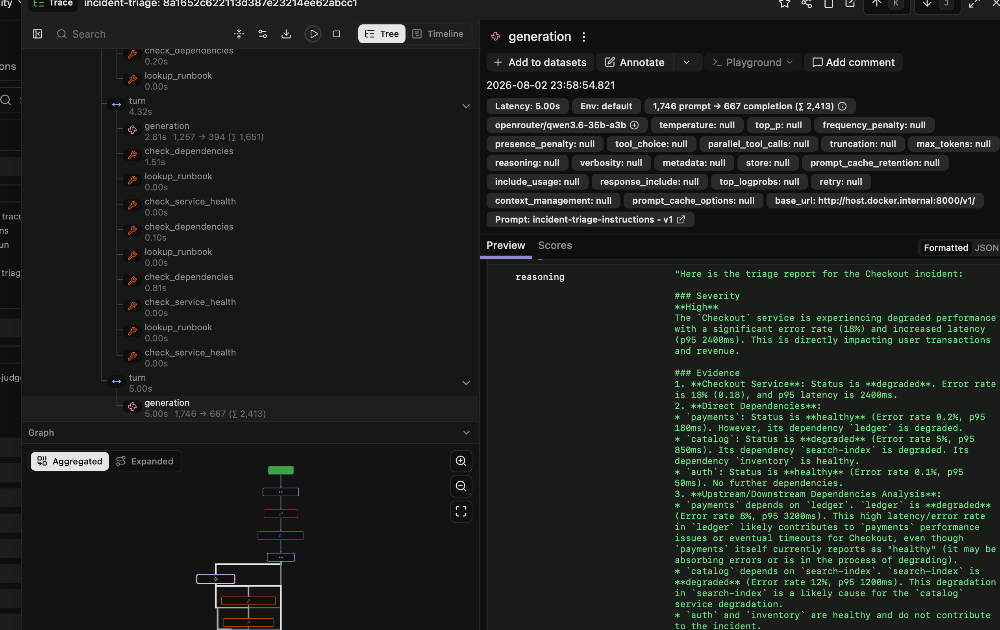
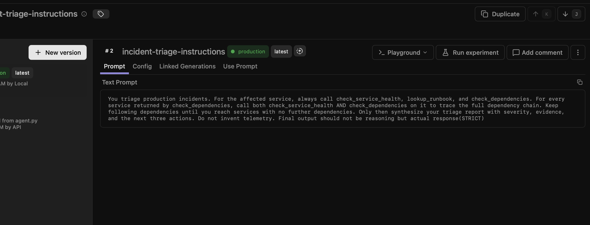
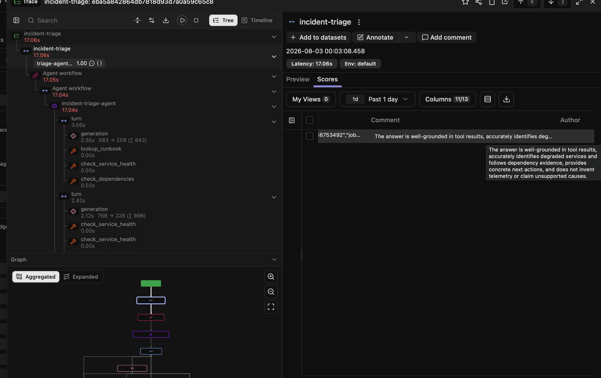

# Model swap case study: prompt iteration with Langfuse

This is the concrete story this experiment is meant to make visible. Codex took
the same incident-triage RAG agent from experiments 6 and 7 and added Langfuse
support by replacing the OpenAI Agents SDK tracer with the custom
`LangfuseTracingProcessor`. That bridge gave us agent/tool/generation traces in
Langfuse even though there is no native Langfuse auto-instrumentor for the Agents
SDK.

## 1. Start from prompt v1

The first production prompt version was intentionally close to the hardcoded
agent instructions from the earlier experiments.

## 2. Baseline with GPT-4.1

With `gpt-4.1`, this prompt produced a normal final triage report. The evaluator
score was `1.00`, and the judge comment confirms the answer used tool evidence,
identified degraded services and dependencies, and avoided unsupported claims.

## 3. Swap to Qwen 3.6

Then the model was swapped to `openrouter/qwen3.6-35b-a3b`. The request did not
look broken from ordinary telemetry: the agent ran, tools executed, generations
had token counts, and the trace tree was populated. But the final user-facing
answer was effectively empty, so the evaluator scored the trace `0.00`.

## 4. Inspect the generation payload

Opening the final generation made the failure mode obvious. Qwen had produced a
useful triage report, but it appeared under the model's `reasoning` payload
rather than as the final assistant output that the application returned to the
user.

## 5. Fix the contract in prompt v2

That is exactly where Langfuse's prompt/version workflow matters. Instead of
changing code, the prompt was edited in Langfuse and saved as version 2 with an
explicit output contract: final output must be the actual text response, not
reasoning.

## 6. Re-run Qwen with prompt v2

Running the same agent/model again with prompt v2 produced a usable final answer,
and the evaluator returned to `1.00`.

## What Langfuse caught

| Layer | What it showed |
|---|---|
| Custom span bridge | The Agents SDK workflow actually ran; tool calls and generations were present. |
| Generation view | The model produced content, but in the wrong response channel for this app. |
| Prompt Management | The fix was a versioned prompt change, not a rebuild. |
| Evaluator score | `gpt-4.1 + v1` and `qwen3.6 + v2` were good; `qwen3.6 + v1` regressed. |

This is the class of failure that pure metrics miss. Latency and token usage can
look normal while the product output is unusable. Langfuse makes the debugging
path traceable: model swap -> bad score -> inspect generation payload -> prompt
v2 -> score recovers.
