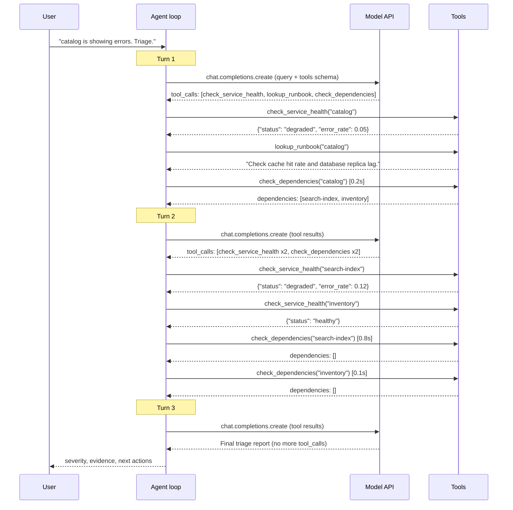
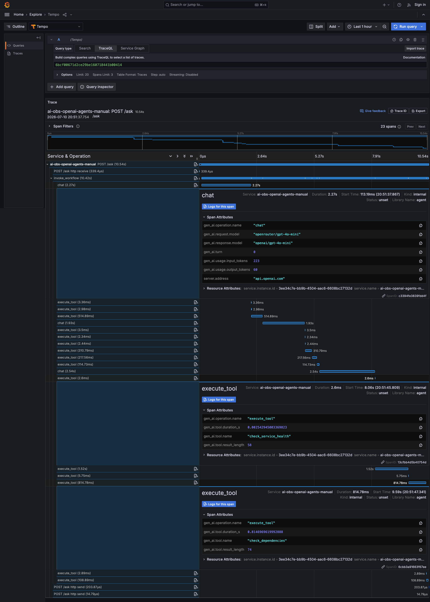
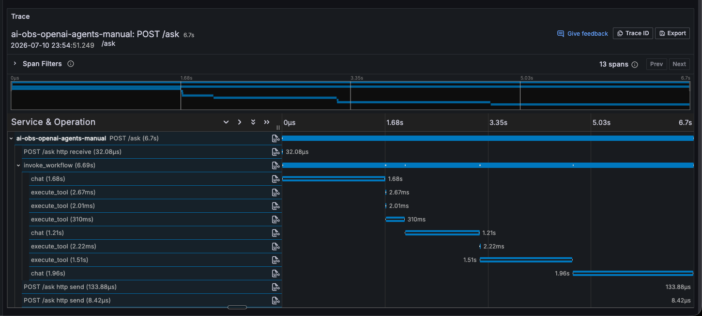
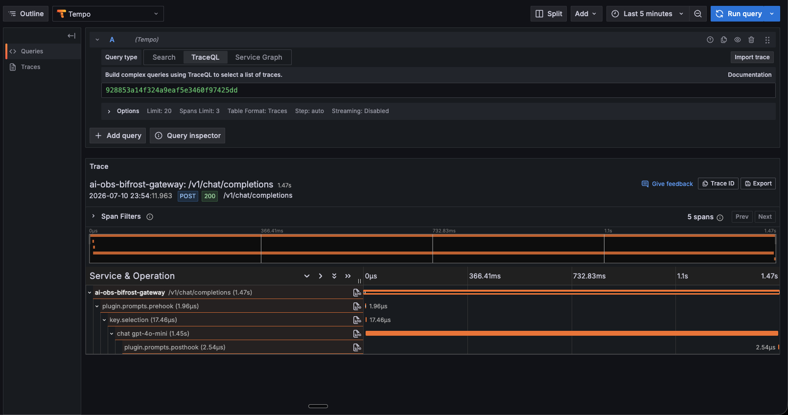
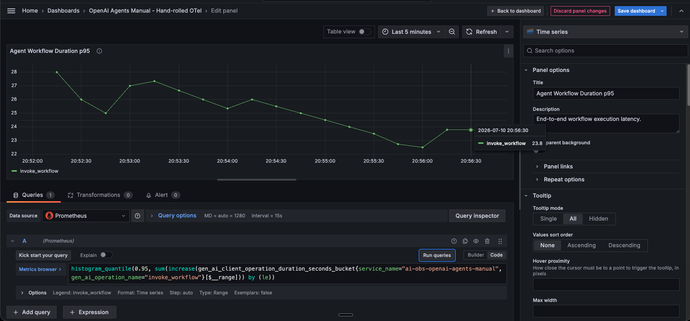
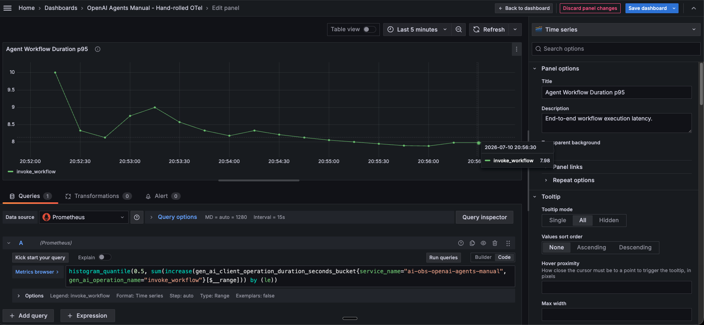
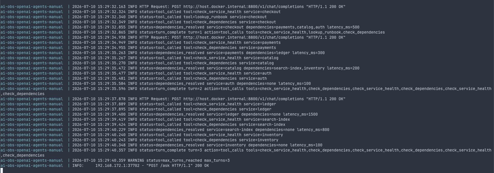

# Manual tool-loop agent with hand-rolled OTel

## Prerequisites

- **Docker and Docker Compose.** The agent runs in a container; `make build` then `make up`.
- **Shared infra up first:** `cd ../../infra && make up`.
  - Brings up the OTel collector gateway (OTLP on `host.docker.internal:4418`) and the selected sink.
  - For `make dashboard` and the workflow/tool/token panels, use a metrics-capable sink: `SINK=grafana`.
  - No pgvector needed — this is an agent tool loop, not a RAG pipeline, so there is no embedding or vector store.
- **`.env`** copied from `.env.example`, no hidden defaults:
  - `OPENAI_API_KEY` — a real provider key; the tool loop calls the model live. e.g. `OPENAI_API_KEY=your-openai-api-key`
  - `OPENAI_MODEL` — model the agent drives. e.g. `OPENAI_MODEL=openrouter/gpt-4o-mini`
  - `OPENAI_BASE_URL` — gateway base URL; set it (plus a Bifrost virtual key as `OPENAI_API_KEY`) to route through Bifrost. e.g. `OPENAI_BASE_URL=http://host.docker.internal:8800/v1`
  - `OTEL_SERVICE_NAME` — service name on emitted telemetry. e.g. `OTEL_SERVICE_NAME=ai-obs-openai-agents-manual`
  - `OTEL_EXPORTER_OTLP_ENDPOINT` — OTLP target; the agent sends to the gateway, never a sink directly. e.g. `OTEL_EXPORTER_OTLP_ENDPOINT=http://host.docker.internal:4418`
- **`python3` on the host** for the `make *-ask` / `make metrics` / `make dashboard` targets.

## Usage

```bash
cd ../../infra
make up

cd ../experiments/openai_agents_manual
cp .env.example .env
# Set OPENAI_API_KEY

make up
```

From another terminal:

```bash
make auth-ask           # 1 turn - no dependencies
make payments-ask       # 2 turns - checks ledger
make catalog-ask        # 3 turns - checks search-index, inventory
make checkout-ask       # 4+ turns - hits max_turns, gets cut off
make random-ask         # random service each time
make metrics
make dashboard
```

## Context: from RAG to agents

Experiments 1-4 instrument a **RAG pipeline** - embed a query, search a vector
database, pass retrieved context to a model, return an answer. The observable
steps are: embedding call, vector search, and generation call.

This experiment shifts to an **agentic pattern**. Instead of retrieving context
from a database, the model decides at runtime which **tools** (functions) to call,
inspects their results, and may loop multiple times before producing a final answer.

The observable steps change:

| RAG pipeline (experiments 1-4) | Agent tool loop (experiments 5-7) |
|---|---|
| Embedding call | Model call (decides which tools to use) |
| Vector search | Tool execution (e.g. check service health) |
| Generation call | Tool execution (e.g. lookup runbook) |
| - | Model call (synthesizes final answer) |
| Single pass, predictable | Multi-turn, model-driven |

New terminology for agent observability:

| Concept | What it means | Why you measure it |
|---|---|---|
| **Workflow** | The entire agent run from question to final answer | End-to-end SLO - "how long did the user wait?" |
| **Tool call** | A function the model chose to invoke (e.g. `check_service_health`) | Identify slow/failing external dependencies |
| **Model call** (chat) | A single round-trip to the LLM API | Provider latency, token cost per turn |
| **Turn** | One iteration of the loop: model call → tool calls → next model call | Detect runaway loops that inflate cost |

## What this experiment does

**The problem:** In an agent, the model controls the execution flow - it decides
which tools to call, how many times, and in what order. A simple request (auth)
completes in 1 turn. A complex request (checkout) triggers 4+ turns as the model
follows dependency chains, with slow tools like `ledger` (1.5s) dominating latency.

The agent has access to a service dependency graph with simulated latencies:

```
checkout (0.5s)
├── payments (0.3s)
│   └── ledger (1.5s)
├── catalog (0.2s)
│   ├── search-index (0.8s)
│   └── inventory (0.1s)
└── auth (0.1s)
```

When the user asks about catalog, the model follows the dependency chain (3 turns):



For checkout (4 turns), the model must also explore payments (-> ledger) and
auth before it can synthesize, which exceeds `max_turns=3` and gets cut off.

The code sets `max_turns=3`. Different services exercise different turn counts:

| Target | Service | Dependencies | Expected turns | Result |
|---|---|---|---|---|
| `make auth-ask` | auth | none | 2 | Checks auth, no deps to follow, synthesizes |
| `make payments-ask` | payments | ledger | 3 | Checks payments, then ledger, synthesizes |
| `make catalog-ask` | catalog | search-index, inventory | 3 | Checks catalog, then search-index and inventory, synthesizes |
| `make checkout-ask` | checkout | payments, catalog, auth | 4 | Checks checkout, then payments, catalog, auth, then ledger, search-index, inventory, hits max_turns=3, fails to synthesize |

If all you have is the HTTP-level
metric ("this request took 20 seconds"), you can't tell whether the bottleneck
is the model, a tool, or a runaway multi-turn loop.

**The solution in this experiment:** Build the tool loop by hand using the raw
OpenAI chat completions API, and wrap every step with manual OTel spans and
metrics. No Agents framework, no auto-instrumentation library - you write
both the loop and the instrumentation.

Because **you own the loop**, you can wrap every step with spans and metrics:

```python
with tracer.start_as_current_span("invoke_workflow"):
    while True:
        with tracer.start_as_current_span("chat"):
            response = await client.chat.completions.create(...)
            duration_histogram.record(elapsed, {"operation": "chat"})

        for call in response.tool_calls:
            with tracer.start_as_current_span("execute_tool"):
                result = dispatch(call)
                duration_histogram.record(elapsed, {"operation": "execute_tool"})
```

The result: **full observability** into every step of the agent loop because you
own the code that executes each step.

The tradeoff is effort: you write and maintain both the loop and the
instrumentation manually. The next experiments explore whether frameworks and
auto-instrumentation libraries can reproduce this visibility with less code.

## Expected trace

A checkout request (10.54s, 23 spans) showing the full dependency chain:



The trace shows what metrics cannot: the exact sequence and duration of each
operation within a single request. You can see which `chat` span was slow,
which `execute_tool` had high `gen_ai.tool.duration_s`, and how many turns
the model took before hitting max_turns or synthesizing.

Notice that tool calls execute sequentially - each `execute_tool` span starts
after the previous one ends. If tool latencies are high (real HTTP calls to
external services instead of in-memory lookups), this is where concurrent
dispatch via `asyncio.gather` would help. The trace would show overlapping
`execute_tool` spans instead of a waterfall, and total workflow duration would
drop to `max(tool latencies)` instead of `sum(tool latencies)` per turn.

### Agent trace vs Bifrost trace

When using Bifrost as the gateway, the app's trace and Bifrost's trace appear as
separate traces. This is because the `AsyncOpenAI` HTTP client doesn't include
the `traceparent` header in requests to the model API, so Bifrost has no way to
link its spans to your app's trace.

App trace - shows the agent loop (workflow, chat, tool spans):



Bifrost trace - shows the proxied model call (separate trace ID):



| # | Span | Parent | Duration | Source | What it tells you | Sample attributes |
|---|---|---|---|---|---|---|
| 1 | `POST /ask` | - | variable | FastAPI auto | End-to-end user latency | `http.target=/ask`, `http.status_code=200` |
| 2 | `invoke_workflow` | `POST /ask` | variable | Manual span | Total agent run including all turns | `gen_ai.operation.name=invoke_workflow`, `gen_ai.request.model` |
| 3 | `chat` | `invoke_workflow` | variable | Manual span | First model call (decides to use tools) | `gen_ai.usage.input_tokens`, `gen_ai.usage.output_tokens` |
| 4 | `execute_tool` | `invoke_workflow` | variable | Manual span | check_service_health call | `gen_ai.tool.name=check_service_health` |
| 5 | `execute_tool` | `invoke_workflow` | variable | Manual span | lookup_runbook call | `gen_ai.tool.name=lookup_runbook` |
| 6 | `chat` | `invoke_workflow` | variable | Manual span | Final synthesis turn | `gen_ai.response.model`, token usage |

## Span attributes

| Attribute | Example | What it tells you |
|---|---|---|
| `gen_ai.operation.name` | `invoke_workflow`, `chat`, `execute_tool` | Operation category |
| `gen_ai.request.model` | `gpt-4.1-mini` | Requested model |
| `gen_ai.response.model` | `gpt-4.1-mini-2025-04-14` | Actual model used |
| `gen_ai.usage.input_tokens` | `418` | Prompt tokens for this turn |
| `gen_ai.usage.output_tokens` | `96` | Generated tokens for this turn |
| `gen_ai.tool.name` | `lookup_runbook` | Which tool was called |
| `gen_ai.tool.result_length` | `87` | Tool response size |

## Metrics dashboard

Import `dashboards/dashboard.grafana.json` from Grafana's dashboard import UI.

For API import:

```bash
make dashboard
```

### Example: checkout workflow duration

After running `make checkout-ask` repeatedly, the workflow duration shows the
cost of deep dependency chains:

**p95 = 23.8s** - worst case, includes slow model responses + all tool sleeps:



**p50 = 7.98s** - typical case, still expensive due to 3 model calls + tool latency:



**Sample log** - one checkout request hitting max_turns=3 (15:29:32 to 15:29:40 = 8s):



The breakdown for this request: 3 model calls (~6s) + tool sleeps (0.5 + 0.3 +
0.2 + 0.1 + 1.5 + 0.8 + 0.1 = 3.5s) = ~9.5s total, with the p95/p50 gap
explained by variable model response times across requests.

| Panel | Metric | PromQL | What it tells you |
|---|---|---|---|
| Agent Workflow Duration p95 | `gen_ai.client.operation.duration` | `histogram_quantile(0.95, sum(increase(gen_ai_client_operation_duration_seconds_bucket{service_name="ai-obs-openai-agents-manual",gen_ai_operation_name="invoke_workflow"}[$__range])) by (le))` | Total agent run latency |
| Tool Execution Duration p95 | `gen_ai.client.operation.duration` | `histogram_quantile(0.95, sum(increase(gen_ai_client_operation_duration_seconds_bucket{service_name="ai-obs-openai-agents-manual",gen_ai_operation_name="execute_tool"}[$__range])) by (le))` | Tool latency |
| Model Call Duration p95 | `gen_ai.client.operation.duration` | `histogram_quantile(0.95, sum(increase(gen_ai_client_operation_duration_seconds_bucket{service_name="ai-obs-openai-agents-manual",gen_ai_operation_name="chat"}[$__range])) by (le, gen_ai_request_model))` | Provider latency |
| Token Usage | `gen_ai.client.token.usage` | `sum(increase(gen_ai_client_token_usage_sum{service_name="ai-obs-openai-agents-manual"}[$__range])) by (gen_ai_token_type, gen_ai_request_model)` | Token consumption |
| HTTP Requests | `http.server.duration` | `sum(increase(http_server_duration_milliseconds_count{service_name="ai-obs-openai-agents-manual",http_target="/ask"}[$__range])) by (http_status_code)` | Traffic volume |
| HTTP Request Duration p95 | `http.server.duration` | `histogram_quantile(0.95, sum(increase(http_server_duration_milliseconds_bucket{service_name="ai-obs-openai-agents-manual",http_target="/ask"}[$__range])) by (le))` | User-visible latency |

## Failure modes

| # | Failure mode | Why? | How? | Where? | What? |
|---|---|---|---|---|---|
| 1 | Slow conversation | Multiple model turns dominate total latency | Alert when workflow p95 exceeds threshold | Agent Workflow Duration p95 panel | `gen_ai_client_operation_duration_seconds{gen_ai_operation_name="invoke_workflow"}` |
| 2 | Slow tool | External tool dominates total latency | Alert when tool p95 exceeds threshold | Tool Execution Duration p95 panel | `gen_ai_client_operation_duration_seconds{gen_ai_operation_name="execute_tool"}` |
| 3 | Slow provider | Model calls dominate total latency | Compare model p95 with workflow p95 | Model Call Duration p95 panel | `gen_ai_client_operation_duration_seconds{gen_ai_operation_name="chat"}` |
| 4 | Token cost spike | Runaway context or loops increase spend | Alert when token rate exceeds budget | Token Usage panel | `gen_ai_client_token_usage{gen_ai_token_type="input\|output"}` |
| 5 | Runaway turns | Model loops inflate cost and latency | chat count growing faster than http_requests count | Operation Count panel | `gen_ai_client_operation_duration_seconds_count{gen_ai_operation_name="chat"}` vs `http_server_duration_milliseconds_count` |
| 6 | Tool failure | Tool returns error, agent cannot triage | Filter spans by error status | Trace explorer | `execute_tool` span with `otel.status_code=ERROR` |
| 7 | Provider error | OpenAI returns 5xx/timeout | Filter error traces and HTTP status | Trace explorer + HTTP Requests panel | `chat` span exception + `http_server_duration_milliseconds_count{http_status_code=~"5.."}` |
| 8 | App saturation | Concurrent requests queue up | HTTP p95 rises while model p95 stays flat | HTTP Request Duration p95 panel | `http_server_duration_milliseconds_bucket` |
| | **Not detectable (needs eval layer)** | | | | |
| 9 | Model quality degradation | Bad answers despite correct tools | - | - | Needs eval layer |
| 10 | Tool returns wrong data | Synthetic tools always "work" | - | - | Needs integration testing |

## Appendix: Metric dimensions

### `gen_ai.client.operation.duration`

| Dimension | Example |
|---|---|
| `gen_ai_operation_name` | `invoke_workflow`, `chat`, `execute_tool` |
| `gen_ai_request_model` | `gpt-4.1-mini` |
| `gen_ai_tool_name` | `check_service_health`, `lookup_runbook` |
| `service_name` | `ai-obs-openai-agents-manual` |

### `gen_ai.client.token.usage`

| Dimension | Example |
|---|---|
| `gen_ai_operation_name` | `chat` |
| `gen_ai_request_model` | `gpt-4.1-mini` |
| `gen_ai_token_type` | `input`, `output` |
| `service_name` | `ai-obs-openai-agents-manual` |

### HTTP metrics

| Dimension | Example |
|---|---|
| `http_method` | `POST` |
| `http_target` | `/ask` |
| `http_status_code` | `200` |
| `service_name` | `ai-obs-openai-agents-manual` |
