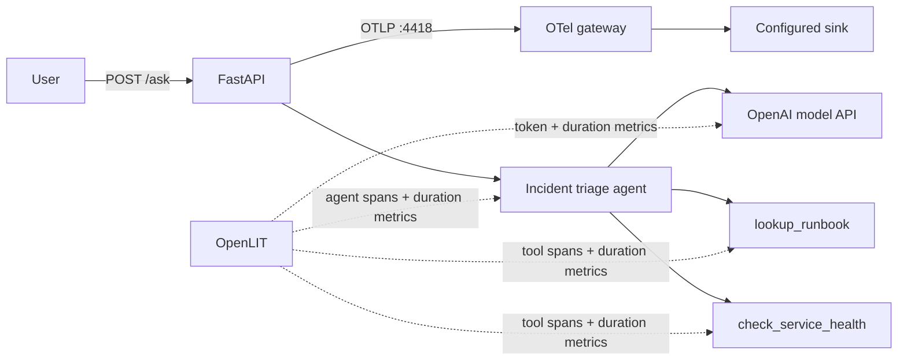

# OpenLIT + OpenAI Agents: working metrics

This experiment runs the same incident-triage agent as the paired OpenLLMetry
experiment, using `openai-agents==0.17.5` and `openlit==1.42.0`.

OpenLIT has dedicated OpenAI Agents instrumentation plus OpenAI SDK
instrumentation. It records workflow, agent, tool, and model-call durations,
plus input/output token usage from either direct Responses API mode or
chat-completions gateway mode.

In this experiment, those GenAI metrics populate in both Agents SDK API modes:
`responses` and legacy `chat_completions`.

Upstream references:

- [OpenLIT OpenAI Agents instrumentor](https://github.com/openlit/openlit/tree/main/openlit/instrumentation/openai_agents)
- [OpenLIT OpenAI instrumentor](https://github.com/openlit/openlit/tree/main/openlit/instrumentation/openai)
- [OpenAI Agents SDK](https://github.com/openai/openai-agents-python)

## Flow



## Expected trace

Replace the table timings with observed values after running against a real key.

| # | Span | Parent | Duration | Source | What it tells you | Sample attributes |
|---|---|---|---|---|---|---|
| 1 | `POST /ask` | - | variable | FastAPI auto | End-to-end user latency | `http.target=/ask`, `http.status_code=200` |
| 2 | `invoke_workflow Agent workflow` | `POST /ask` | variable | OpenLIT Agents | Whole Agents SDK run | `gen_ai.operation.name=invoke_workflow` |
| 3 | `invoke_agent incident-triage-agent` | workflow | variable | OpenLIT Agents | One agent invocation | `gen_ai.agent.name=incident-triage-agent` |
| 4 | `chat gpt-4.1-mini` | agent | variable | OpenLIT OpenAI | Model turn through Responses API or chat completions | model, response ID, token usage |
| 5 | `execute_tool check_service_health` | agent | variable | OpenLIT Agents | Health tool latency and errors | `gen_ai.tool.name=check_service_health` |
| 6 | `execute_tool lookup_runbook` | agent | variable | OpenLIT Agents | Runbook tool latency and errors | `gen_ai.tool.name=lookup_runbook` |
| 7 | `chat gpt-4.1-mini` | agent | variable | OpenLIT OpenAI | Final synthesis turn | input/output token usage |

## Span attributes

| Attribute | Example | What it tells you |
|---|---|---|
| `gen_ai.operation.name` | `invoke_workflow`, `invoke_agent`, `execute_tool`, `chat` | Operation category |
| `gen_ai.agent.name` | `incident-triage-agent` | Agent identity |
| `gen_ai.request.model` | `gpt-4.1-mini` | Requested model |
| `gen_ai.response.model` | `gpt-4.1-mini-...` | Actual model |
| `gen_ai.usage.input_tokens` | `418` | Prompt/tool context tokens |
| `gen_ai.usage.output_tokens` | `96` | Generated tokens |
| `gen_ai.tool.name` | `lookup_runbook` | Executed tool |
| `server.address` | `api.openai.com` | Provider endpoint |

Message content capture is disabled in `src/instrument.py` to avoid exporting incident
text, tool arguments, and tool results by default.

## Metrics dashboard


Import `dashboards/dashboard.grafana.json` from Grafana's dashboard import UI.

For API import, use:

```bash
make dashboard
```

This dashboard has the same six panels as the OpenLLMetry dashboard so the
missing OpenLLMetry workflow/tool metric series are directly visible. See
[the comparison doc](../../docs/openai_agents_openlit_vs_openllmetry.md) for the
side-by-side expected behavior.

| Panel | Metric | PromQL | What it tells you |
|---|---|---|---|
| Agent Workflow Duration p95 | `gen_ai.client.operation.duration` | `histogram_quantile(0.95, sum(increase(gen_ai_client_operation_duration_seconds_bucket{service_name="ai-obs-openlit-openai-agents",gen_ai_operation_name=~"invoke_workflow\|invoke_agent"}[$__range])) by (le, gen_ai_operation_name))` | End-to-end workflow and agent latency |
| Tool Execution Duration p95 | `gen_ai.client.operation.duration` | `histogram_quantile(0.95, sum(increase(gen_ai_client_operation_duration_seconds_bucket{service_name="ai-obs-openlit-openai-agents",gen_ai_operation_name="execute_tool"}[$__range])) by (le))` | Tool latency |
| Model Call Duration p95 | `gen_ai.client.operation.duration` | `histogram_quantile(0.95, sum(increase(gen_ai_client_operation_duration_seconds_bucket{service_name="ai-obs-openlit-openai-agents",gen_ai_operation_name="chat"}[$__range])) by (le, gen_ai_request_model))` | Model-call latency |
| Token Usage | `gen_ai.client.token.usage` | `sum(increase(gen_ai_client_token_usage_sum{service_name="ai-obs-openlit-openai-agents"}[$__range])) by (gen_ai_token_type, gen_ai_request_model)` | Input/output token consumption |
| HTTP Requests | `http.server.duration` | `sum(increase(http_server_duration_milliseconds_count{service_name="ai-obs-openlit-openai-agents",http_target="/ask"}[$__range])) by (http_status_code)` | Traffic volume |
| HTTP Request Duration p95 | `http.server.duration` | `histogram_quantile(0.95, sum(increase(http_server_duration_milliseconds_bucket{service_name="ai-obs-openlit-openai-agents",http_target="/ask"}[$__range])) by (le))` | User-visible latency |

## Metric dimensions

### `gen_ai.client.operation.duration`

| Dimension | Example |
|---|---|
| `gen_ai_operation_name` | `invoke_workflow`, `invoke_agent`, `execute_tool`, `chat` |
| `gen_ai_provider_name` | `openai` |
| `gen_ai_request_model` | `gpt-4.1-mini` |
| `server_address` | `api.openai.com` |
| `server_port` | `443` |
| `deployment_environment` | `benchmark` |
| `service_name` | `ai-obs-openlit-openai-agents` |

### `gen_ai.client.token.usage`

| Dimension | Example |
|---|---|
| `gen_ai_operation_name` | `chat` |
| `gen_ai_provider_name` | `openai` |
| `gen_ai_request_model` | `gpt-4.1-mini` |
| `gen_ai_response_model` | `gpt-4.1-mini-...` |
| `gen_ai_token_type` | `input`, `output` |
| `server_address` | `api.openai.com` |
| `service_name` | `ai-obs-openlit-openai-agents` |

### HTTP metrics

| Dimension | Example |
|---|---|
| `http_method` | `POST` |
| `http_target` | `/ask` |
| `http_status_code` | `200` |
| `service_name` | `ai-obs-openlit-openai-agents` |

## Failure modes

| # | Failure mode | Why? | How? | Where? | What? |
|---|---|---|---|---|---|
| 1 | Agent latency regression | Slow multi-turn runs hurt users | Alert on workflow p95 | Agent dashboard | `gen_ai.client.operation.duration` |
| 2 | Slow tool | External/tool work dominates latency | Filter operation=`execute_tool` | Tool panel | Duration histogram |
| 3 | Provider slowdown | Model calls dominate latency | Filter operation=`chat` | Responses panel | Duration histogram |
| 4 | Token cost spike | Context or loops increase spend | Alert on token rate | Token panel | Token histogram |
| 5 | Runaway agent turns | Multiple model calls per request multiply cost | Compare chat-call rate with HTTP rate | Dashboard | GenAI duration count vs HTTP count |
| 6 | Tool failure | Agent cannot obtain evidence | Inspect tool error spans | Trace explorer | Tool span error status |
| 7 | Provider error | Responses call fails | Filter error traces and HTTP 5xx | Traces + HTTP | Error status/type |
| 8 | Metrics pipeline failure | No operational visibility | Compare HTTP and GenAI panels | Dashboard | Both signal families absent |

## Usage

```bash
cd ../../infra
make up

cd ../experiments/openlit_openai_agents
cp .env.example .env
# Set OPENAI_API_KEY and OPENAI_MODEL.

make up
```

For Bifrost, use the virtual key and force the Agents SDK onto the
chat-completions path:

```bash
OPENAI_API_KEY=<bifrost-virtual-key>
OPENAI_MODEL=openai/gpt-4o-mini
OPENAI_AGENTS_API=chat_completions
OPENAI_BASE_URL=http://host.docker.internal:8000/v1
```

The `/v1` suffix matters. Without it the OpenAI SDK posts to
`http://host.docker.internal:8000/responses`, which Bifrost rejects with
`405 Method Not Allowed`.

The app also calls `set_default_openai_client(..., use_for_tracing=False)`.
Without that, the OpenAI Agents SDK tries to upload hosted traces to OpenAI with
the Bifrost virtual key and logs `401 invalid_api_key` for `/v1/traces/ingest`.

From another terminal:

```bash
make ask
make metrics
make dashboard
```

Run `make ask` several times. The imported dashboard should show HTTP traffic,
agent/workflow/tool duration series, model-call duration, and token usage.
