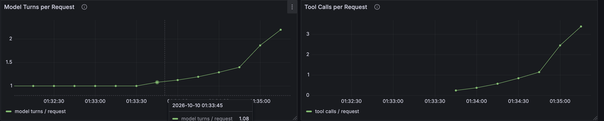

# OpenLIT + OpenAI Agents: full metrics restored

## Prerequisites

- **Docker and Docker Compose.** The agent runs in a container; `make build` then `make up`.
- **Shared infra up first:** `cd ../../infra && make up`.
  - Brings up the OTel collector gateway (OTLP on `host.docker.internal:4418`) and the selected sink.
  - For `make dashboard` and the full workflow/tool/model/token panels, use a metrics-capable sink: `SINK=grafana`.
  - No pgvector needed — this is the OpenAI Agents SDK tool loop, not a RAG pipeline.
- **`.env`** copied from `.env.example`, no hidden defaults:
  - `OPENAI_API_KEY` — a real provider key; the agent calls the model live. e.g. `OPENAI_API_KEY=your-openai-api-key`
  - `OPENAI_MODEL` — model the agent drives. e.g. `OPENAI_MODEL=gpt-4o-mini`
  - `OPENAI_AGENTS_API` — Agents SDK transport. e.g. `OPENAI_AGENTS_API=chat_completions`
  - `OPENAI_BASE_URL` — gateway base URL; set it (plus a Bifrost virtual key as `OPENAI_API_KEY`) to route through Bifrost. e.g. `OPENAI_BASE_URL=http://host.docker.internal:8800/v1`
  - `OTEL_SERVICE_NAME` — service name on emitted telemetry. e.g. `OTEL_SERVICE_NAME=ai-obs-openlit-openai-agents`
  - `OTEL_EXPORTER_OTLP_ENDPOINT` — OTLP target; the agent sends to the gateway, never a sink directly. e.g. `OTEL_EXPORTER_OTLP_ENDPOINT=http://host.docker.internal:4418`
- **`python3` on the host** for the `make *-ask` / `make metrics` / `make dashboard` targets.
- OpenLIT auto-instruments the Agents SDK, so all GenAI panels populate with no manual instrumentation.

## Usage

```bash
cd ../../infra
make up

cd ../experiments/openlit_openai_agents
cp .env.example .env
# Set OPENAI_API_KEY

make build
make up
```

From another terminal:

```bash
make auth-ask           # 2 turns - no dependencies
make payments-ask       # 3 turns - checks ledger
make catalog-ask        # 3 turns - checks search-index, inventory
make checkout-ask       # 4 turns - hits max_turns=3, gets cut off
make random-ask         # random service each time
make metrics
make dashboard
```

All GenAI panels populate. Compare with experiment 6 where workflow and tool
panels were empty.

## Context: from OpenLLMetry to OpenLIT

The previous experiment (`openllmetry_openai_agents`) set up the question this one answers.

- **What OpenLLMetry gave us:**
  - Model call and token metrics.
- **What OpenLLMetry missed:**
  - Workflow duration metrics.
  - Tool duration metrics.
- **What this experiment changes:**
  - Swaps OpenLLMetry for **OpenLIT** (`openlit`).
  - Everything else is held fixed: same agent, same tools, same dependency graph.
- **The question:**
  - Does OpenLIT fill the gap OpenLLMetry left?

**Answer: yes, and more.**

- OpenLIT records all operation types: workflow, agent, tool, and chat.
- It also adds metrics that neither the manual experiment nor OpenLLMetry provide:
  - Time-to-first-token.
  - Cost in USD.

## What OpenLIT emits vs OpenLLMetry

| Metric | OpenLIT | OpenLLMetry | Manual (exp 5) |
|---|---|---|---|
| `gen_ai.client.operation.duration` with `invoke_workflow` | Yes | No | Yes |
| `gen_ai.client.operation.duration` with `invoke_agent` | Yes | No | No |
| `gen_ai.client.operation.duration` with `execute_tool` | Yes | No | Yes |
| `gen_ai.client.operation.duration` with `chat` | Yes | Yes | Yes |
| `gen_ai.client.token.usage` (input/output) | Yes | Yes | Yes |
| `gen_ai.server.time_to_first_token` | Yes | No | No |
| `gen_ai.usage.cost` (USD) | Yes | No | No |
| `gen_ai.client.generation.choices` | No | Yes | No |
| HTTP metrics | Yes | Yes | Yes |

The agent code (`src/agent.py`) is identical between this experiment and
experiment 6 - same `Runner.run()`, same 3 lines. The only difference is which
instrumentation library wraps it.

### The one metric OpenLIT drops: `generation.choices`

OpenLLMetry's "Generation Choices by Finish Reason" panel (the `stop` vs `tool_call`
lines) was built on `gen_ai.client.generation.choices`. OpenLIT does not emit that
metric, so you cannot reproduce that exact panel here. The capability is not lost,
it moves to a cleaner pair of panels.

- **What OpenLLMetry did:**
  - It had no per-request operation counts, only finish-reason counts.
  - So it inferred tool work from the `tool_call` count and divided by the `stop` count (final answers).
  - The denominator was a proxy (answer-completions), not real requests.
- **What OpenLIT does instead:**
  - Every operation duration carries a `_count`, so OpenLIT counts the operations directly: `chat` turns and `execute_tool` calls.
  - It divides those by actual HTTP requests to `/ask`, so the denominator is real user requests, not a proxy.
- **The equivalent panels on this dashboard:**
  - **Tool Calls per Request** = `execute_tool` count / `/ask` request count. This is the direct equivalent of OpenLLMetry's "Tool Calls per Completed Request": how many tools each question invoked.
  - **Model Turns per Request** = `chat` count / `/ask` request count. How many LLM round-trips each question took. OpenLLMetry could not produce this reliably, since it had no per-request chat count tied to requests.
- **What you give up:**
  - The raw `stop` vs `tool_call` line itself. There is no finish-reason breakdown, because the underlying metric is not emitted.
  - In this setup that line was already of limited use: every question forces at least one tool call, so `tool_call` was always at or above `stop` and the ratio floored at ~1. The per-request ratios above carry the same "how much tool work per question" signal with a cleaner denominator.

**The shape in the screenshot (shallow questions, then deep ones)**



- Early on you drove shallow questions (like `auth-ask`).
  - Each question resolved in roughly one model turn, so **Model Turns per Request** sits flat at ~1.
  - Those questions touched almost no tools, so **Tool Calls per Request** stays near ~0.2.
- Then you switched to deep questions (like `checkout-ask`), which fan out across dependencies.
  - Each question now takes several model round-trips, so **Model Turns per Request** climbs toward ~2.2.
  - Each question invokes several tools, so **Tool Calls per Request** climbs toward ~3.4.
- Both lines rising together is the signature of the workload shifting from shallow, near-direct questions to deep, tool-heavy ones.
  - This is the same story OpenLLMetry's `stop` vs `tool_call` panel told, but read off real per-request ratios instead of a finish-reason proxy.

## Instrumentation code: OpenLLMetry vs OpenLIT

The agent code is identical; only `instrument.py` differs. Compare the two:

- OpenLLMetry: [`experiments/openllmetry_openai_agents/src/instrument.py`](https://github.com/one2nc/ai_observability/blob/main/experiments/openllmetry_openai_agents/src/instrument.py)
- OpenLIT: [`experiments/openlit_openai_agents/src/instrument.py`](https://github.com/one2nc/ai_observability/blob/main/experiments/openlit_openai_agents/src/instrument.py)

**Clarity**

- OpenLIT: one `openlit.init(...)` call auto-instruments the agent, chat, tools, and workflow.
- OpenLLMetry: `Traceloop.init(...)` plus a manual `OpenAIAgentsInstrumentor(...).instrument()`, so instrumentation is split across two steps.

**Extra work**

- OpenLLMetry needs defensive plumbing that OpenLIT does not:
  - Suppresses noisy `opentelemetry.attributes` warnings from the Agents SDK `Omit` sentinel.
  - Blocks its own default Agents instrumentor, then re-adds one with `replace_existing_processors=True` to stop the SDK uploading traces to OpenAI.
  - Hand-wires the whole logs pipeline (LoggerProvider, exporter, LoggingInstrumentor).
- OpenLIT's only "extra" is declaring more metric views (ttft, cost, server duration). The views just pick histogram buckets; OpenLIT's library is what actually records those metrics.

**Net**

- OpenLIT: less code, richer metrics (ttft, USD cost, all operation types).
- OpenLLMetry: more code, and still misses workflow/tool/ttft/cost.

## What stays the same

- Same tools: `check_service_health`, `lookup_runbook`, `check_dependencies`
- Same dependency graph and simulated latencies
- Same `max_turns=3`
- Same make targets: `make auth-ask`, `make payments-ask`, `make catalog-ask`, `make checkout-ask`
- Same agent code as experiment 6

## Expected trace

| # | Span | Parent | Duration | Source | What it tells you | Sample attributes |
|---|---|---|---|---|---|---|
| 1 | `POST /ask` | - | variable | FastAPI auto | End-to-end user latency | `http.target=/ask`, `http.status_code=200` |
| 2 | `invoke_workflow` | `POST /ask` | variable | OpenLIT Agents | Whole agent SDK run | `gen_ai.operation.name=invoke_workflow` |
| 3 | `invoke_agent` | workflow | variable | OpenLIT Agents | Single agent invocation | `gen_ai.agent.name=incident-triage-agent` |
| 4 | `chat` | agent | variable | OpenLIT OpenAI | Model call | `gen_ai.request.model`, token usage |
| 5 | `execute_tool` | agent | variable | OpenLIT Agents | Tool with latency | `gen_ai.tool.name=check_dependencies` |
| 6 | `chat` | agent | variable | OpenLIT OpenAI | Subsequent model turn | response model and usage |

## Span attributes

| Attribute | Example | What it tells you |
|---|---|---|
| `gen_ai.operation.name` | `invoke_workflow`, `invoke_agent`, `execute_tool`, `chat` | Operation category |
| `gen_ai.agent.name` | `incident-triage-agent` | Agent identity |
| `gen_ai.request.model` | `gpt-4o-mini` | Requested model |
| `gen_ai.response.model` | `openai/gpt-4o-mini` | Actual model |
| `gen_ai.usage.input_tokens` | `418` | Prompt tokens |
| `gen_ai.usage.output_tokens` | `96` | Generated tokens |
| `gen_ai.tool.name` | `check_dependencies` | Tool called |
| `server.address` | `host.docker.internal` | Provider endpoint |

## Metrics dashboard

Import `dashboards/dashboard.grafana.json` from Grafana's dashboard import UI.

For API import:

```bash
make dashboard
```

| Panel | Metric | PromQL | What it tells you |
|---|---|---|---|
| Agent Workflow Duration p95 | `gen_ai.client.operation.duration` | `histogram_quantile(0.95, ...{gen_ai_operation_name=~"invoke_workflow\|invoke_agent"})` | End-to-end workflow and agent latency |
| Tool Execution Duration p95 | `gen_ai.client.operation.duration` | `...{gen_ai_operation_name="execute_tool"}` | Tool latency |
| Model Call Duration p95 | `gen_ai.client.operation.duration` | `...{gen_ai_operation_name="chat"}` | Provider latency |
| Token Usage | `gen_ai.client.token.usage` | `sum(increase(...)) by (gen_ai_token_type, gen_ai_request_model)` | Token consumption |
| Time to First Token p95 | `gen_ai.server.time_to_first_token` | `histogram_quantile(0.95, ...)` | How fast the model starts responding |
| Usage Cost (USD) | `gen_ai.usage.cost` | `sum(increase(...)) by (gen_ai_request_model)` | Dollar cost per model |
| Operation Rate | `gen_ai.client.operation.duration` | `sum(rate(..._count[1m])) by (gen_ai_operation_name)` | Operations/sec by type |
| Time Breakdown % | `gen_ai.client.operation.duration` | `rate(chat_sum) / rate(workflow_sum)` | Model vs tool time fraction |
| Model Turns per Request | `gen_ai.client.operation.duration` | `chat count / http count` | How many model calls per user request |
| Tool Calls per Request | `gen_ai.client.operation.duration` | `execute_tool count / http count` | How many tool invocations per user request |
| Request Rate | `http.server.duration` | `sum(increase(..._count)) by (http_status_code)` | Traffic volume |
| Request Duration p95 (ms) | `http.server.duration` | `histogram_quantile(0.95, ...)` | User-visible latency |
| Active Requests | `http.server.active_requests` | `http_server_active_requests{...}` | Concurrency |
| Error Rate (5xx) | `http.server.duration` | `...{http_status_code=~"5.."}` | Server errors |

## Failure modes

| # | Failure mode | Detectable? | How? | Where? | What metric? |
|---|---|---|---|---|---|
| 1 | Slow conversation | Yes | Alert on workflow p95 | Agent Workflow Duration panel | `gen_ai_client_operation_duration_seconds{gen_ai_operation_name="invoke_workflow"}` |
| 2 | Slow tool | Yes | Alert on tool p95 | Tool Execution Duration panel | `gen_ai_client_operation_duration_seconds{gen_ai_operation_name="execute_tool"}` |
| 3 | Slow provider | Yes | Alert on chat p95 | Model Call Duration panel | `gen_ai_client_operation_duration_seconds{gen_ai_operation_name="chat"}` |
| 4 | Token cost spike | Yes | Alert on token rate | Token Usage panel | `gen_ai_client_token_usage_sum` |
| 5 | Dollar cost spike | Yes | Alert on cost rate | Usage Cost panel | `gen_ai_usage_cost_USD_sum` |
| 6 | Slow first token | Yes | Alert on TTFT p95 | Time to First Token panel | `gen_ai_server_time_to_first_token_seconds` |
| 7 | Runaway turns | Yes | Operation rate ratio | Operation Rate panel | `chat` rate vs `http_requests` rate |
| 8 | Tool failure | Yes (traces) | Filter error spans | Trace explorer | `execute_tool` span with error |
| 9 | Provider error | Yes | Error spans + HTTP 5xx | Trace explorer + Error Rate panel | Chat span exception + `http_status_code=~"5.."` |

Every failure mode from experiment 5 (manual) is detectable here from metrics.
No need to open traces for latency or cost debugging.

## Appendix: Metric dimensions

### `gen_ai.client.operation.duration`

| Dimension | Example |
|---|---|
| `gen_ai_operation_name` | `invoke_workflow`, `invoke_agent`, `execute_tool`, `chat` |
| `gen_ai_provider_name` | `openai` |
| `gen_ai_request_model` | `gpt-4o-mini` (only for `chat`) |
| `gen_ai_response_model` | `openai/gpt-4o-mini` (only for `chat`) |
| `server_address` | `api.openai.com` or `host.docker.internal` |
| `server_port` | `443` or `8800` |
| `deployment_environment` | `benchmark` |
| `service_name` | `ai-obs-openlit-openai-agents` |

### `gen_ai.client.token.usage`

| Dimension | Example |
|---|---|
| `gen_ai_operation_name` | `chat` |
| `gen_ai_request_model` | `gpt-4o-mini` |
| `gen_ai_token_type` | `input`, `output` |
| `service_name` | `ai-obs-openlit-openai-agents` |

### `gen_ai.server.time_to_first_token`

| Dimension | Example |
|---|---|
| `gen_ai_request_model` | `gpt-4o-mini` |
| `server_address` | `host.docker.internal` |
| `service_name` | `ai-obs-openlit-openai-agents` |

### `gen_ai.usage.cost`

| Dimension | Example |
|---|---|
| `gen_ai_request_model` | `gpt-4o-mini` |
| `service_name` | `ai-obs-openlit-openai-agents` |

### HTTP metrics

| Dimension | Example |
|---|---|
| `http_method` | `POST` |
| `http_target` | `/ask` |
| `http_status_code` | `200` |
| `service_name` | `ai-obs-openlit-openai-agents` |
