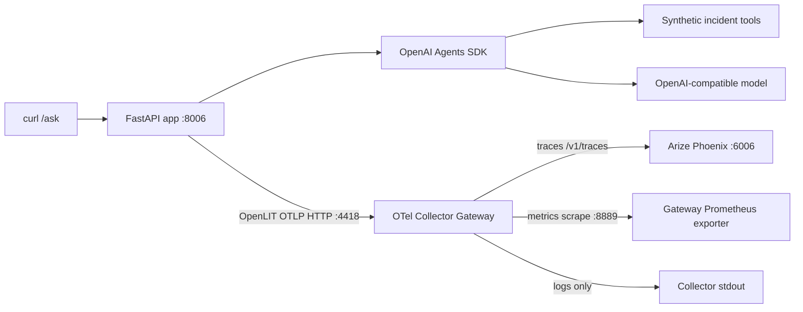

# OpenLIT to Arize Phoenix

This experiment answers: what does Arize Phoenix show when an OpenAI Agents app
is auto-instrumented with OpenLIT and sends OTLP through the shared collector
gateway?

The application is the same incident-triage agent used by the OpenLIT OpenAI
Agents experiment: one FastAPI endpoint, one OpenAI Agents SDK agent, and three
synthetic tools. The sink is different. Instead of Grafana/Tempo/Prometheus,
`SINK=phoenix` routes traces to Phoenix.

## Flow



Apps stay sink-agnostic: OpenLIT exports to `host.docker.internal:4418`, and the
gateway decides that traces go to Phoenix.

## Example traces

Expected span shape after running `make checkout-ask`:

| # | Span | Parent | Duration | Source | What it tells you | Sample attributes |
|---|---|---|---|---|---|---|
| 1 | `POST /ask` | - | End-to-end request | FastAPI OTel | User-visible latency and HTTP status | `http.request.method=POST`, `url.path=/ask`, `http.response.status_code=200` |
| 2 | `invoke_workflow` | `POST /ask` | Whole agent run | OpenLIT Agents | Total OpenAI Agents SDK workflow time | `gen_ai.operation.name=invoke_workflow`, `service.name=ai-obs-openlit-phoenix` |
| 3 | `invoke_agent` | `invoke_workflow` | Agent turn | OpenLIT Agents | Agent execution and turn boundaries | `gen_ai.agent.name=incident-triage-agent` |
| 4 | `chat` | `invoke_agent` | Model call | OpenLIT OpenAI | Provider latency, prompt text and token usage | `gen_ai.request.model=openrouter/gpt-4o-mini`, `gen_ai.prompt.0.content=...`, `gen_ai.usage.input_tokens=...` |
| 5 | `execute_tool` | `invoke_agent` | Tool latency | OpenLIT Agents | Which tool ran and how long it took | `gen_ai.tool.name=check_dependencies`, `gen_ai.operation.name=execute_tool` |
| 6 | `chat` | `invoke_agent` | Follow-up model call | OpenLIT OpenAI | Additional model turn and response text | `gen_ai.completion.0.content=...`, `gen_ai.response.model=...`, `gen_ai.usage.output_tokens=...` |

Phoenix is most useful when these spans include OpenInference/GenAI attributes:
model name, tool name, token counts, input/output metadata and error status.

## Span attributes

| Attribute | Example | What it tells you |
|---|---|---|
| `service.name` | `ai-obs-openlit-phoenix` | Which experiment emitted the span |
| `deployment.environment` | `benchmark` | Local benchmark environment |
| `gen_ai.operation.name` | `invoke_workflow`, `invoke_agent`, `execute_tool`, `chat` | Operation category |
| `gen_ai.agent.name` | `incident-triage-agent` | Agent identity |
| `gen_ai.tool.name` | `check_dependencies` | Tool called by the agent |
| `gen_ai.request.model` | `openrouter/gpt-4o-mini` | Requested model |
| `gen_ai.response.model` | `openai/gpt-4o-mini` | Model reported by the provider |
| `gen_ai.prompt.*.content` | `checkout is showing errors...` | Captured prompt/input text |
| `gen_ai.completion.*.content` | `Severity: ...` | Captured completion/output text |
| `gen_ai.usage.input_tokens` | `418` | Prompt tokens |
| `gen_ai.usage.output_tokens` | `96` | Completion tokens |
| `server.address` | `host.docker.internal` | OpenAI-compatible endpoint host |

`OPENLIT_CAPTURE_MESSAGE_CONTENT=true` is set in `.env.example`, so this
Phoenix experiment intentionally captures LLM input and output text in spans.
Set it to `false` to benchmark metadata-only traces or privacy-safe telemetry.

## Metrics dashboard

Phoenix is configured here as a trace sink. It does not replace Grafana or
SigNoz as this repo's importable metric dashboard backend, so this experiment
ships no dashboard JSON.

OpenLIT still emits OTLP metrics. The gateway exposes them on
http://localhost:8889/metrics through its Prometheus exporter, but Phoenix does
not store or visualize these app metrics in this setup.

| Panel | Metric | PromQL | What it tells you |
|---|---|---|---|
| Not shipped | `gen_ai.client.operation.duration` | N/A for Phoenix | Visible as span durations in Phoenix traces |
| Not shipped | `gen_ai.client.token.usage` | N/A for Phoenix | Visible as span attributes when OpenLIT records usage |
| Not shipped | `gen_ai.server.time_to_first_token` | N/A for Phoenix | Available only from gateway metrics output in this setup |
| Not shipped | `gen_ai.usage.cost` | N/A for Phoenix | Available only from gateway metrics output in this setup |
| Not shipped | `http.server.duration` | N/A for Phoenix | Request latency appears in HTTP spans |

For metric dashboards, run the sibling `openlit_openai_agents` experiment with
`SINK=grafana`.

## Failure modes

| # | Failure mode | Why? | How? | Where? | What? |
|---|---|---|---|---|---|
| 1 | Slow agent workflow | Agent took too long overall | Inspect root-to-workflow duration | Phoenix trace view | `invoke_workflow` span duration |
| 2 | Slow model call | Provider latency dominates | Find long `chat` spans | Phoenix trace view | `gen_ai.operation.name=chat` |
| 3 | Slow tool | Synthetic dependency lookup sleeps | Find long `execute_tool` spans | Phoenix trace view | `gen_ai.tool.name=check_dependencies` |
| 4 | Runaway turns | Agent keeps calling tools until `max_turns=3` | Count repeated `chat` and `execute_tool` spans | Phoenix trace timeline | Multiple child spans under one request |
| 5 | Tool error | Tool returns unknown-service error | Inspect tool span attributes/output metadata | Phoenix span detail | `execute_tool` span and status |
| 6 | Provider error | API key, model or base URL is wrong | Request fails and model span records error | Phoenix trace view and app logs | Error span or failed `/ask` request |
| 7 | Missing token/cost data | Provider response or gateway may not expose usage | Check `chat` span attributes | Phoenix span detail | Missing `gen_ai.usage.*` attributes |
| 8 | Missing metrics dashboard | Phoenix is not the metrics store here | Query gateway metrics directly | `make metrics` | Raw Prometheus exposition from `:8889` |
| 9 | Missing logs | Phoenix is not a log backend here | Read app or collector stdout | `make logs` and infra logs | Log lines, not indexed search |

## Usage

Start Phoenix-backed infra:

```bash
cd ../../infra
make up SINK=phoenix
```

Open Phoenix at http://localhost:6006 and sign in as the local admin:

```text
email: admin@localhost
password: admin
```

Use the admin account to add Phoenix Secrets or Custom AI Providers under
Settings. Those provider settings are for Phoenix features such as Playground;
this experiment app still exports telemetry through the OTel gateway.

Start the experiment from another terminal:

```bash
cd ../experiments/openlit_phoenix
cp .env.example .env
# Set OPENAI_API_KEY and, if needed, OPENAI_BASE_URL.
# Keep OPENLIT_CAPTURE_MESSAGE_CONTENT=true if you want prompt/completion text.
make up
```

Send traffic from a third terminal:

```bash
make auth-ask
make payments-ask
make catalog-ask
make checkout-ask
make random-ask
```

Open Phoenix at http://localhost:6006 and filter for service
`ai-obs-openlit-phoenix`.

Useful local checks:

```bash
make health
make metrics

cd ../../infra
make check-phoenix
```

## Appendix: Metric dimensions

These metrics are emitted by OpenLIT to the gateway, but are not visualized in
Phoenix by this experiment.

### `gen_ai.client.operation.duration`

| Dimension | Example |
|---|---|
| `gen_ai_operation_name` | `invoke_workflow`, `invoke_agent`, `execute_tool`, `chat` |
| `gen_ai_provider_name` | `openai` |
| `gen_ai_request_model` | `openrouter/gpt-4o-mini` |
| `gen_ai_response_model` | `openai/gpt-4o-mini` |
| `server_address` | `host.docker.internal` |
| `server_port` | `8800` |
| `deployment_environment` | `benchmark` |
| `service_name` | `ai-obs-openlit-phoenix` |

### `gen_ai.client.token.usage`

| Dimension | Example |
|---|---|
| `gen_ai_operation_name` | `chat` |
| `gen_ai_request_model` | `openrouter/gpt-4o-mini` |
| `gen_ai_token_type` | `input`, `output` |
| `service_name` | `ai-obs-openlit-phoenix` |

### `gen_ai.server.time_to_first_token`

| Dimension | Example |
|---|---|
| `gen_ai_request_model` | `openrouter/gpt-4o-mini` |
| `server_address` | `host.docker.internal` |
| `service_name` | `ai-obs-openlit-phoenix` |

### `gen_ai.usage.cost`

| Dimension | Example |
|---|---|
| `gen_ai_request_model` | `openrouter/gpt-4o-mini` |
| `service_name` | `ai-obs-openlit-phoenix` |

### HTTP metrics

| Dimension | Example |
|---|---|
| `http_method` | `POST` |
| `http_target` | `/ask` |
| `http_status_code` | `200` |
| `service_name` | `ai-obs-openlit-phoenix` |
