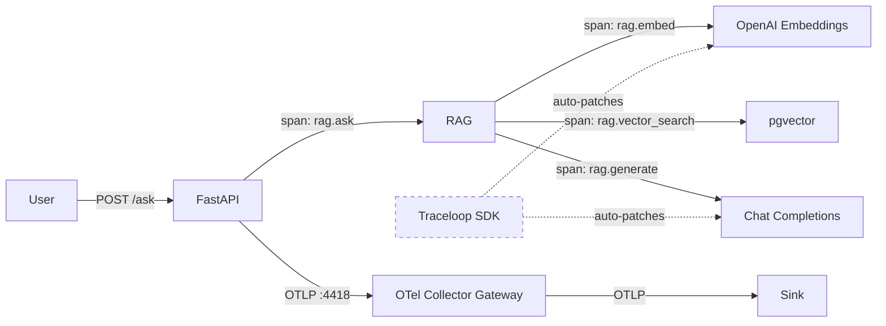
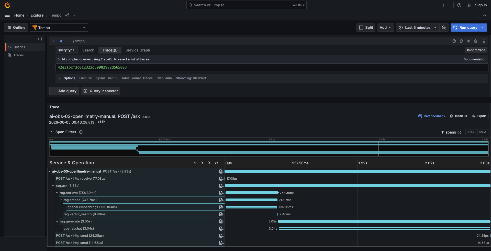
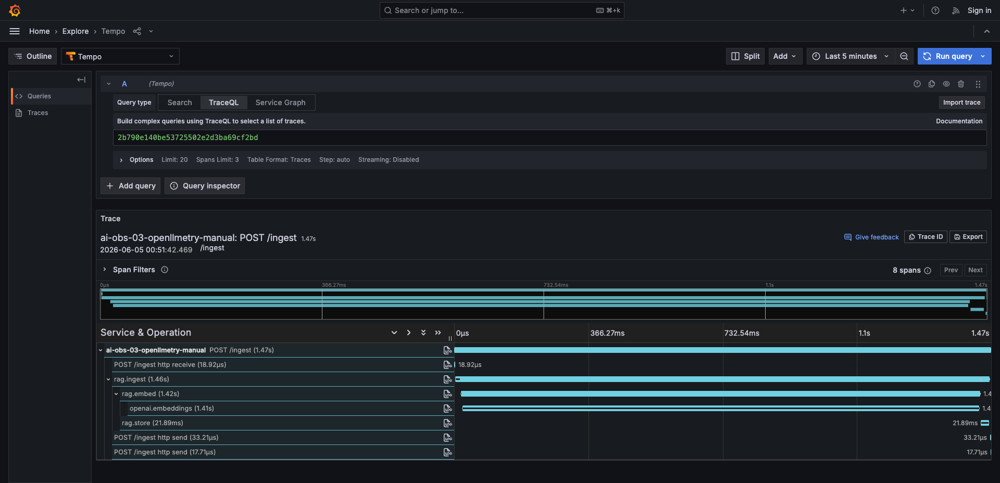
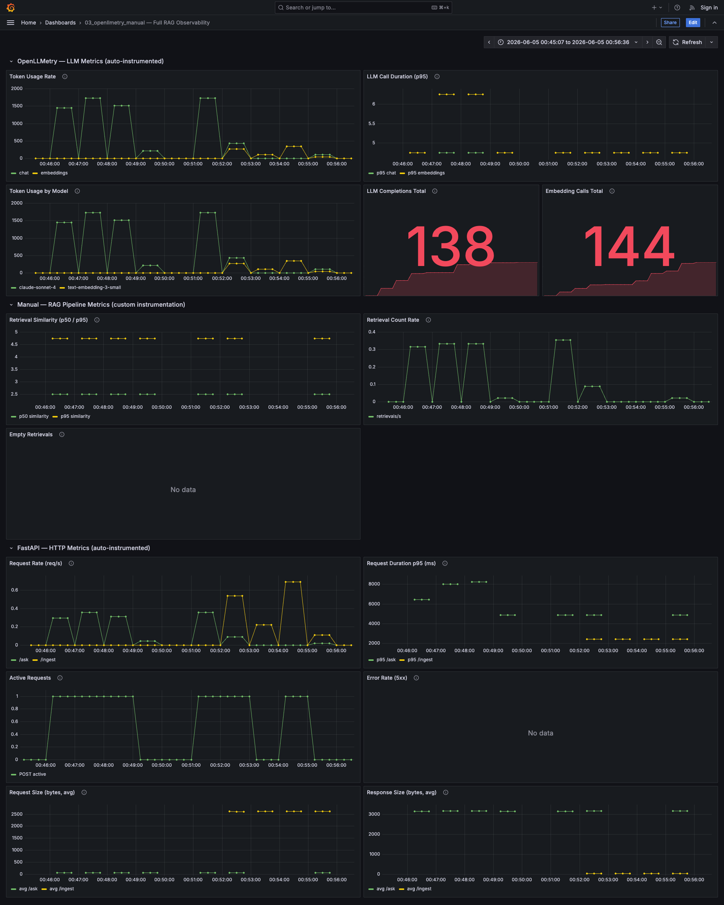

# openllmetry_manual — OpenLLMetry + Manual Spans

Builds on `openllmetry` by adding manual spans to close the instrumentable gaps.

## Flow



## What this adds over openllmetry

| What | openllmetry | openllmetry_manual |
|------|----------------|----------------------|
| LLM call spans (tokens, model) | ✅ auto | ✅ auto |
| Embedding call spans | ✅ auto | ✅ auto |
| RAG pipeline spans (ask, ingest, retrieve, generate) | ❌ | ✅ manual |
| Vector search span (pgvector query) | ❌ | ✅ manual |
| Retrieval similarity scores (min/max/avg) | ❌ | ✅ span attributes |
| Per-user attribution | ❌ | ✅ user.id on rag.ask span |
| Logs | ✅ | ✅ |
| Metrics (HTTP + gen_ai) | ✅ | ✅ |

## Example traces

### POST /ask (3.83s, 11 spans)



```
POST /ask (3.83s)
├── POST /ask http receive (17µs)
├── rag.ask (3.83s)
│   ├── rag.retrieve (758ms)
│   │   ├── rag.embed (746ms)
│   │   │   └── openai.embeddings (735ms)
│   │   └── rag.vector_search (9ms)
│   └── rag.generate (3.05s)
│       └── openai.chat (3.04s)
├── POST /ask http send (24µs)
└── POST /ask http send (15µs)
```

| # | Span | Parent | Duration | Source | What it tells you | Sample attributes |
|---|------|--------|----------|--------|-------------------|-------------------|
| 1 | `POST /ask` | — | 3.83s | FastAPI auto | How long did the user wait? | `http.method=POST`, `http.target=/ask`, `http.status_code=200` |
| 2 | `POST /ask http receive` | `POST /ask` | 17µs | FastAPI auto | How long to receive the request? | — |
| 3 | `rag.ask` | `POST /ask` | 3.83s | Manual | Who asked? What did they ask? | `user.id=saurabh`, `ask.query=What does the kube-scheduler do?` |
| 4 | `rag.retrieve` | `rag.ask` | 758ms | Manual | How relevant were the retrieved chunks? | `retrieve.top_k=5`, `retrieve.num_results=5`, `retrieve.similarity_avg=0.485`, `retrieve.similarity_min=0.308`, `retrieve.similarity_max=0.574` |
| 5 | `rag.embed` | `rag.retrieve` | 746ms | Manual | How long did query embedding take? | `embed.model=openai/text-embedding-3-small`, `embed.num_texts=1` |
| 6 | `openai.embeddings` | `rag.embed` | 735ms | OpenLLMetry auto | How many tokens did embedding consume? | `gen_ai.usage.input_tokens=8`, `gen_ai.request.model=text-embedding-3-small` |
| 7 | `rag.vector_search` | `rag.retrieve` | 9ms | Manual | Is the database the bottleneck? | — |
| 8 | `rag.generate` | `rag.ask` | 3.05s | Manual | How many context chunks sent to LLM? | `generate.model=claude-sonnet-4`, `generate.num_context_chunks=5` |
| 9 | `openai.chat` | `rag.generate` | 3.04s | OpenLLMetry auto | How many tokens consumed? | `gen_ai.usage.input_tokens=1250`, `gen_ai.usage.total_tokens=1490` |
| 10 | `POST /ask http send` (×2) | `POST /ask` | ~24µs | FastAPI auto | How long to send the response? | — |

### POST /ingest (1.47s, 8 spans)



```
POST /ingest (1.47s)
├── POST /ingest http receive (19µs)
├── rag.ingest (1.46s)
│   ├── rag.embed (1.42s)
│   │   └── openai.embeddings (1.41s)
│   └── rag.store (22ms)
├── POST /ingest http send (33µs)
└── POST /ingest http send (18µs)
```

| # | Span | Parent | Duration | Source | What it tells you | Sample attributes |
|---|------|--------|----------|--------|-------------------|-------------------|
| 1 | `POST /ingest` | — | 1.47s | FastAPI auto | How long did ingestion take? | `http.method=POST`, `http.target=/ingest`, `http.status_code=200` |
| 2 | `POST /ingest http receive` | `POST /ingest` | 19µs | FastAPI auto | How long to receive the upload? | — |
| 3 | `rag.ingest` | `POST /ingest` | 1.46s | Manual | How long did the full ingest pipeline take? | `ingest.source=kubernetes.txt` |
| 4 | `rag.embed` | `rag.ingest` | 1.42s | Manual | How long to embed all chunks? | `embed.model=openai/text-embedding-3-small`, `embed.num_texts=7` |
| 5 | `openai.embeddings` | `rag.embed` | 1.41s | OpenLLMetry auto | How many tokens did embedding consume? | `gen_ai.usage.input_tokens=350` |
| 6 | `rag.store` | `rag.ingest` | 22ms | Manual | How long to write to pgvector? | `store.source=kubernetes.txt`, `store.num_chunks=7` |
| 7 | `POST /ingest http send` (×2) | `POST /ingest` | ~33µs | FastAPI auto | How long to send the response? | — |

## Span attributes

### Auto-captured (OpenLLMetry) — on `openai.embeddings` and `openai.chat` spans

| Attribute | Example value | What it tells you |
|-----------|--------------|-------------------|
| `gen_ai.operation.name` | `embeddings`, `chat` | Which type of LLM operation |
| `gen_ai.provider.name` | `openrouter` | Which provider handled the request |
| `gen_ai.request.model` | `text-embedding-3-small` | Model requested |
| `gen_ai.response.model` | `text-embedding-3-small` | Model actually used |
| `gen_ai.response.id` | `gen-emb-1780475301-...` | Unique response ID for provider debugging |
| `gen_ai.usage.input_tokens` | `8` | Tokens in the prompt/input |
| `gen_ai.usage.total_tokens` | `8` | Total tokens consumed |
| `gen_ai.usage.cache_read.input_tokens` | `0` | Tokens served from cache |
| `gen_ai.input.messages` | `[{"role": "user", ...}]` | Full prompt content |
| `gen_ai.is_streaming` | `false` | Whether response was streamed |
| `gen_ai.openai.api_base` | `https://openrouter.ai/api/v1/` | API base URL |

### Manual (added in 03) — on `rag.*` spans

| Attribute | Span | Example value | What it tells you |
|-----------|------|--------------|-------------------|
| `user.id` | `rag.ask` | `saurabh` | Who made the request (per-user cost/audit) |
| `ask.query` | `rag.ask` | `What does the kube-scheduler do?` | The user's question |
| `retrieve.top_k` | `rag.retrieve` | `5` | How many chunks requested |
| `retrieve.num_results` | `rag.retrieve` | `5` | How many chunks returned |
| `retrieve.similarity_avg` | `rag.retrieve` | `0.485` | Average relevance of retrieved chunks |
| `retrieve.similarity_min` | `rag.retrieve` | `0.308` | Worst chunk relevance |
| `retrieve.similarity_max` | `rag.retrieve` | `0.574` | Best chunk relevance |
| `embed.model` | `rag.embed` | `openai/text-embedding-3-small` | Embedding model used |
| `embed.num_texts` | `rag.embed` | `1` | Number of texts embedded |
| `generate.model` | `rag.generate` | `claude-sonnet-4` | Chat model used |
| `generate.num_context_chunks` | `rag.generate` | `5` | Chunks sent as context to LLM |
| `ingest.source` | `rag.ingest` | `kubernetes.txt` | File being ingested |
| `store.source` | `rag.store` | `kubernetes.txt` | Source stored |
| `store.num_chunks` | `rag.store` | `7` | Chunks written to DB |

**Why the manual attributes matter:**
- `retrieve.similarity_avg` → alert when retrieval quality drops below threshold
- `user.id` → per-user cost breakdown, abuse detection
- `generate.num_context_chunks` → correlate answer quality with context size
- `embed.num_texts` → batch size visibility for embedding calls

## Metrics dashboard



### OpenLLMetry — LLM Metrics (auto-instrumented)

| Panel | Metric | PromQL | What it tells you |
|-------|--------|--------|-------------------|
| Token Usage Rate | `gen_ai_client_token_usage_sum` | `sum(rate(...[1m])) by (gen_ai_operation_name)` | Tokens consumed per second, split by chat vs embeddings. |
| LLM Call Duration (p95) | `gen_ai_client_operation_duration_seconds_bucket` | `histogram_quantile(0.95, ...)` | 95th percentile LLM call latency. |
| Token Usage by Model | `gen_ai_client_token_usage_sum` | `sum(rate(...[1m])) by (gen_ai_response_model)` | Which model consumes the most tokens. |
| LLM Completions Total | `gen_ai_client_generation_choices_choice_total` | `sum(...)` | Cumulative LLM completions (138 shown). |
| Embedding Calls Total | `llm_openai_embeddings_vector_size_element_total` | `sum(...) / 1536` | Total embedding calls (144 shown). |

### Manual — RAG Pipeline Metrics (custom instrumentation)

| Panel | Metric | PromQL | What it tells you |
|-------|--------|--------|-------------------|
| Retrieval Similarity (p50/p95) | `rag_retrieve_similarity_score_bucket` | `histogram_quantile(0.50, ...) / histogram_quantile(0.95, ...)` | Cosine similarity of retrieved chunks. Dropping p50 = quality degrading. |
| Retrieval Count Rate | `rag_retrieve_count_total` | `sum(rate(...[1m]))` | Retrieval operations per second. |
| Empty Retrievals | `rag_retrieve_empty_total` | `sum(rate(...[1m]))` | Retrievals with zero results. Rising = missing documents. |

### FastAPI — HTTP Metrics (auto-instrumented)

| Panel | Metric | PromQL | What it tells you |
|-------|--------|--------|-------------------|
| Request Rate (req/s) | `http_server_duration_milliseconds_count` | `sum(rate(..._count[1m])) by (http_target)` | Requests per second by endpoint. |
| Request Duration p95 (ms) | `http_server_duration_milliseconds_bucket` | `histogram_quantile(0.95, ...)` | Worst-case latency per endpoint. |
| Active Requests | `http_server_active_requests` | `http_server_active_requests` | Concurrent in-flight requests. |
| Error Rate (5xx) | `http_server_duration_milliseconds_count` | `...{http_status_code=~"5.."}` | Rate of server errors. |
| Request Size (bytes, avg) | `http_server_request_size_bytes_sum/count` | `rate(..._sum) / rate(..._count)` | Average request payload. |
| Response Size (bytes, avg) | `http_server_response_size_bytes_sum/count` | `rate(..._sum) / rate(..._count)` | Average response payload. |

**Value of this setup:** Everything from 02 (LLM cost, latency) PLUS retrieval quality monitoring. You can now answer:
- "Are retrievals finding relevant documents?" → Retrieval Similarity p50 dropping
- "Is the knowledge base incomplete?" → Empty Retrievals count increasing
- "Which user is burning tokens?" → `user.id` attribute on traces
- "Is the vector search the bottleneck?" → `rag.vector_search` span duration in traces

## Failure modes

| # | Failure mode | Why? | How? | Where? | What? |
|---|---|---|---|---|---|
| 1 | LLM provider down/slow | Avoid timeouts, trigger failover | Alert when p95 exceeds threshold | OpenLLMetry → LLM Call Duration (p95) | `gen_ai.client.operation.duration` |
| 2 | Embedding API failure | Prevent silent search degradation | Filter traces by error status | Trace explorer | `openai.embeddings` span error |
| 3 | Token budget blown | Control costs before bill shock | Alert when token rate exceeds budget | OpenLLMetry → Token Usage Rate | `gen_ai.client.token.usage` |
| 4 | Prompt injection / abuse | Detect misuse, identify abuser | Token spike → identify user via `user.id` | OpenLLMetry → Token Usage Rate + Trace explorer | `gen_ai.client.token.usage` + `user.id` |
| 5 | Cost runaway | Catch runaway loops | Token rate growing faster than request rate | OpenLLMetry → Token Usage Rate vs FastAPI → Request Rate | `gen_ai.client.token.usage` vs `http.server.duration.count` |
| 6 | App is slow | Identify bottleneck step | Compare request p95 with LLM duration | FastAPI → Request Duration p95 vs OpenLLMetry → LLM Call Duration | `http.server.duration` vs `gen_ai.client.operation.duration` |
| 7 | App errors (5xx) | Detect crashes | Alert when 5xx rate > 0 | FastAPI → Error Rate (5xx) | `http.server.duration{status=5xx}` |
| 8 | App saturation | Prevent queuing | Alert when active requests stays high | FastAPI → Active Requests | `http.server.active_requests` |
| 9 | Database connection failure | Avoid silent retrieval failures | Span errors before `rag.retrieve` | Trace explorer | `rag.ask` span error |
| 10 | Bad retrieval (irrelevant docs) | Prevent poor answers | Alert when p50 similarity drops | Manual → Retrieval Similarity (p50/p95) | `rag_retrieve_similarity_score` |
| 11 | Knowledge base gaps | Detect missing documents | Alert when empty retrievals rise | Manual → Empty Retrievals | `rag_retrieve_empty` |
| 12 | Per-user abuse | Identify who is abusing | Group traces by `user.id` | Trace explorer | `user.id` on `rag.ask` span |
| | **Not detectable (needs eval layer)** | | | | |
| 13 | Model degradation | Catch quality regressions | — | — | Needs eval layer |
| 14 | Hallucination | Prevent incorrect answers | — | — | Needs eval layer |
| 15 | Bad chunking | Fix chunk boundaries | — | — | Needs retrieval eval |

## Usage

```bash
# 1. Start shared infra
cd ../../infra && make up

# 2. Configure
cp .env.example .env
# Edit .env with your keys

# 3. Run
make up

# 4. Test (from another terminal)
make ingest
make ask

# 5. View traces in your configured sink (e.g. http://localhost:3301 for SigNoz)
# Look for rag.* spans with similarity attributes
```

## Appendix: Metric Dimensions

### `gen_ai.client.token.usage`

| Dimension | Example | Purpose |
|-----------|---------|---------|
| `gen_ai.operation.name` | `embeddings`, `chat` | Slice by operation type |
| `gen_ai.provider.name` | `openrouter`, `openai` | Slice by provider |
| `gen_ai.response.model` | `text-embedding-3-small`, `claude-sonnet-4` | Slice by model |
| `gen_ai.token.type` | `input`, `output` | Separate input vs output tokens |
| `server.address` | `https://openrouter.ai/api/v1/` | Which endpoint was called |
| `stream` | `false` | Streaming vs non-streaming |
| `service.name` | `ai-obs-openllmetry-manual` | Which service emitted it |

### `gen_ai.client.operation.duration`

Same dimensions as `gen_ai.client.token.usage` minus `gen_ai.token.type`.

### `gen_ai.client.generation.choices`

| Dimension | Example | Purpose |
|-----------|---------|---------|
| `gen_ai.operation.name` | `chat` | Operation type |
| `gen_ai.provider.name` | `openai` | Provider |
| `gen_ai.response.model` | `claude-sonnet-4` | Model used |
| `gen_ai.response.finish_reason` | `stop` | Why generation ended (stop, length, tool_calls) |
| `server.address` | `http://host.docker.internal:8000/v1/` | Endpoint |
| `stream` | `false` | Streaming mode |

### `http.server.duration` / `http.server.request.size` / `http.server.response.size`

| Dimension | Example | Purpose |
|-----------|---------|---------|
| `http.method` | `POST` | Slice by HTTP method |
| `http.target` | `/ask` | Slice by endpoint path |
| `http.status_code` | `200`, `500` | Error rate = filter by 5xx |
| `http.flavor` | `1.1` | HTTP version |
| `net.host.port` | `8001` | Port |

### `http.server.active_requests`

| Dimension | Example | Purpose |
|-----------|---------|---------|
| `http.method` | `POST` | Slice by method |
| `http.scheme` | `http` | Protocol |

### `rag.retrieve.similarity` (custom)

No additional dimensions beyond `service.name`. Each histogram record is one chunk's similarity score. Aggregate with p50/p95 to track retrieval quality over time.

To add dimensions (e.g. per-user), pass attributes when recording: `similarity_histogram.record(s, {"user.id": user_id})`.

### `rag.retrieve.count` / `rag.retrieve.empty` (custom)

No additional dimensions beyond `service.name`. Counts total retrievals and empty retrievals respectively.
