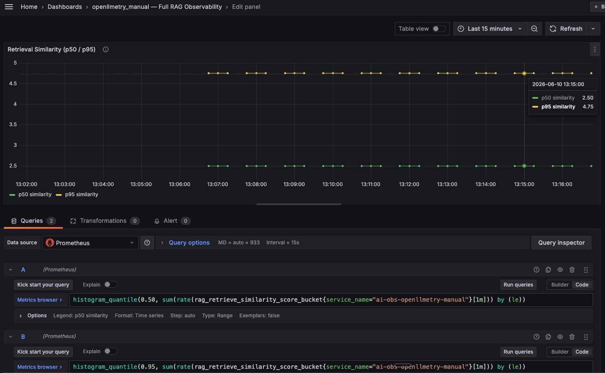
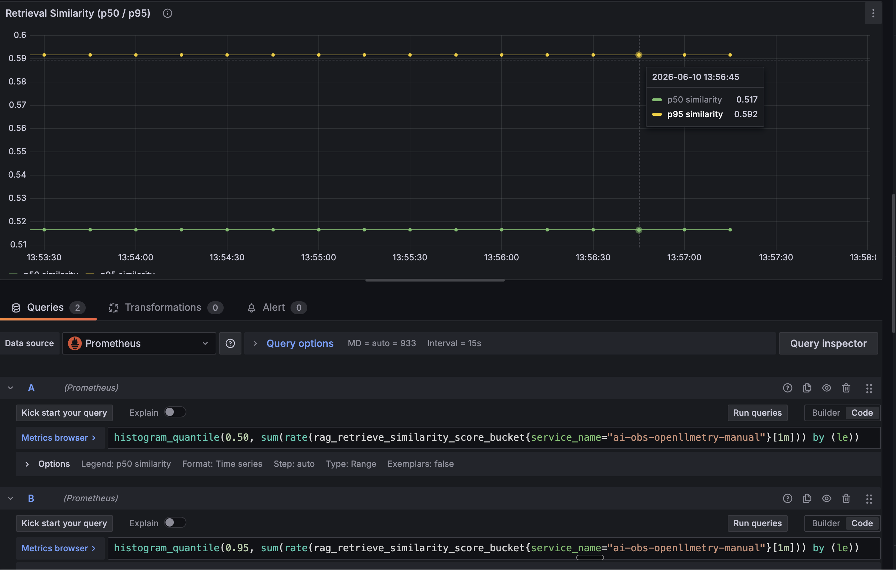

# Histogram Bucket Boundaries: Why p50 Similarity Was Showing 2.5

## Symptom

The Grafana panel "Retrieval Similarity (p50/p95)" showed values > 1 (e.g. p50=2.5, p95=4.75) despite cosine similarity scores from the app being in the 0–1 range:



App response showing actual similarity scores:

```json
{
    "sources": [
        {"content": "...", "similarity": 0.574},
        {"content": "...", "similarity": 0.514},
        {"content": "...", "similarity": 0.513},
        {"content": "...", "similarity": 0.447},
        {"content": "...", "similarity": 0.308}
    ]
}
```

### Checking the bucket boundaries

```bash
curl -s --data-urlencode \
  'query=rag_retrieve_similarity_score_bucket{service_name="ai-obs-openllmetry-manual"}' \
  'http://localhost:9091/api/v1/query' | \
  python3 -c "
import sys,json
data=json.load(sys.stdin)
les = sorted(set(float(r['metric']['le']) for r in data['data']['result'] if r['metric']['le'] != '+Inf'))
print('Boundaries:', les)
"
```

Output (before fix):
```
Boundaries: [0.0, 5.0, 10.0, 25.0, 50.0, 75.0, 100.0, 250.0, 500.0, 750.0, 1000.0, 2500.0, 5000.0, 7500.0, 10000.0]
```

### Checking p50/p95

```bash
curl -s --data-urlencode \
  'query=histogram_quantile(0.50, sum(rate(rag_retrieve_similarity_score_bucket{service_name="ai-obs-openllmetry-manual"}[5m])) by (le))' \
  'http://localhost:9091/api/v1/query' | \
  python3 -c "import sys,json; d=json.load(sys.stdin); [print(r['value'][1]) for r in d['data']['result']]"
```

Output (before fix):
```
p50: 2.5
p95: 4.75
```

## Problem

- The `rag.retrieve.similarity` histogram was created without explicit bucket boundaries:
  ```python
  similarity_histogram = meter.create_histogram(
      "rag.retrieve.similarity",
      description="Cosine similarity of retrieved chunks",
      unit="score",
  )
  ```
- OpenTelemetry uses default bucket boundaries designed for **latency in milliseconds**: `[0, 5, 10, 25, 50, 75, 100, 250, ...]`
- Cosine similarity values (0.3–0.6) all fall into the **first bucket** (0–5)
- `histogram_quantile()` performs **linear interpolation** within a bucket. With all observations between 0 and 5, the p50 interpolates to the midpoint of that range → **2.5**
- The metric is technically working — the data arrives in Prometheus — but the bucket granularity is too coarse for the value range

## Solution

Set explicit bucket boundaries appropriate for 0–1 range values in `instrument.py`:

```python
from opentelemetry.sdk.metrics import MeterProvider
from opentelemetry.sdk.metrics.export import PeriodicExportingMetricReader
from opentelemetry.sdk.metrics.view import ExplicitBucketHistogramAggregation, View

SIMILARITY_BUCKETS = (0.0, 0.1, 0.2, 0.3, 0.4, 0.5, 0.6, 0.7, 0.8, 0.9, 1.0)

similarity_view = View(
    instrument_name="rag.retrieve.similarity",
    aggregation=ExplicitBucketHistogramAggregation(boundaries=SIMILARITY_BUCKETS),
)

meter_provider = MeterProvider(
    resource=resource,
    metric_readers=[metric_reader],
    views=[similarity_view],
)
metrics.set_meter_provider(meter_provider)
```

Key points:
- The `View` targets only `instrument_name="rag.retrieve.similarity"` — all other histograms keep default buckets
- The MeterProvider is set globally **before** Traceloop.init(), so Traceloop's auto-instrumented metrics (GenAI token usage, operation duration) still flow through it
- Traceloop is initialized without `metrics_exporter`, so it skips its own MeterProvider setup and relies on the global one

### Why removing `metrics_exporter` from Traceloop doesn't break OpenLLMetry metrics

Previously, `Traceloop.init()` received both `exporter` (traces) and `metrics_exporter` (metrics):

```python
# Before — Traceloop manages its own MeterProvider
Traceloop.init(
    app_name=service_name,
    exporter=trace_exporter,
    metrics_exporter=metric_exporter,  # Traceloop creates its own MeterProvider
    ...
)
```

When you pass `metrics_exporter`, Traceloop creates an internal `MetricsWrapper` with its own `MeterProvider`. That MeterProvider uses default bucket boundaries — and there's no way to inject a custom `View` into it.

The fix: set up our own MeterProvider (with the view) globally, and don't pass `metrics_exporter` to Traceloop:

```python
# After — we manage the MeterProvider, Traceloop only handles traces
metrics.set_meter_provider(meter_provider)  # global, with our custom view

Traceloop.init(
    app_name=service_name,
    exporter=trace_exporter,
    # no metrics_exporter — Traceloop skips its MeterProvider setup
    ...
)
```

This works because of how Traceloop's [`init()`](https://github.com/traceloop/openllmetry/blob/4643b8826a6e6a4ce1968178d6ac9ca3ce607e2e/packages/traceloop-sdk/traceloop/sdk/__init__.py#L198-L203) handles the absence of `metrics_exporter`:

```python
# From Traceloop source (traceloop/sdk/__init__.py)
custom_trace_without_custom_metrics = has_custom_spans_pipeline and not metrics_exporter
if metrics_disabled_by_config or custom_trace_without_custom_metrics:
    print("Metrics are disabled")  # Traceloop skips its own MeterProvider
```

When Traceloop sees a custom trace exporter but no metrics exporter, it prints "Metrics are disabled" and skips creating its internal `MetricsWrapper`. But "disabled" here only means Traceloop won't set up its own metrics pipeline — it doesn't disable metric recording globally.

OpenLLMetry's auto-instrumentations (for OpenAI SDK, etc.) record metrics by calling `metrics.get_meter()` — which resolves to whatever global MeterProvider is set. Since we already called `metrics.set_meter_provider(meter_provider)` before Traceloop.init(), all metrics (both our custom ones and OpenLLMetry's auto-instrumented GenAI metrics) flow through our MeterProvider → our exporter → Prometheus.

Net result:
- `gen_ai_client_token_usage` — still works (OpenLLMetry auto-instrumentation → global MeterProvider)
- `gen_ai_client_operation_duration` — still works (same path)
- `rag.retrieve.similarity` — now uses correct 0–1 buckets (via our View)
- All other histograms — keep default buckets (the View only targets the specific instrument name)

### After fix — bucket boundaries

```
Boundaries: [0.0, 0.1, 0.2, 0.3, 0.4, 0.5, 0.6, 0.7, 0.8, 0.9, 1.0]
```

### After fix — p50/p95



```
p50: 0.517
p95: 0.592
```

These values now align with the actual similarity scores returned by the app:

```bash
curl -s -X POST http://localhost:8001/ask \
  -H "Content-Type: application/json" \
  -d '{"query": "What does the kube-scheduler do?", "user_id": "anonymous"}' | python3 -m json.tool
```

```
similarity: 0.574  ← top chunk
similarity: 0.514
similarity: 0.513
similarity: 0.447
similarity: 0.308  ← bottom chunk
```

- **p50 = 0.517** — the median sits between the 2nd and 3rd chunk (0.514, 0.513). ✓
- **p95 = 0.592** — close to the top chunk's score (0.574). ✓

## Takeaway

When creating a histogram for a non-latency metric, always define explicit bucket boundaries matching the expected value range. The OTel defaults assume millisecond latency — any metric with a different range (percentages, scores, ratios, byte counts) will produce misleading quantiles unless you override the buckets via a View.
