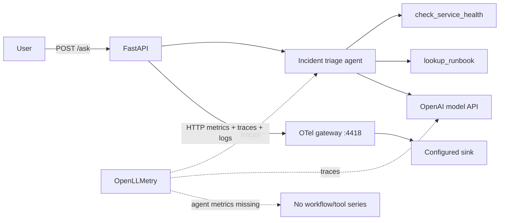

# OpenLLMetry + OpenAI Agents: metrics gap

This experiment runs a tool-using incident-triage agent with `openai-agents==0.17.5`
and `traceloop-sdk==0.61.0`. It demonstrates a narrow failure mode: traces are
created for the Agents SDK and model calls, but OpenAI Agents workflow, agent,
and tool duration metrics are not recorded.

This is not a claim that OpenLLMetry lacks OpenAI Agents support. Its current
agent instrumentor creates token and duration instruments, but does not retain
or record them. With the Agents SDK `responses` path, no GenAI metrics are
emitted in this experiment. In legacy `chat_completions` mode, minimal underlying
chat and token metrics can appear, but agent/workflow/tool metrics remain absent.
HTTP metrics provide the control signal proving that the OTLP metrics pipeline is
working.

Implementation note: the OpenAI Agents SDK has a built-in trace processor.
`src/instrument.py` blocks Traceloop's default OpenAI Agents auto-registration and
installs `OpenAIAgentsInstrumentor(replace_existing_processors=True)` manually,
so this experiment sends only the OpenTelemetry processor output instead of
duplicating the SDK's default processor.

Upstream references:

- [OpenLLMetry OpenAI Agents instrumentor](https://github.com/traceloop/openllmetry/tree/main/packages/opentelemetry-instrumentation-openai-agents)
- [OpenLLMetry OpenAI instrumentor](https://github.com/traceloop/openllmetry/tree/main/packages/opentelemetry-instrumentation-openai)
- [OpenAI Agents SDK](https://github.com/openai/openai-agents-python)

## Flow



## Expected trace

Replace the table timings with observed values after running against a real key.

| # | Span | Parent | Duration | Source | What it tells you | Sample attributes |
|---|---|---|---|---|---|---|
| 1 | `POST /ask` | - | variable | FastAPI auto | End-to-end user latency | `http.target=/ask`, `http.status_code=200` |
| 2 | agent workflow | `POST /ask` | variable | OpenLLMetry Agents | Overall SDK workflow | `gen_ai.operation.name=agent` |
| 3 | `openai.responses` / chat call | workflow | variable | OpenLLMetry OpenAI | Model-call latency and token attributes on the span | `gen_ai.request.model`, `gen_ai.usage.input_tokens` |
| 4 | `check_service_health` | workflow | variable | OpenLLMetry Agents | Tool execution | tool name and arguments |
| 5 | `lookup_runbook` | workflow | variable | OpenLLMetry Agents | Tool execution | tool name and result |
| 6 | `openai.responses` / chat call | workflow | variable | OpenLLMetry OpenAI | Final model turn | response model and usage |

## Span attributes

| Attribute | Example | Source |
|---|---|---|
| `gen_ai.operation.name` | `agent`, `chat`, `execute_tool` | OpenLLMetry |
| `gen_ai.request.model` | `gpt-4.1-mini` | OpenLLMetry |
| `gen_ai.usage.input_tokens` | `418` | Responses span |
| `gen_ai.usage.output_tokens` | `96` | Responses span |
| `gen_ai.tool.name` | `lookup_runbook` | Agents span |
| `http.target` | `/ask` | FastAPI |

## Metrics dashboard


Import `dashboards/dashboard.grafana.json` from Grafana's dashboard import UI.

For API import, use:

```bash
make dashboard
```

This dashboard has the same six panels as the OpenLIT dashboard. The
agent/workflow/tool panels being empty is the experiment result, not a dashboard
defect. See [the comparison doc](../../docs/openai_agents_openlit_vs_openllmetry.md) for
the side-by-side expected behavior.

| Panel | Metric | PromQL | What it tells you |
|---|---|---|---|
| Agent Workflow Duration p95 | `gen_ai.client.operation.duration` | `histogram_quantile(0.95, sum(increase(gen_ai_client_operation_duration_seconds_bucket{service_name="ai-obs-openllmetry-openai-agents",gen_ai_operation_name=~"invoke_workflow\|invoke_agent"}[$__range])) by (le, gen_ai_operation_name))` | Expected empty: workflow/agent duration metrics are not recorded |
| Tool Execution Duration p95 | `gen_ai.client.operation.duration` | `histogram_quantile(0.95, sum(increase(gen_ai_client_operation_duration_seconds_bucket{service_name="ai-obs-openllmetry-openai-agents",gen_ai_operation_name="execute_tool"}[$__range])) by (le))` | Expected empty: tool duration metrics are not recorded |
| Model Call Duration p95 | `gen_ai.client.operation.duration` | `histogram_quantile(0.95, sum(increase(gen_ai_client_operation_duration_seconds_bucket{service_name="ai-obs-openllmetry-openai-agents",gen_ai_operation_name="chat"}[$__range])) by (le, gen_ai_request_model))` | Empty in `responses`; minimal in legacy `chat_completions` |
| Token Usage | `gen_ai.client.token.usage` | `sum(increase(gen_ai_client_token_usage_sum{service_name="ai-obs-openllmetry-openai-agents"}[$__range])) by (gen_ai_token_type, gen_ai_request_model)` | Empty in `responses`; minimal in legacy `chat_completions` |
| HTTP Requests | `http.server.duration` | `sum(increase(http_server_duration_milliseconds_count{service_name="ai-obs-openllmetry-openai-agents",http_target="/ask"}[$__range])) by (http_status_code)` | Control signal: app metrics reach the sink |
| HTTP Request Duration p95 | `http.server.duration` | `histogram_quantile(0.95, sum(increase(http_server_duration_milliseconds_bucket{service_name="ai-obs-openllmetry-openai-agents",http_target="/ask"}[$__range])) by (le))` | User-visible latency |

## Metric dimensions

### HTTP metrics that should exist

| Dimension | Example |
|---|---|
| `service_name` | `ai-obs-openllmetry-openai-agents` |
| `http_method` | `POST` |
| `http_target` | `/ask` |
| `http_status_code` | `200` |

### GenAI dimensions expected but absent

| Dimension | Example |
|---|---|
| `gen_ai_operation_name` | `chat`, `invoke_agent`, `execute_tool` |
| `gen_ai_request_model` | `gpt-4.1-mini` |
| `gen_ai_token_type` | `input`, `output` |
| `server_address` | `api.openai.com` |
| `service_name` | `ai-obs-openllmetry-openai-agents` |

## Failure modes

| # | Failure mode | Why? | How? | Where? | What? |
|---|---|---|---|---|---|
| 1 | Agent latency regression | Slow tool loops hurt users | Trace workflow duration | Trace explorer | Agent/workflow spans |
| 2 | Tool failure | Bad synthetic health or runbook calls break triage | Inspect error spans | Trace explorer | Tool span status |
| 3 | Provider error | Responses call fails | Inspect error spans and HTTP 5xx | Traces + HTTP panel | Responses span exception |
| 4 | Token cost spike | Runaway turns increase spend | Not detectable from metrics in this setup | - | Token attributes exist only on spans |
| 5 | Agent traffic growth | Capacity planning | Count `/ask` requests | HTTP dashboard | Request-rate metric |
| 6 | Per-operation SLO | Need separate agent/tool/model latency | Not detectable from metrics in this setup | - | GenAI duration series absent |
| 7 | Metrics pipeline failure vs library gap | Avoid blaming collector | Compare HTTP metrics with empty GenAI panels | Dashboard | HTTP present, GenAI absent |

## Usage

```bash
cd ../../infra
make up

cd ../experiments/openllmetry_openai_agents
cp .env.example .env
# Set OPENAI_API_KEY, OPENAI_MODEL, and OPENAI_AGENTS_API.

make up
```

Use `OPENAI_AGENTS_API=responses` to exercise the default Agents SDK Responses
path. Use `OPENAI_AGENTS_API=chat_completions` to exercise the legacy
chat-completions path.

For Bifrost, use the virtual key and OpenAI-compatible `/v1` base URL:

```bash
OPENAI_API_KEY=<bifrost-virtual-key>
OPENAI_MODEL=openai/gpt-4o-mini
OPENAI_AGENTS_API=chat_completions
OPENAI_BASE_URL=http://host.docker.internal:8000/v1
```

The `/v1` suffix matters. Without it the OpenAI SDK posts to
`http://host.docker.internal:8000/responses`, which Bifrost rejects with
`405 Method Not Allowed`.

The app also calls `set_default_openai_client(..., use_for_tracing=False)`.
Without that, the OpenAI Agents SDK tries to upload hosted traces to OpenAI with
the Bifrost virtual key and logs `401 invalid_api_key` for `/v1/traces/ingest`.

From another terminal:

```bash
make ask
make metrics
```

Run `make ask` several times, import the dashboard, and compare populated HTTP
metrics with empty workflow/tool metric panels. Traces should still contain the
agent, tool, and model operations.
