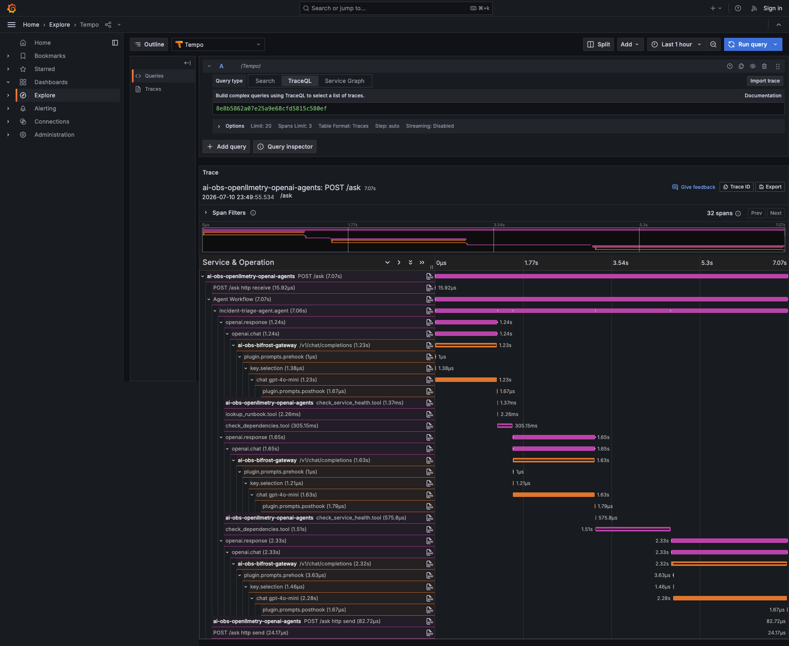
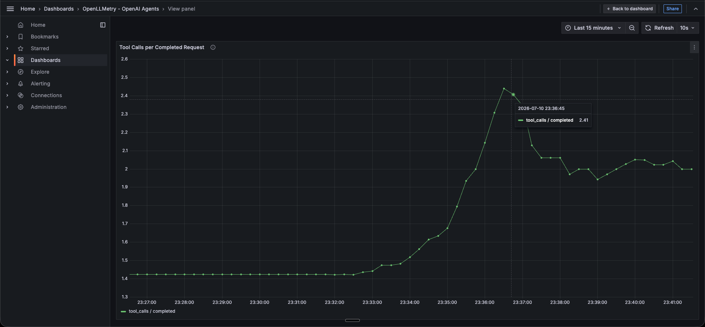
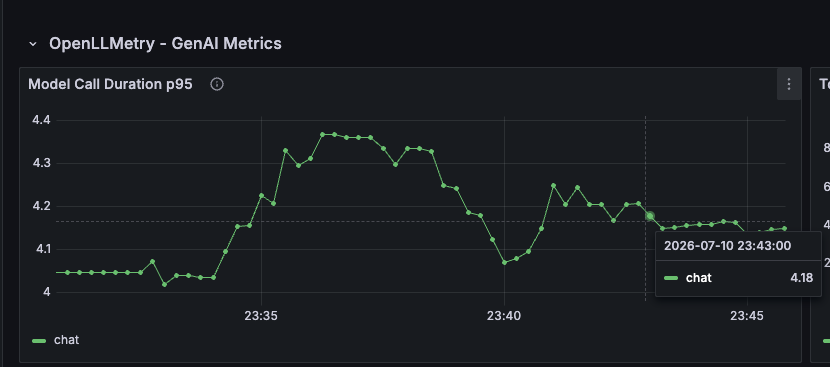
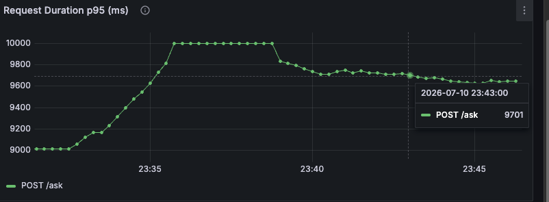

# OpenLLMetry + OpenAI Agents: metrics gap

## Context: from manual loop to Agents SDK

The previous experiment (`openai_agents_manual`) runs the same incident-triage
agent with a hand-written tool loop and manual OTel instrumentation. Every span
and metric is created by our code - full visibility.

This experiment replaces the manual loop with the **OpenAI Agents SDK**
(`openai-agents`) and uses **OpenLLMetry** (`traceloop-sdk`) for
auto-instrumentation. The agent, tools, and dependency graph are identical.
The question: does OpenLLMetry reproduce the metrics that the manual experiment
gets for free?

**Answer: partially.** Traces work (spans for agent, tools, model calls). Model
call duration and token usage metrics are recorded (from the OpenAI SDK
instrumentor). But agent workflow and tool duration metrics are absent - only
`gen_ai_operation_name="chat"` appears in Prometheus, with no `invoke_workflow`
or `execute_tool` operation names present.

## What OpenLLMetry emits

### GenAI metrics (from OpenAI SDK instrumentor)

| Metric | What it records | Dimensions |
|---|---|---|
| `gen_ai.client.operation.duration` | Duration of `chat` completions calls | `gen_ai_operation_name=chat`, `gen_ai_response_model`, `gen_ai_provider_name`, `server_address` |
| `gen_ai.client.token.usage` | Input and output token counts per call | `gen_ai_token_type=input\|output`, `gen_ai_response_model`, `gen_ai_operation_name=chat` |
| `gen_ai.client.generation.choices` | Completion count by finish reason | `gen_ai_response_finish_reason=stop\|tool_call`, `gen_ai_response_model` |

### GenAI metrics NOT emitted (from Agents instrumentor)

| Metric | What it should record | Why missing |
|---|---|---|
| `gen_ai.client.operation.duration` with `invoke_workflow` | Total workflow duration | Instrument allocated, `.record()` never called |
| `gen_ai.client.operation.duration` with `execute_tool` | Per-tool latency | Instrument allocated, `.record()` never called |
| `gen_ai.client.token.usage` per workflow | Token totals per agent run | Not implemented |

### HTTP metrics (from FastAPI instrumentor)

| Metric | What it records | Dimensions |
|---|---|---|
| `http.server.duration` | Request latency | `http_method`, `http_target`, `http_status_code` |
| `http.server.active_requests` | Concurrent in-flight requests | `http_method`, `http_scheme` |
| `http.server.request_size` | Request body bytes | `http_method`, `http_target`, `http_status_code` |
| `http.server.response_size` | Response body bytes | `http_method`, `http_target`, `http_status_code` |

## What stays the same from experiment 5

- Same tools: `check_service_health`, `lookup_runbook`, `check_dependencies`
- Same dependency graph and simulated latencies
- Same `max_turns=3`
- Same make targets: `make auth-ask`, `make payments-ask`, `make catalog-ask`, `make checkout-ask`

## What changes from experiment 5

| | Experiment 5 (manual) | This experiment (OpenLLMetry) |
|---|---|---|
| Tool loop | Hand-written `for` loop | OpenAI Agents SDK `Runner.run()` |
| Instrumentation | Manual spans + manual metrics | OpenLLMetry auto |
| Workflow/tool metrics | Populated | Missing |
| Model call duration metrics | Populated | Populated (from OpenAI SDK instrumentor) |
| Token usage metrics | Populated | Populated (from OpenAI SDK instrumentor) |
| Generation choices metric | Not present | Populated (finish reason: stop vs tool_call) |
| Traces | Manual spans, disconnected from Bifrost | Auto spans, connected through Bifrost |

### Code simplification

The agent logic goes from ~250 lines to ~113 lines. The core of it:

```python
# Experiment 5: manual loop (~80 lines of loop + dispatch + message management)
async def run_agent(query: str, client: AsyncOpenAI, model: str, max_turns: int = 3) -> str:
    for turn in range(max_turns):
        response = await client.chat.completions.create(...)
        if not choice.tool_calls:
            break
        for call in choice.tool_calls:
            result = _dispatch_tool(call.function.name, call.function.arguments)
            ...

# This experiment: 3 lines
async def run_agent(query: str) -> str:
    result = await Runner.run(agent, query, max_turns=3)
    return str(result.final_output)
```

No client management, no message list, no tool dispatch loop, no
instrumentation code in the agent. The tradeoff: you lose workflow and tool
metrics.

## Expected trace

Unlike experiment 5 where the agent and Bifrost traces are disconnected (two
separate trace IDs), OpenLLMetry instruments the HTTP client layer and injects
the `traceparent` header into outgoing requests. This means the agent spans and
Bifrost gateway spans appear in the same trace - a connected view from user
request through to the model provider:



This is something OpenLLMetry does better than manual instrumentation: distributed
tracing across the gateway works automatically.

| # | Span | Parent | Duration | Source | What it tells you | Sample attributes |
|---|---|---|---|---|---|---|
| 1 | `POST /ask` | - | variable | FastAPI auto | End-to-end user latency | `http.target=/ask`, `http.status_code=200` |
| 2 | agent workflow | `POST /ask` | variable | OpenLLMetry Agents | Overall SDK workflow | `gen_ai.operation.name=agent` |
| 3 | `openai.chat` | workflow | variable | OpenLLMetry OpenAI | Model-call with token attributes | `gen_ai.request.model`, `gen_ai.usage.input_tokens` |
| 4 | `check_service_health` | workflow | variable | OpenLLMetry Agents | Tool execution | tool name and arguments |
| 5 | `lookup_runbook` | workflow | variable | OpenLLMetry Agents | Tool execution | tool name and result |
| 6 | `check_dependencies` | workflow | variable | OpenLLMetry Agents | Tool with simulated latency | tool name and arguments |
| 7 | `openai.chat` | workflow | variable | OpenLLMetry OpenAI | Subsequent model turns | response model and usage |

## Span attributes

| Attribute | Example | Source |
|---|---|---|
| `gen_ai.operation.name` | `agent`, `chat`, `execute_tool` | OpenLLMetry |
| `gen_ai.request.model` | `gpt-4o-mini` | OpenLLMetry |
| `gen_ai.usage.input_tokens` | `418` | Chat span |
| `gen_ai.usage.output_tokens` | `96` | Chat span |
| `gen_ai.tool.name` | `check_dependencies` | Agents span |
| `http.target` | `/ask` | FastAPI |

## Metrics dashboard

Import `dashboards/dashboard.grafana.json` from Grafana's dashboard import UI.

For API import:

```bash
make dashboard
```

| Panel | Metric | PromQL | What it tells you |
|---|---|---|---|
| Model Call Duration p95 | `gen_ai.client.operation.duration` | `histogram_quantile(0.95, sum(increase(gen_ai_client_operation_duration_seconds_bucket{service_name="ai-obs-openllmetry-openai-agents"}[$__range])) by (le, gen_ai_operation_name))` | Provider latency per chat call |
| Token Usage | `gen_ai.client.token.usage` | `sum(increase(gen_ai_client_token_usage_sum{service_name="ai-obs-openllmetry-openai-agents"}[$__range])) by (gen_ai_token_type, gen_ai_response_model)` | Token consumption |
| Generation Choices by Finish Reason | `gen_ai.client.generation.choices` | `sum(increase(gen_ai_client_generation_choices_choice_total{service_name="ai-obs-openllmetry-openai-agents"}[$__range])) by (gen_ai_response_finish_reason)` | Ratio of tool_call vs stop - shows how often the model invokes tools |
| Tool Calls per Completed Request | `gen_ai.client.generation.choices` | `tool_call count / stop count` | Average tool-calling turns per request. Spike = model looping more |
| Agent Workflow Duration p95 (MISSING) | `gen_ai.client.operation.duration` | `...{gen_ai_operation_name="invoke_workflow"}` | Empty - not recorded by OpenLLMetry |
| Tool Execution Duration p95 (MISSING) | `gen_ai.client.operation.duration` | `...{gen_ai_operation_name="execute_tool"}` | Empty - not recorded by OpenLLMetry |
| Request Rate | `http.server.duration` | `sum(increase(..._count{http_target="/ask"}[$__range])) by (http_status_code)` | Traffic volume |
| Request Duration p95 (ms) | `http.server.duration` | `histogram_quantile(0.95, ...)` | User-visible latency |
| Active Requests | `http.server.active_requests` | `http_server_active_requests{...}` | Concurrency |
| Error Rate (5xx) | `http.server.duration` | `...{http_status_code=~"5.."}` | Server errors |
| Request Size (bytes, avg) | `http.server.request_size` | `rate(_sum) / rate(_count)` | Payload size |
| Response Size (bytes, avg) | `http.server.response_size` | `rate(_sum) / rate(_count)` | Response size |

### Example: Tool Calls per Completed Request



Flat at ~1.4 means the model averages 1.4 tool-calling turns before synthesizing.
The spike to 2.4 shows when `checkout-ask` requests dominate (3 tool-calling
turns, cut off at max_turns). This is OpenLLMetry's closest proxy to detecting
runaway agent behavior without workflow/tool duration metrics.

### Example: the latency blind spot

Model Call Duration p95 shows ~4.3s per individual chat completions call:



Request Duration p95 shows ~9.6s total per HTTP request:



The gap: 9.6s - 4.3s = ~5.3s unaccounted for. That time is spent in multiple
model calls (p95 shows per-call, not per-request total), tool execution (dependency
sleeps), and framework overhead. Without workflow and tool duration metrics, you
can't break this down from the dashboard. You'd have to open a trace to find
where the time went.

In experiment 5 (manual), the Operation Rate and Time Breakdown panels answer
this from metrics alone. Here, it's a blind spot.

## Failure modes

| # | Failure mode | Detectable? | How? | Where? | What metric/span? |
|---|---|---|---|---|---|
| 1 | Slow conversation | Yes (HTTP only) | Alert on HTTP request p95 | Request Duration p95 panel | `http_server_duration_milliseconds_bucket` |
| 2 | Slow provider | Yes | Alert on model call p95 | Model Call Duration p95 panel | `gen_ai_client_operation_duration_seconds{gen_ai_operation_name="chat"}` |
| 3 | Token cost spike | Yes | Alert on token rate | Token Usage panel | `gen_ai_client_token_usage_sum` |
| 4 | Runaway turns | Partially | tool_call finish reason count growing vs stop | Generation Choices panel | `gen_ai_client_generation_choices_choice_total{gen_ai_response_finish_reason="tool_call"}` |
| 5 | Slow tool | No (metrics) | Inspect tool spans in traces | Trace explorer | `execute_tool` span duration |
| 6 | Tool failure | Yes (traces) | Filter spans by error status | Trace explorer | `execute_tool` span with error |
| 7 | Provider error | Yes | Error spans + HTTP 5xx | Trace explorer + Error Rate panel | Chat span exception + `http_status_code=~"5.."` |
| 8 | Per-tool SLO (e.g. tool X > 2s) | No (metrics) | Inspect tool spans in traces | Trace explorer | `execute_tool` span duration |
| 9 | Workflow SLO (e.g. agent > 10s) | No (GenAI metrics) | Only via HTTP p95 (includes framework overhead) | Request Duration panel | `http_server_duration_milliseconds_bucket` |
| 10 | Metrics gap vs pipeline failure | Yes | HTTP panels populated, GenAI workflow/tool empty | Dashboard | Compare HTTP section with GenAI MISSING panels |

## Prerequisites

- **Docker and Docker Compose.** The agent runs in a container; `make build` then `make up`.
- **Shared infra up first:** `cd ../../infra && make up`.
  - Brings up the OTel collector gateway (OTLP on `host.docker.internal:4418`) and the selected sink.
  - For `make dashboard`, use a metrics-capable sink: `SINK=grafana`.
  - No pgvector needed — this is the OpenAI Agents SDK tool loop, not a RAG pipeline.
- **`.env`** copied from `.env.example`, no hidden defaults:
  - `OPENAI_API_KEY` — a real provider key; the agent calls the model live. e.g. `OPENAI_API_KEY=your-openai-api-key`
  - `OPENAI_MODEL` — model the agent drives. e.g. `OPENAI_MODEL=gpt-4o-mini`
  - `OPENAI_AGENTS_API` — Agents SDK transport. e.g. `OPENAI_AGENTS_API=chat_completions`
  - `OPENAI_BASE_URL` — gateway base URL; set it (plus a Bifrost virtual key as `OPENAI_API_KEY`) to route through Bifrost. e.g. `OPENAI_BASE_URL=http://host.docker.internal:8800/v1`
  - `OTEL_SERVICE_NAME` — service name on emitted telemetry. e.g. `OTEL_SERVICE_NAME=ai-obs-openllmetry-openai-agents`
  - `OTEL_EXPORTER_OTLP_ENDPOINT` — OTLP target; the agent sends to the gateway, never a sink directly. e.g. `OTEL_EXPORTER_OTLP_ENDPOINT=http://host.docker.internal:4418`
- **`python3` on the host** for the `make *-ask` / `make metrics` / `make dashboard` targets.
- Expect gaps: OpenLLMetry traces the model calls but misses the workflow and tool metrics — the empty panels are the point of this experiment.

## Usage

```bash
cd ../../infra
make up

cd ../experiments/openllmetry_openai_agents
cp .env.example .env
# Set OPENAI_API_KEY

make up
```

From another terminal:

```bash
make auth-ask           # 2 turns - no dependencies
make payments-ask       # 3 turns - checks ledger
make catalog-ask        # 3 turns - checks search-index, inventory
make checkout-ask       # 4 turns - hits max_turns=3, gets cut off
make random-ask         # random service each time
make metrics
make dashboard
```

Compare the dashboard with experiment 5: Model Call Duration and Token Usage
panels populate. Agent Workflow Duration and Tool Execution Duration panels
are empty. HTTP panels populate as control signal.

## Appendix: Metric dimensions

### `gen_ai.client.operation.duration`

| Dimension | Example |
|---|---|
| `gen_ai_operation_name` | `chat` (only value present) |
| `gen_ai_provider_name` | `openai` |
| `gen_ai_response_model` | `openai/gpt-4o-mini` |
| `server_address` | `http://host.docker.internal:8800/v1/` |
| `stream` | `false` |
| `service_name` | `ai-obs-openllmetry-openai-agents` |

### `gen_ai.client.token.usage`

| Dimension | Example |
|---|---|
| `gen_ai_operation_name` | `chat` |
| `gen_ai_provider_name` | `openai` |
| `gen_ai_response_model` | `openai/gpt-4o-mini` |
| `gen_ai_token_type` | `input`, `output` |
| `server_address` | `http://host.docker.internal:8800/v1/` |
| `service_name` | `ai-obs-openllmetry-openai-agents` |

### `gen_ai.client.generation.choices`

| Dimension | Example |
|---|---|
| `gen_ai_operation_name` | `chat` |
| `gen_ai_provider_name` | `openai` |
| `gen_ai_response_model` | `openai/gpt-4o-mini` |
| `gen_ai_response_finish_reason` | `stop`, `tool_call` |
| `server_address` | `http://host.docker.internal:8800/v1/` |
| `service_name` | `ai-obs-openllmetry-openai-agents` |

### HTTP metrics

| Dimension | Example |
|---|---|
| `http_method` | `POST` |
| `http_target` | `/ask` |
| `http_status_code` | `200`, `500` |
| `http_scheme` | `http` |
| `net_host_port` | `8004` |
| `service_name` | `ai-obs-openllmetry-openai-agents` |
