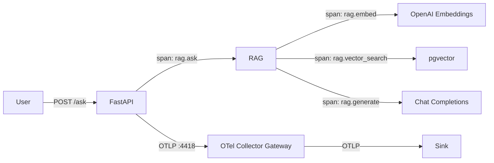
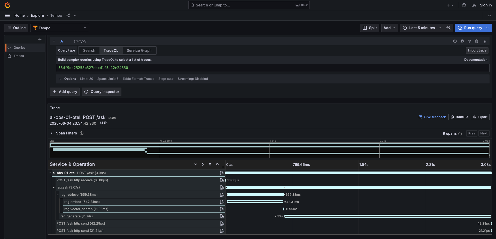
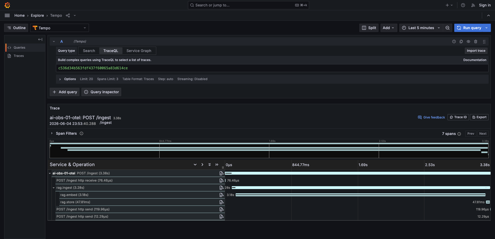
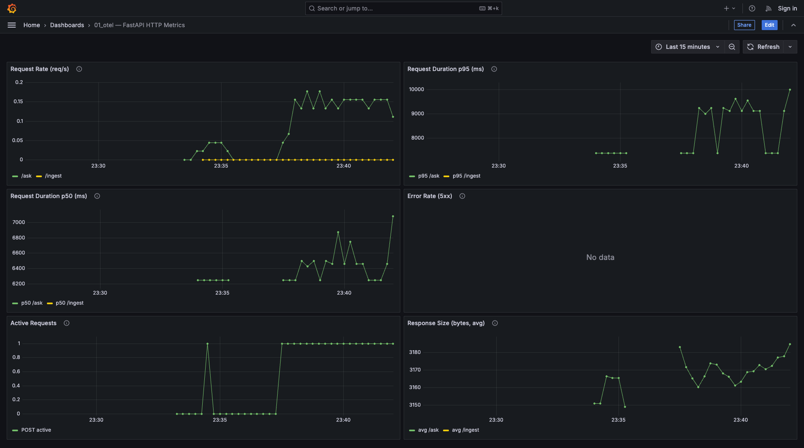

# otel — Vanilla OpenTelemetry

Instruments the RAG app with plain OpenTelemetry — manual spans, metrics, and logs. No LLM-specific auto-instrumentation.

## Flow



## Example traces

### POST /ask (3.08s, 9 spans)



```
POST /ask (3.08s)
├── POST /ask http receive (16µs)
├── rag.ask (3.07s)
│   ├── rag.retrieve (659ms)
│   │   ├── rag.embed (642ms)
│   │   └── rag.vector_search (12ms)
│   └── rag.generate (2.39s)
├── POST /ask http send (42µs)
└── POST /ask http send (21µs)
```

| # | Span | Parent | Duration | Source | What it tells you | Sample attributes |
|---|------|--------|----------|--------|-------------------|-------------------|
| 1 | `POST /ask` | — | 3.08s | FastAPI auto | How long did the user wait? | `http.method=POST`, `http.target=/ask`, `http.status_code=200` |
| 2 | `POST /ask http receive` | `POST /ask` | 16µs | FastAPI auto | How long to receive the request? | — |
| 3 | `rag.ask` | `POST /ask` | 3.07s | Manual | How long did the full RAG pipeline take? | — |
| 4 | `rag.retrieve` | `rag.ask` | 659ms | Manual | How long did retrieval take? | `retrieve.top_k=5` |
| 5 | `rag.embed` | `rag.retrieve` | 642ms | Manual | How long did query embedding take? | `embed.model=openai/text-embedding-3-small`, `embed.num_texts=1` |
| 6 | `rag.vector_search` | `rag.retrieve` | 12ms | Manual | Is the database the bottleneck? | — |
| 7 | `rag.generate` | `rag.ask` | 2.39s | Manual | How long did LLM generation take? | `generate.model=claude-sonnet-4`, `generate.num_context_chunks=5` |
| 8 | `POST /ask http send` (×2) | `POST /ask` | ~42µs | FastAPI auto | How long to send the response? | — |

### POST /ingest (3.38s, 7 spans)



```
POST /ingest (3.38s)
├── POST /ingest http receive (76µs)
├── rag.ingest (3.28s)
│   ├── rag.embed (3.18s)
│   └── rag.store (48ms)
├── POST /ingest http send (120µs)
└── POST /ingest http send (12µs)
```

| # | Span | Parent | Duration | Source | What it tells you | Sample attributes |
|---|------|--------|----------|--------|-------------------|-------------------|
| 1 | `POST /ingest` | — | 3.38s | FastAPI auto | How long did ingestion take? | `http.method=POST`, `http.target=/ingest`, `http.status_code=200` |
| 2 | `POST /ingest http receive` | `POST /ingest` | 76µs | FastAPI auto | How long to receive the upload? | — |
| 3 | `rag.ingest` | `POST /ingest` | 3.28s | Manual | How long did the full ingest pipeline take? | `ingest.source=kubernetes.txt` |
| 4 | `rag.embed` | `rag.ingest` | 3.18s | Manual | How long to embed all chunks? | `embed.model=openai/text-embedding-3-small`, `embed.num_texts=7` |
| 5 | `rag.store` | `rag.ingest` | 48ms | Manual | How long to write to pgvector? | `store.source=kubernetes.txt`, `store.num_chunks=7` |
| 6 | `POST /ingest http send` (×2) | `POST /ingest` | ~120µs | FastAPI auto | How long to send the response? | — |

**What you can see:** Full pipeline structure for both read and write paths. Where time is spent (embedding dominates both).

**What you can't see:** Token counts, model metadata, prompt/completion content — vanilla OTel doesn't know about LLM APIs.

**No LLM-specific metrics.** Token usage, model info, and cost are not captured — vanilla OTel has no concept of `gen_ai.*` semantics.

## Metrics dashboard



### FastAPI — HTTP Metrics (auto-instrumented)

| Panel | Metric | PromQL | What it tells you |
|-------|--------|--------|-------------------|
| Request Rate (req/s) | `http_server_duration_milliseconds_count` | `sum(rate(..._count[1m])) by (http_target)` | Requests per second by endpoint. Shows traffic volume. |
| Request Duration p95 (ms) | `http_server_duration_milliseconds_bucket` | `histogram_quantile(0.95, sum(rate(..._bucket[1m])) by (le, http_target))` | Worst-case latency per endpoint. What the user experiences. |
| Request Duration p50 (ms) | `http_server_duration_milliseconds_bucket` | `histogram_quantile(0.50, ...)` | Typical latency per endpoint. |
| Error Rate (5xx) | `http_server_duration_milliseconds_count` | `sum(rate(..._count{http_status_code=~"5.."}[1m])) by (http_target)` | Rate of server errors. Non-zero = failures reaching users. |
| Active Requests | `http_server_active_requests` | `http_server_active_requests` | Concurrent in-flight requests. High = saturated. |
| Response Size (bytes, avg) | `http_server_response_size_bytes_sum/count` | `sum(rate(..._sum[1m])) / sum(rate(..._count[1m]))` | Average response payload. Large /ask = verbose LLM output. |

## Failure modes

| # | Failure mode | Why? | How? | Where? | What? |
|---|---|---|---|---|---|
| 1 | App is slow | Identify which RAG step is the bottleneck | Check which span is longest in trace | Trace explorer | `rag.embed` / `rag.generate` span durations |
| 2 | Database down | Avoid silent retrieval failures | `rag.vector_search` span errors | Trace explorer | `rag.vector_search` span with error status |
| 3 | Embedding API down | Detect upstream failures | `rag.embed` span errors | Trace explorer | `rag.embed` span with error status |
| 4 | High request latency | SLA monitoring | Alert on p95 exceeding threshold | FastAPI → Request Duration p95 | `http.server.duration` metric |
| 5 | App errors (5xx) | Detect crashes, unhandled exceptions | Alert when 5xx rate > 0 | FastAPI → Error Rate (5xx) | `http.server.duration{http_status_code=~"5.."}` |
| 6 | App saturation | Prevent request queuing, scale up | Alert when active requests stays high | FastAPI → Active Requests | `http.server.active_requests` |
| | **Not detectable (needs LLM-aware instrumentation)** | | | | |
| 7 | Token budget blown | — | — | — | No token metrics |
| 8 | LLM provider slow vs app slow | — | — | — | No `openai.chat` span to isolate LLM time |
| 9 | Bad retrieval quality | — | — | — | No similarity scores |
| 10 | Per-user abuse | — | — | — | No `user.id` |
| 11 | Cost runaway | — | — | — | No token/cost metrics |

## Usage

```bash
# 1. Start shared infra
cd ../../infra && make up

# 2. Configure
cp .env.example .env
# Edit .env with your keys

# 3. Run
make up

# 4. Test (from another terminal)
make ingest
make ask

# 5. View traces in your configured sink
```

## Appendix: Metric Dimensions

### `http.server.duration` / `http.server.request.size` / `http.server.response.size`

| Dimension | Example | Purpose |
|-----------|---------|---------|
| `http.method` | `POST` | Slice by HTTP method |
| `http.target` | `/ask` | Slice by endpoint path |
| `http.status_code` | `200`, `500` | Error rate = filter by 5xx |
| `http.flavor` | `1.1` | HTTP version |
| `net.host.port` | `8001` | Port |

### `http.server.active_requests`

| Dimension | Example | Purpose |
|-----------|---------|---------|
| `http.method` | `POST` | Slice by method |
| `http.scheme` | `http` | Protocol |
