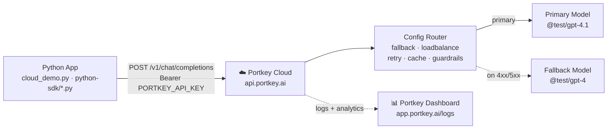
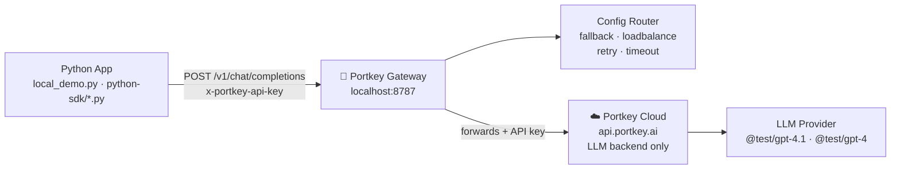

# portkey — Portkey AI Gateway + Cloud Dashboard

Routes LLM calls through the Portkey AI Gateway across two deployment tracks: cloud-hosted SaaS and self-hosted Docker. Demonstrates config-driven routing (fallback, load balancing, retries, streaming) and gateway-level observability — showing what you get from a feature-rich AI ops platform without requiring app-side instrumentation.

> **OSS vs Cloud:** The self-hosted OSS gateway natively supports 6 scenarios (routing, fallback, load balancing, retry, timeout, streaming). Guardrails and semantic caching require a paid Portkey Cloud plan and are **not available** in the local Docker deployment.

## Flow

### Track 1 — Cloud-Hosted



### Track 2 — Self-Hosted Local



> **Note:** No Redis in the local stack. Caching is a Portkey Cloud feature — the OSS gateway does not implement a cache layer. The local setup is a single Docker container (`portkey-gateway`).

## What this captures vs other experiments

| What | otel | openllmetry_manual | bifrost | portkey |
|------|---------|------------------|---------|---------|
| HTTP request spans | ✅ (FastAPI auto) | ✅ (FastAPI auto) | ✅ (FastAPI auto) | ❌ (no app instrumentation in POC) |
| Custom pipeline spans | ✅ (manual) | ✅ (manual) | ✅ (manual) | ❌ |
| LLM call spans (model, tokens, latency) | ❌ | ✅ (auto) | ✅ (auto) | ✅ (dashboard logs) |
| Prompt / completion content | ❌ | ✅ (auto) | ✅ (auto) | ✅ (dashboard logs) |
| Gateway routing / key selection | ❌ | ❌ | ✅ (Bifrost spans) | ✅ (Portkey logs) |
| Gateway token / cost tracking | ❌ | ❌ | ✅ (Prometheus metrics) | ✅ (dashboard analytics) |
| Gateway provider latency | ❌ | ❌ | ✅ (Bifrost spans) | ✅ (dashboard logs) |
| Gateway retry visibility | ❌ | ❌ | ✅ (Bifrost spans) | ✅ (dashboard logs) |
| Fallback routing | ❌ | ❌ | ✅ | ✅ |
| Weighted load balancing | ❌ | ❌ | ✅ | ✅ |
| Semantic caching | ❌ | ❌ | ❌ | ⚠️ (Cloud paid plan only; not available in local OSS gateway — no cache layer) |
| Client-side guardrails | ❌ | ❌ | ❌ | ⚠️ (Cloud paid plan only; OSS default.* checks are no-ops) |
| Gateway-level guardrails (HTTP 446) | ❌ | ❌ | ❌ | ⚠️ (paid Portkey Cloud plan required; portkey.* checks return 403 on free tier) |
| OTel-compatible traces | ✅ | ✅ | ✅ | ✅ (export configurable) |
| Grafana / Prometheus | ✅ | ✅ | ✅ (16-panel dashboard included) | ⚠️ (optional, not enabled in POC) |
| Self-hosted feature parity | ✅ | ✅ | ✅ | ⚠️ (OSS supports 6 routing/retry scenarios; guardrails + cache + virtual keys need Cloud) |
| Logs | ✅ | ✅ | ✅ | ✅ |
| Metrics (HTTP) | ✅ | ✅ | ✅ | ⚠️ (Prometheus optional) |

## Example scenarios

### Scenario 4 — Fallback Routing (~1.2s, 2 attempts)

Primary target uses an invalid model. Gateway detects the 4xx and automatically retries on the fallback target. Client receives a 200 with no code change.

**Dashboard log entry (app.portkey.ai/logs):**

```
trace_id: trc_abc123
status:   200

target[0]   model=@test/invalid-trigger-fallback   status=4xx   FAILED
target[1]   model=@test/gpt-4                      status=200   SUCCESS

prompt_tokens:      45
completion_tokens:  62
total_tokens:       107
latency:            1218ms
```

| # | Field | Value | Source | What it tells you |
|---|-------|-------|--------|-------------------|
| 1 | `trace_id` | `trc_abc123` | Portkey | Unique trace — links both target attempts under one request |
| 2 | `target[0].status` | `4xx` | Portkey | Primary failed — fallback chain was triggered |
| 3 | `target[1].status` | `200` | Portkey | Fallback succeeded — client received a valid response |
| 4 | `latency` | `1218ms` | Portkey | Includes failed primary attempt + successful fallback round-trip |
| 5 | `total_tokens` | `107` | Provider | Charged only for the successful fallback attempt |

### Scenario 5 — Weighted Load Balancing (10 requests, 80/20 split)

10 requests distributed across two models by weight. Traffic split is a config JSON change — no code redeploy needed.

**Gateway UI sample (`http://localhost:8787/public/` → request list):**

```
request 1  → model=@test/gpt-4.1   (weight 80)
request 2  → model=@test/gpt-4.1   (weight 80)
request 3  → model=@test/gpt-4     (weight 20)
request 4  → model=@test/gpt-4.1   (weight 80)
...
```

**Dashboard → Analytics → Requests by Model:**

| Model | Requests | % |
|-------|----------|---|
| `@test/gpt-4.1` | ~8 | ~80% |
| `@test/gpt-4` | ~2 | ~20% |

| # | Field | Value | Source | What it tells you |
|---|-------|-------|--------|-------------------|
| 1 | `model` per request | `@test/gpt-4.1` or `@test/gpt-4` | Gateway log | Which target served each individual request |
| 2 | Analytics split | 80/20 across 10 requests | Dashboard | Confirms weight config was applied correctly |
| 3 | Config change required | weight JSON only | App code | No code redeploy — policy lives in the config object |

### Scenario 8 — Gateway Cache (MISS → HIT) ⚠️ Portkey Cloud Only

> **Not available in the local OSS setup.** Cache state is managed at Portkey Cloud level. The local OSS gateway has no cache layer — there is no Redis in the local stack. This scenario requires Portkey Cloud (free tier supports `cache.mode: simple`).

The cloud demo uses `cache.mode: simple` (exact prompt hash match) — this works reliably with all models including the `@test` catalog. `cache.mode: semantic` (cosine similarity) requires real embedding models and is not supported by `@test` mock models.

Demo pattern: 3 questions asked twice — Round 1 (cold cache, all MISS) then Round 2 (same questions, all HIT). Cache status is read directly from `resp.get_headers()['cache-status']`.

**Portkey Cloud dashboard log entries:**

```
Round 1  Q1  query="What is Kubernetes? Answer in one sentence."    cache_status=MISS  tokens=N   latency=1412ms
Round 2  Q1  query="What is Kubernetes? Answer in one sentence."    cache_status=HIT   tokens=0   latency=47ms
```

```python
config = json.dumps({"cache": {"mode": "simple", "max_age": 3600}})
resp    = client.chat.completions.create(...)
cache_st = resp.get_headers().get("cache-status", "?")   # "HIT" or "MISS"
```

| # | Field | Miss value | Hit value | Source | What it tells you |
|---|-------|-----------|-----------|--------|-------------------|
| 1 | `cache-status` | `MISS` | `HIT` | Portkey Cloud | Whether cloud cache served the response (from `resp.get_headers()`) |
| 2 | `tokens_charged` | `N` | `0` | Provider | Zero token cost on every cache hit |
| 3 | `latency` | `~1400ms` | `~80ms` | Portkey Cloud | ~18x speedup; gap widens further with production models |
| 4 | `cache_mode` | `simple` | `simple` | Config | Exact prompt hash match — works with all models |

**What you can see:** Per-request routing decisions (which target, which model, fallback chain), token counts, latency, cache status, cost attribution, and full prompt/response payload. Gateway logs show whether each request was a cache hit or miss and exactly which fallback target recovered a failed request.

**What you can't see:** App-level pipeline stages (embed, retrieve, generate), retrieval similarity scores, SDK-level spans — those require separate app-side instrumentation (OpenLLMetry + manual spans). Answer correctness and hallucination are not visible without an eval layer.

## Logged fields

### Captured by Portkey gateway (all requests)

| Field | Example value | What it tells you |
|-------|--------------|-------------------|
| `trace_id` | `trc_abc123` | Unique request trace — links all fallback attempts |
| `status` | `200`, `4xx`, `5xx` | Final HTTP status returned to the client |
| `model` | `@test/gpt-4.1` | Model that served the final response |
| `provider` | `openai` | Upstream provider |
| `prompt_tokens` | `45` | Input token count |
| `completion_tokens` | `62` | Output token count |
| `total_tokens` | `107` | Total tokens consumed |
| `tokens_charged` | `0`, `350` | Tokens actually billed (0 on cache hit) |
| `latency` | `1218ms` | End-to-end gateway latency |
| `cache_status` | `HIT`, `MISS` | Portkey Cloud cache result (Cloud only — not in OSS local setup) |
| `stream` | `true`, `false` | Whether response was streamed (SSE) |
| `target[n].status` | `4xx`, `200` | Per-attempt HTTP status in the fallback chain |
| `target[n].model` | `@test/gpt-4` | Model used for each fallback attempt |
| `request.messages` | `[{"role": "user", ...}]` | Full prompt payload |
| `response.content` | `"Docker is a..."` | Full completion payload |

### Routing config fields (per request)

| Field | Example value | What it tells you |
|-------|--------------|-------------------|
| `strategy.mode` | `fallback`, `loadbalance` | Routing strategy applied to this request |
| `targets[n].weight` | `80`, `20` | Traffic weight per target in load balance mode |
| `retry.attempts` | `3` | Max retry count on transient errors |
| `retry.on_status_codes` | `[429, 500, 502, 503, 504]` | Status codes that trigger a retry; add `400` to prove retry fires with `@test/invalid-trigger-fallback` |
| `request_timeout` | `30000` | Gateway-enforced timeout in ms (server-side, not client-side) |
| `cache.mode` | `semantic` | Cache strategy — **Cloud paid plan only**; accepted by OSS config parser but no-op locally |
| `cache.max_age` | `3600` | Cache TTL in seconds — **Cloud paid plan only** |

### Guardrail results (Portkey Cloud only — not available in OSS)

> In the local OSS deployment, `portkey.*` guardrail checks return 403 (paid plan required) and `default.*` checks always return pass (no-op). The fields below are only visible when using a paid Portkey Cloud plan with guardrails configured.

| Field | Example value | What it tells you |
|-------|--------------|-------------------|
| `blocked` | `true`, `false` | Whether the prompt was blocked before reaching the LLM provider |
| `block_reason` | `injection detected`, `PII detected (email)` | Why the prompt was rejected |
| `tokens_saved` | `5` | Blocked requests that consumed zero tokens |
| `network_calls_saved` | `5` | Requests that never reached the provider |

**Why these matter (OSS local — 6 scenarios):**
- `target[n].status=4xx` → shows the fallback chain was exercised — confirms reliability config is working
- `latency` difference across retry attempts → confirms retry overhead is gateway-side, not app-side
- `request_timeout` enforced at gateway → server-side protection against hung provider connections; no client retry code needed
- `strategy.mode` in config → routing policy lives in JSON, no code redeploy needed for traffic shape changes

**Additional (Portkey Cloud paid plan only):**
- `cache_status=HIT` + `tokens_charged=0` → direct per-request cost saving from semantic cache
- `latency` on hit vs miss → quantifies the semantic cache speedup for the actual workload
- `block_reason` → audit trail for guardrail decisions without consuming any tokens

## Dashboard

Portkey Cloud dashboard at `https://app.portkey.ai`. Self-hosted OSS: built-in request viewer at `http://localhost:8787/public/` (OSS v1.15.2+ does not write request logs to stdout or local files).

### Portkey Cloud — Logs view

| Panel | What it shows | Key filter |
|-------|--------------|------------|
| Request log | Per-request trace — full prompt/response, tokens, latency, model, cache status | `trace_id`, `status`, `model` |
| Fallback chain | Expanded trace shows `target[0]`, `target[1]` with per-attempt status | `target[n].status=4xx` |
| Cache log | `cache_status=HIT` or `MISS` with `tokens_charged=0` on hits (**Cloud paid plan only**) | `cache_status=HIT` |
| Stream log | `stream=true` entries with SSE chunk delivery visible | `stream=true` |

### Portkey Cloud — Analytics view

| Panel | What it shows | What it tells you |
|-------|--------------|-------------------|
| Requests by Model | Request count grouped by model | Confirms load balance weights; shows which fallback models activate |
| Token Usage | Input + output tokens over time | Cost trend by model; identifies token-heavy requests |
| Latency | p50/p95 latency by model or endpoint | Gateway overhead vs provider latency |
| Cost | USD spend by model and time window | Which model drives most spend |
| Cache Hit Rate | HIT vs MISS ratio over time (**Cloud paid plan only**) | Effectiveness of semantic cache for the workload |
| Error Rate | 4xx/5xx grouped by model | Provider reliability; fallback trigger frequency |

### Optional: Prometheus + Grafana (self-hosted)

Uncomment the `prometheus` and `grafana` services in `portkey-local-poc/docker-compose.yml`:

```bash
docker compose up -d
```

| Endpoint | What it exposes |
|----------|----------------|
| `http://localhost:9090` | Prometheus — gateway request / latency / error metrics |
| `http://localhost:3000` | Grafana — dashboards over Prometheus metrics (admin / admin) |

**Value of this setup:** Gateway-level observability (routing decisions, token counts, cache performance, cost) without touching application code. A single `base_url` change routes all LLM calls through Portkey. Adding Prometheus + Grafana + OpenLLMetry + manual spans on the app side brings it to the same trace depth as the bifrost experiment.

## Usage

```bash
# Track 1 — Cloud-Hosted POC (8 demos)
cd portkey-poc
pip install -r requirements.txt
cp .env.example .env   # fill PORTKEY_API_KEY

# Run all 8 demos (automated runner)
python3 cloud_demo.py

# Or run individual demo scripts
python3 python-sdk/run_all.py
python3 python-sdk/06_retry_timeout.py   # 3-part retry proof
python3 python-sdk/07_guardrails.py      # Portkey-native guardrail API
python3 python-sdk/08_semantic_cache.py  # cache.mode=simple, MISS→HIT via headers

# Track 2 — Self-Hosted Local POC

# 1. Configure environment
cd portkey-local-poc
cp .env.example .env
# Set PORTKEY_CLOUD_API_KEY in .env

# 2. Start Docker stack
docker compose up -d
docker compose ps   # verify portkey-gateway is Up (healthy)

# 3. Install Python dependencies
pip install -r python-sdk/requirements.txt

# 4. Run all 6 demos
python3 local_demo.py

# 5. Run individual demos
python3 python-sdk/04_fallback.py
python3 python-sdk/05_load_balance.py
python3 python-sdk/06_retry_timeout.py

# 6. Run all 6 in sequence
python3 python-sdk/run_all.py

# 7. Team presentation mode (pauses before each demo)
python3 team_demo.py

# 8. View requests in built-in gateway UI
# Open in browser: http://localhost:8787/public/
# Shows every request — model, status, latency, fallback chain, retry trace

# 9. Stop
docker compose down
```

Override model and routing strategy per request:

```python
import json
from portkey_ai import Portkey

config = json.dumps({
    "strategy": {"mode": "fallback"},
    "targets": [
        {"override_params": {"model": "@test/gpt-4.1"}},
        {"override_params": {"model": "@test/gpt-4"}},
    ]
})

client = Portkey(
    base_url="http://localhost:8787/v1",
    api_key="local-test-key",
    config=config,
)
```

## Appendix: Log Field Dimensions

### `trace_id` / `status`

| Dimension | Example | Purpose |
|-----------|---------|---------|
| `trace_id` | `trc_abc123` | Unique request identifier; links all fallback attempts |
| `status` | `200`, `4xx`, `5xx` | Final HTTP status returned to the client |
| `target[n].status` | `4xx`, `200` | Per-attempt status in the fallback chain |

### Token and cost fields

| Dimension | Example | Purpose |
|-----------|---------|---------|
| `prompt_tokens` | `45`, `350` | Input tokens for the request |
| `completion_tokens` | `62`, `120` | Output tokens in the response |
| `total_tokens` | `107`, `470` | Total tokens billed |
| `tokens_charged` | `0`, `350` | Tokens actually charged (0 on cache hit) |

### Routing fields

| Dimension | Example | Purpose |
|-----------|---------|---------|
| `strategy.mode` | `fallback`, `loadbalance`, `single` | Routing strategy applied |
| `targets[n].weight` | `80`, `20` | Traffic weight per target |
| `retry.attempts` | `3` | Max retry count |
| `retry.on_status_codes` | `[429, 500, 502, 503, 504]` | Status codes that trigger retry |
| `request_timeout` | `1`, `30000` | Gateway-enforced timeout in ms |

### Cache fields (Portkey Cloud only — not available in OSS local setup)

> The local OSS gateway has no cache layer (no Redis). Cache is a Portkey Cloud feature. The fields below are only populated when using Portkey Cloud. `cache.mode: simple` is available on free tier; `cache.mode: semantic` requires real embedding models (not `@test` catalog).

| Dimension | Example | Purpose |
|-----------|---------|---------|
| `cache-status` | `HIT`, `MISS` | Whether Cloud cache served the response (from `resp.get_headers()`) |
| `cache_mode` | `simple`, `semantic` | Cache strategy: `simple` = exact hash; `semantic` = cosine similarity |
| `cache_max_age` | `3600` | Cache TTL in seconds |
| `tokens_charged` | `0` | Confirms zero provider cost on hit |

### Analytics dimensions (Portkey Cloud)

| Dimension | Example | Purpose |
|-----------|---------|---------|
| `model` | `@test/gpt-4.1`, `@test/gpt-4` | Per-model request / token / cost breakdown |
| `provider` | `openai` | Provider attribution |
| `status` | `200`, `4xx`, `5xx` | Error rate by status code |
| `cache_status` | `HIT`, `MISS` | Cache effectiveness over time |
| `time_window` | `1h`, `24h`, `7d` | Analytics aggregation period |

### `stream` fields

| Dimension | Example | Purpose |
|-----------|---------|---------|
| `stream` | `true`, `false` | Whether SSE streaming was used |
| `chunk_count` | `85` | Number of SSE chunks delivered (stream=true only) |
