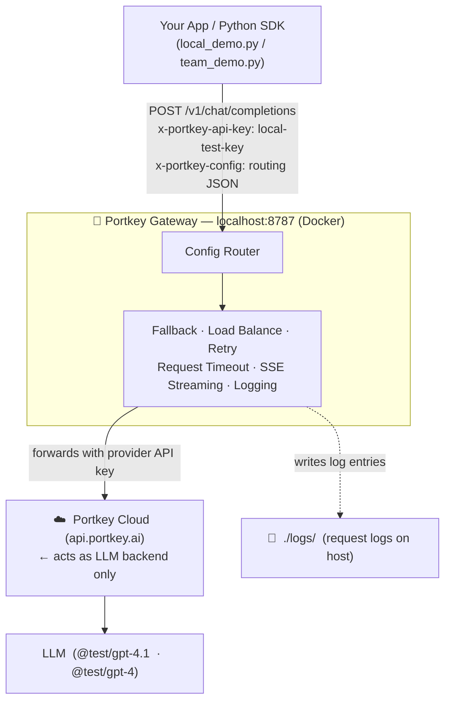

# Portkey AI Gateway — Local Self-Hosted POC

A fully runnable local setup of the [Portkey AI Gateway](https://github.com/Portkey-AI/gateway) running via Docker. Demonstrates how an AI Gateway sits between your application and LLM providers — handling routing, retries, fallbacks, timeouts, and streaming — all on your own machine.

---

## Architecture



### Request flow

1. SDK sends an OpenAI-compatible request to `localhost:8787/v1/chat/completions`
2. Gateway authenticates via `x-portkey-api-key` header
3. Router reads `x-portkey-config` JSON to determine strategy (single / fallback / loadbalance)
4. Gateway forwards to Portkey Cloud with the embedded API key
5. On fallback — if provider returns 4xx/5xx, gateway retries next target automatically
6. Response returned to SDK in standard OpenAI format

---

## Folder Structure

```
portkey-local-poc/
│
├── docker-compose.yml          ← Gateway-only stack (no Redis needed)
├── .env.example                ← Copy to .env, fill in keys
├── .env                        ← Actual keys (keep out of git)
├── local_demo.py               ← Automated end-to-end demo (all 6 scenarios)
├── team_demo.py                ← Interactive demo with narration pauses
├── README.md
│
└── python-sdk/
    ├── requirements.txt
    ├── common.py               ← Shared client factory + config builders
    ├── run_all.py              ← Runs all 6 scripts in sequence
    ├── 01_basic_completion.py  ← Single provider, simplest request
    ├── 02_chat_completion.py   ← Multi-turn conversation
    ├── 03_streaming.py         ← SSE token-by-token streaming
    ├── 04_fallback.py          ← Primary fails → fallback succeeds
    ├── 05_load_balance.py      ← Weighted traffic split (80/20)
    └── 06_retry_timeout.py     ← Auto-retry + request timeout abort
```

---

## Prerequisites

| Requirement | Version |
|---|---|
| Docker Desktop | 4.x+ |
| Docker Compose | v2 (`docker compose`, not `docker-compose`) |
| Python | 3.9+ |
| Portkey Cloud API key | From [portkey.ai](https://portkey.ai) (free tier) |

---

## Setup

### 1. Configure environment

```bash
cp .env.example .env
```

Edit `.env` and set your Portkey Cloud API key:

```bash
# Gateway auth — sent by SDK as x-portkey-api-key header
PORTKEY_CLIENT_AUTH=local-test-key

# Local gateway URL
PORTKEY_GATEWAY_URL=http://localhost:8787/v1

# Portkey Cloud API key — get from portkey.ai dashboard
PORTKEY_CLOUD_API_KEY=your-portkey-cloud-key-here
PORTKEY_CLOUD_HOST=https://api.portkey.ai/v1

# Models (Portkey Cloud test catalog)
PRIMARY_PROVIDER=openai
PRIMARY_MODEL=@test/gpt-4.1
FALLBACK_MODEL=@test/gpt-4
```

### 2. Start Docker services

```bash
docker compose up -d
```

Starts one container:
- `portkey-gateway` — AI Gateway on port **8787**

Verify it is healthy:

```bash
docker compose ps
```

Expected:
```
NAME               STATUS
portkey-gateway    Up (healthy)
```

### 3. Install Python dependencies

```bash
pip install -r python-sdk/requirements.txt
```

### 4. Run the automated demo

```bash
python3 local_demo.py
```

All 6 demos run automatically and print a final pass/fail summary. Expected output:

```
  ✅ PASS  01 — Basic Completion          1414ms
  ✅ PASS  02 — Multi-Turn Chat          11597ms
  ✅ PASS  03 — Streaming                 1484ms
  ✅ PASS  04 — Fallback Routing          1594ms
  ✅ PASS  05 — Load Balancing           10828ms
  ✅ PASS  06 — Retry + Timeout           1638ms

  6/6 demos passed
```

---

## Running the Team Demo

`team_demo.py` is built for live presentations — it pauses before each demo so you can narrate what's about to happen, then run it on-screen.

**Recommended terminal layout (2 panes):**

| Pane | Command | Shows |
|---|---|---|
| 1 | `docker compose logs -f portkey` | Live gateway request logs |
| 2 | `python3 team_demo.py` | Demo script with narration pauses |

```bash
python3 team_demo.py
```

---

## The 6 Demos

### Demo 1 — Basic Completion

Simplest request through the gateway. Shows the SDK talking to `localhost:8787` instead of a provider directly.

```python
config = json.dumps({
    "provider":        "openai",
    "customHost":      "https://api.portkey.ai/v1",
    "api_key":         CLOUD_API_KEY,
    "override_params": {"model": "@test/gpt-4.1"},
})
client = Portkey(base_url="http://localhost:8787/v1", api_key="local-test-key", config=config)
response = client.chat.completions.create(model="@test/gpt-4.1", messages=[...])
```

**Shows:** Token usage, latency, and gateway proxy confirmed in logs.

---

### Demo 2 — Multi-Turn Chat

Three-turn conversation where the full message history (system + user + assistant) flows through the gateway unchanged on every request.

**Shows:** Gateway preserves conversation context across all 3 turns without modification.

---

### Demo 3 — Streaming (SSE)

`stream=True` — the gateway proxies Server-Sent Events without buffering. Tokens appear word-by-word as the model generates them.

**Shows:** Chunk count, total chars, wall time — confirms no buffering by the local gateway.

---

### Demo 4 — Fallback Routing

Primary target uses an invalid model — gateway detects the 4xx and automatically retries on the fallback target. Client receives a `200` with zero code changes.

```python
config = json.dumps({
    "strategy": {"mode": "fallback"},
    "targets": [
        {**cloud_target("@test/invalid-trigger-fallback")},   # fails with 4xx
        {**cloud_target("@test/gpt-4")},                      # succeeds
    ]
})
```

**Shows:** Auto-recovery from provider failure — zero application code change needed.

---

### Demo 5 — Weighted Load Balancing

8 requests distributed across two models by weight (20% gpt-4 / 80% gpt-4.1). Traffic split is a config-only change — no redeploy needed.

```python
config = json.dumps({
    "strategy": {"mode": "loadbalance"},
    "targets": [
        {"weight": 20, **cloud_target("@test/gpt-4")},    # heavier model — 20%
        {"weight": 80, **cloud_target("@test/gpt-4.1")},  # lighter  model — 80%
    ]
})
```

**Shows:** All 8 requests succeed; gateway logs confirm which model served each request.

---

### Demo 6 — Retry + Request Timeout

Two parts:
- **Retry config**: gateway retries on status codes `429, 500, 502, 503, 504` up to 3 attempts automatically
- **Timeout demo**: `request_timeout: 1` (1ms) forces the gateway to abort and return HTTP 408

```python
# Normal retry config
config = json.dumps({
    "retry":           {"attempts": 3, "on_status_codes": [429, 500, 502, 503, 504]},
    "request_timeout": 30000,   # 30s normal timeout
    ...
})

# 1ms timeout — always aborts before provider responds
timeout_config = json.dumps({"request_timeout": 1, ...})
```

**Shows:** Timeout enforced server-side at the gateway — aborts in <15ms, no application retry code required.

---

## Running Individual Scripts

```bash
# Run a single demo
python3 python-sdk/01_basic_completion.py
python3 python-sdk/04_fallback.py

# Run all 6 in sequence
python3 python-sdk/run_all.py

# Run only specific demos
python3 python-sdk/run_all.py --only 1 4

# Skip a demo
python3 python-sdk/run_all.py --skip 3
```

---

## How Provider Config Works

The self-hosted gateway has no virtual key store — the provider API key is embedded in the routing config JSON sent with each request via `x-portkey-config`.

**Single target (Portkey Cloud as backend):**

```python
import json
from portkey_ai import Portkey

config = json.dumps({
    "provider":        "openai",
    "customHost":      "https://api.portkey.ai/v1",   # route through Portkey Cloud
    "api_key":         "your-portkey-cloud-key",
    "override_params": {"model": "@test/gpt-4.1"},
})

client = Portkey(
    base_url="http://localhost:8787/v1",   # local gateway
    api_key="local-test-key",              # matches PORTKEY_CLIENT_AUTH in .env
    config=config,
)
```

**Fallback:**

```python
config = json.dumps({
    "strategy": {"mode": "fallback"},
    "targets": [
        {"provider": "openai", "customHost": "...", "api_key": "...", "override_params": {"model": "@test/invalid"}},
        {"provider": "openai", "customHost": "...", "api_key": "...", "override_params": {"model": "@test/gpt-4"}},
    ]
})
```

**Load balance:**

```python
config = json.dumps({
    "strategy": {"mode": "loadbalance"},
    "targets": [
        {"weight": 80, "provider": "openai", "customHost": "...", "api_key": "...", "override_params": {"model": "@test/gpt-4.1"}},
        {"weight": 20, "provider": "openai", "customHost": "...", "api_key": "...", "override_params": {"model": "@test/gpt-4"}},
    ]
})
```

---

## Observability

### Live gateway logs

```bash
# Stream all logs
docker compose logs -f portkey

# Filter by feature
docker compose logs portkey | grep -i fallback
docker compose logs portkey | grep -i retry
docker compose logs portkey | grep -i error
docker compose logs portkey | grep model      # see which model served each request
```

---

## Stopping the Stack

```bash
# Stop containers, keep data
docker compose down

# Stop and wipe all data
docker compose down -v
```

---

## Troubleshooting

### Gateway not responding on port 8787

```bash
docker compose ps                      # check health status
docker compose logs portkey            # check startup errors
docker compose restart portkey         # restart if needed
curl http://localhost:8787/            # should return gateway info
```

### `401 — Invalid API Key` on provider requests

Your `PORTKEY_CLOUD_API_KEY` in `.env` is wrong or expired.
Log in to [portkey.ai](https://portkey.ai), generate a new key, update `.env`, and re-run.

### `401 — Unauthorized` from the local gateway

The `api_key` the SDK sends must match `PORTKEY_CLIENT_AUTH` in `.env`:

```bash
# .env
PORTKEY_CLIENT_AUTH=local-test-key
```

### `(warm-up skipped)` at the start of `local_demo.py`

Not an error — the warm-up request failed silently (gateway cold-starting). All 6 demos run regardless.

---

## OSS Gateway Limitations

The self-hosted Portkey OSS gateway natively supports routing, retry, fallback, load balancing, and streaming. The following features are **not available** in the local OSS deployment:

| Feature | Status |
|---|---|
| **Guardrails** (PII, prompt injection blocking) | ❌ Requires paid Portkey Cloud plan — `portkey.*` checks return 403 on free tier |
| **Semantic cache** | ❌ Cache state managed at Portkey Cloud level — not available in the local OSS gateway |
| **Analytics dashboard** | ❌ Cloud-only UI at `app.portkey.ai` |
| **Virtual key store** | ❌ Cloud-only; keys embedded per-request in config JSON in self-hosted mode |

---

## Quick Reference

| Task | Command |
|---|---|
| Start stack | `docker compose up -d` |
| Check health | `docker compose ps` |
| Automated demo | `python3 local_demo.py` |
| Team presentation | `python3 team_demo.py` |
| Run one script | `python3 python-sdk/01_basic_completion.py` |
| Run all scripts | `python3 python-sdk/run_all.py` |
| Live gateway logs | `docker compose logs -f portkey` |
| Stop stack | `docker compose down` |
