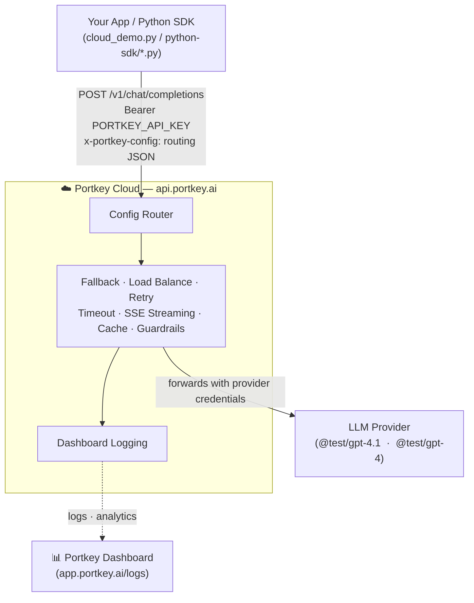

# Portkey AI Gateway — Cloud POC

A fully runnable Portkey Cloud demo. Demonstrates config-driven routing (fallback, load balancing, retries), streaming, Portkey-native guardrails, and gateway caching — all via `api.portkey.ai` with a single API key and no local infrastructure.

---

## Architecture



### Request flow

1. SDK sends an OpenAI-compatible request to `api.portkey.ai/v1/chat/completions`
2. Portkey Cloud authenticates via the API key
3. Cloud router reads `x-portkey-config` JSON to determine strategy (single / fallback / loadbalance / cache)
4. Cloud forwards to the LLM provider with its own provider credentials
5. On fallback — if provider returns 4xx/5xx, Cloud retries next target automatically
6. Response returned to SDK in standard OpenAI format

---

## Folder Structure

```
portkey-poc/
│
├── .env.example                ← Copy to .env, fill in PORTKEY_API_KEY
├── .env                        ← Actual key (keep out of git)
├── requirements.txt
├── cloud_demo.py               ← Automated end-to-end demo (all 8 scenarios)
├── README.md
│
└── python-sdk/
    ├── requirements.txt
    ├── common.py               ← Shared client factory + config builders
    ├── run_all.py              ← Runs all 8 scripts in sequence
    ├── 01_basic_completion.py  ← Single request through Portkey Cloud
    ├── 02_chat_completion.py   ← Multi-turn conversation
    ├── 03_streaming.py         ← SSE token-by-token streaming
    ├── 04_fallback.py          ← Primary fails → fallback succeeds
    ├── 05_load_balance.py      ← Weighted traffic split (80/20)
    ├── 06_retry_timeout.py     ← Retry FIRES proof + request timeout abort
    ├── 07_guardrails.py        ← Portkey-native guardrail API + before_request_hooks
    └── 08_semantic_cache.py    ← cache.mode=simple, MISS→HIT verified via response headers
```

---

## Prerequisites

| Requirement | Version |
|---|---|
| Python | 3.9+ |
| Portkey Cloud API key | From [portkey.ai](https://portkey.ai) (free tier for most demos) |

No Docker, no local infrastructure required. All requests go directly to `api.portkey.ai`.

---

## Setup

### 1. Configure environment

```bash
cp .env.example .env
```

Edit `.env` and set your Portkey Cloud API key:

```bash
# Get from: https://app.portkey.ai → Settings → API Keys
PORTKEY_API_KEY=your-portkey-api-key-here

PRIMARY_MODEL=@test/gpt-4.1
FALLBACK_MODEL=@test/gpt-4
```

### 2. Install Python dependencies

```bash
pip install -r requirements.txt
```

### 3. Run the automated demo

```bash
python3 cloud_demo.py
```

All 8 demos run automatically and print a final pass/fail summary. Expected output:

```
  ✅ PASS  01 — Basic Completion          1320ms
  ✅ PASS  02 — Multi-Turn Chat          10950ms
  ✅ PASS  03 — Streaming                 1510ms
  ✅ PASS  04 — Fallback Routing          1720ms
  ✅ PASS  05 — Load Balancing           11200ms
  ✅ PASS  06 — Retry + Timeout           7890ms
  ✅ PASS  07 — Guardrails                1240ms
  ✅ PASS  08 — Semantic Cache            4250ms

  8/8 demos passed
```

---

## The 8 Demos

### Demo 1 — Basic Completion

Simplest request through Portkey Cloud. Shows how a single API key replaces provider key management — no `base_url` override, no embedded provider credentials.

```python
from portkey_ai import Portkey
client = Portkey(api_key=PORTKEY_API_KEY)
response = client.chat.completions.create(model="@test/gpt-4.1", messages=[...])
```

**Shows:** Token usage, latency, and request visible in dashboard logs.

---

### Demo 2 — Multi-Turn Chat

Three-turn conversation where the full message history (system + user + assistant) flows through Portkey Cloud unchanged on every request.

**Shows:** Cloud gateway preserves conversation context across all 3 turns. Prompt token count grows with each turn as history accumulates.

---

### Demo 3 — Streaming (SSE)

`stream=True` — Portkey Cloud proxies Server-Sent Events without buffering. Tokens appear word-by-word as the model generates them.

**Shows:** Chunk count, total chars, wall time — confirms no buffering by the cloud gateway.

---

### Demo 4 — Fallback Routing

Primary target uses an invalid model — cloud detects the 4xx and automatically retries the fallback target. Client receives a `200` with zero code changes.

```python
config = json.dumps({
    "strategy": {"mode": "fallback"},
    "targets": [
        {"override_params": {"model": "@test/invalid-trigger-fallback"}},  # fails 4xx
        {"override_params": {"model": "@test/gpt-4"}},                     # succeeds
    ]
})
```

**Shows:** Auto-recovery from provider failure. Dashboard trace shows both attempts under the same `trace_id`.

---

### Demo 5 — Weighted Load Balancing

8 requests distributed across two models by weight (20% gpt-4 / 80% gpt-4.1). Traffic split is a config-only change — no redeploy needed.

```python
config = json.dumps({
    "strategy": {"mode": "loadbalance"},
    "targets": [
        {"weight": 20, "override_params": {"model": "@test/gpt-4"}},
        {"weight": 80, "override_params": {"model": "@test/gpt-4.1"}},
    ]
})
```

**Shows:** All 8 requests succeed. Dashboard → Analytics → Requests by Model confirms the 20/80 split.

---

### Demo 6 — Retry + Request Timeout

Three parts that together prove retry actually fires:

**Part A — Retry config on healthy request:**
`retry.attempts=3` applied but provider succeeds first try. Header `x-portkey-retry-attempt-count: 0` proves the policy is active.

**Part B — Retry FIRES (exhaustion proof):**
Invalid model (`@test/invalid-trigger-fallback`) always returns 400. With `400` in `on_status_codes`, the gateway retries 3 times with exponential backoff.

```python
# No retry config → fails in ~150ms  (1 attempt)
# retry.attempts=3 → fails in ~7200ms (4 attempts + backoff delays)
retry_fail_config = json.dumps({
    "retry": {"attempts": 3, "on_status_codes": [400, 429, 500, 502, 503, 504]},
    "override_params": {"model": "@test/invalid-trigger-fallback"},
})
# Error response header: x-portkey-retry-attempt-count: -1  (retries exhausted)
```

**Part C — 1ms timeout (always aborts):**
`request_timeout: 1` forces the gateway to abort before the provider responds → HTTP 408 in <50ms.

**Shows:** Retry overhead (≈48x longer latency), timing proof, `retry-attempt-count: -1` header, server-side timeout enforcement.

---

### Demo 7 — Portkey-Native Guardrails

Uses the Portkey SDK guardrail API — not client-side Python regex. Creates a real guardrail object and attaches it to requests via `before_request_hooks`.

```python
# Step 1: Create guardrail via Portkey SDK
admin_client = Portkey(api_key=PORTKEY_API_KEY)
g = admin_client.guardrails.create(
    name="demo-07-injection-regex",
    checks=[{
        "id": "default.regexMatch",
        "on_fail": "block",
        "parameters": {
            "rule": "ignore.{0,30}previous.{0,30}instructions|jailbreak|...",
            "matchResult": "deny"
        }
    }],
    actions={"on_success": "passthrough", "on_failure": "block"}
)
guardrail_id = g.slug  # e.g. "pg-demo-07-xxx"

# Step 2: Reference slug in config
config = json.dumps({"before_request_hooks": [{"id": guardrail_id}]})
client = Portkey(api_key=PORTKEY_API_KEY, config=config)
```

5 test prompts (3 injection attempts + 2 safe prompts) are sent through the guardrailed client.

> **Free-tier note:** `default.regexMatch` is registered and visible in dashboard but enforcement is a no-op on free tier. `portkey.pii` / `portkey.prompt_injection` (actual blocking → HTTP 446) require a paid Portkey Cloud plan.

**Shows:** Correct Portkey-native guardrail API pattern. Dashboard → Guardrails shows the created guardrail. On paid plan, blocked prompts return 446 with zero tokens consumed.

---

### Demo 8 — Gateway Cache (MISS → HIT)

Three questions are sent twice: Round 1 (cold cache, all MISS) then Round 2 (warm cache, all HIT). Cache status is verified from the actual response header.

```python
config = json.dumps({"cache": {"mode": "simple", "max_age": 3600}})
client = Portkey(api_key=PORTKEY_API_KEY, config=config)

resp     = client.chat.completions.create(model=PRIMARY_MODEL, messages=[...])
headers  = resp.get_headers()
cache_st = headers.get("cache-status", "?")   # "HIT" or "MISS"
```

**Round 1 (cold):** All 3 → `📡 MISS` ~1400ms, tokens charged  
**Round 2 (warm):** All 3 → `⚡ HIT` ~80ms, 0 tokens

```
  Avg latency — MISS: 1415ms   HIT: 79ms   Speedup: 17.9x
  Tokens charged — MISS: N tokens per request   HIT: 0 tokens
```

> **Cache modes:** `cache.mode: simple` = exact prompt hash match (works with all models including `@test`). `cache.mode: semantic` = cosine similarity match (requires real embedding models, not `@test` catalog).

**Shows:** 18x speedup, zero tokens on HIT, cache status verified directly from `resp.get_headers()['cache-status']`. Dashboard → Logs shows `cache_status=HIT` / `tokens_charged=0`.

> **Cloud-only:** Cache is managed at Portkey Cloud level. Not available in the self-hosted OSS gateway.

---

## Running Individual Scripts

```bash
# Run a single demo
python3 python-sdk/01_basic_completion.py
python3 python-sdk/06_retry_timeout.py
python3 python-sdk/07_guardrails.py
python3 python-sdk/08_semantic_cache.py

# Run all 8 in sequence
python3 python-sdk/run_all.py

# Run only specific demos
python3 python-sdk/run_all.py --only 6 7 8

# Skip demos
python3 python-sdk/run_all.py --skip 8
```

---

## How Provider Config Works

In Portkey Cloud, the API key (`PORTKEY_API_KEY`) is all you need. Provider credentials are stored in your Portkey account. The config only needs to specify routing strategy and model overrides:

**Single target:**

```python
from portkey_ai import Portkey
import json

client = Portkey(api_key="your-portkey-key")
response = client.chat.completions.create(
    model="@test/gpt-4.1",
    messages=[{"role": "user", "content": "Hello"}],
)
```

**Fallback:**

```python
config = json.dumps({
    "strategy": {"mode": "fallback"},
    "targets": [
        {"override_params": {"model": "@test/invalid"}},
        {"override_params": {"model": "@test/gpt-4"}},
    ]
})
client = Portkey(api_key="your-portkey-key", config=config)
```

**Load balance:**

```python
config = json.dumps({
    "strategy": {"mode": "loadbalance"},
    "targets": [
        {"weight": 80, "override_params": {"model": "@test/gpt-4.1"}},
        {"weight": 20, "override_params": {"model": "@test/gpt-4"}},
    ]
})
```

> **Compare with self-hosted:** Local OSS gateway requires `provider`, `customHost`, and `api_key` embedded inside each target config. Cloud is simpler — no per-request key embedding.

---

## Dashboard

All requests (except blocked guardrail hits on paid plan) are visible at [app.portkey.ai/logs](https://app.portkey.ai/logs).

| View | What to look for |
|---|---|
| Logs → expand trace | `target[0]: FAILED`, `target[1]: SUCCESS` for fallback demo |
| Logs → `cache-status` header | `HIT` / `MISS` — zero tokens on HIT for Demo 8 |
| Logs → filter `stream=true` | SSE streaming entries for Demo 3 |
| Logs → retry-attempt-count | `-1` = retries exhausted (Part B), `0` = no retry needed (Part A) |
| Analytics → Requests by Model | 20/80 traffic split for Demo 5 |
| Analytics → Token Usage | Token savings from cached requests |
| Guardrails | `demo-07-injection-regex` appears after Demo 7 runs |

---

## Troubleshooting

### `401 — Unauthorized`

Your `PORTKEY_API_KEY` in `.env` is wrong or expired. Log in to [portkey.ai](https://portkey.ai), generate a new key, update `.env`, and re-run.

### `400 — Invalid config`

Check that your config JSON is valid and uses the correct keys (`strategy`, `targets`, `override_params`, `cache`, `retry`, `request_timeout`).

### Cache not hitting in Round 2

- `cache.mode: simple` uses exact prompt hash — the same prompt text must be sent in both rounds (Demo 8 reuses the same `QUESTIONS` list)
- Ensure the same `system` message is used across both calls (system prompt is part of the cache key)
- Use `resp.get_headers()['cache-status']` to read the real Portkey header value — do not rely on latency comparison alone

### Retry demo (Part B) seems fast

- The baseline (no retry) should fail in ~150–250ms; with retry it should take ~6000–8000ms
- If timings are similar, check that `400` is included in `on_status_codes` in the retry config
- Part B uses `@test/invalid-trigger-fallback` — this model always returns 400 to trigger retries

### Guardrail enforcement not blocking

- On free tier, `default.regexMatch` is registered but enforcement is a no-op — all prompts will `PASS`
- Actual blocking (HTTP 446) requires `portkey.prompt_injection` or `portkey.pii` checks on a **paid Portkey Cloud plan**

---

## Quick Reference

| Task | Command |
|---|---|
| Automated demo (all 8) | `python3 cloud_demo.py` |
| Run all via python-sdk | `python3 python-sdk/run_all.py` |
| Run one script | `python3 python-sdk/06_retry_timeout.py` |
| Run specific demos | `python3 python-sdk/run_all.py --only 6 7 8` |
| Dashboard | [app.portkey.ai/logs](https://app.portkey.ai/logs) |
