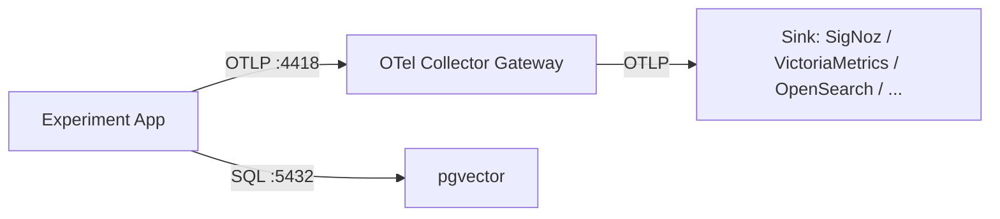

# Shared Infrastructure

Centralized services used by all experiments.

## Architecture



Apps always send to the gateway. To change the backend, use `SINK=<name>`. No app changes needed.

## Structure

```
infra/
├── Makefile
├── postgres/
│   └── docker-compose.yml
├── otel-collector-gateway/
│   ├── docker-compose.yml
│   └── config.yaml
├── sinks/
│   └── signoz/
│       ├── bootstrap.sh
│       └── docker-compose.yml (port override)
└── .vendor/                     (gitignored, cloned repos)
```

## Usage

```bash
make up                    # default: SINK=signoz
make up SINK=signoz        # explicit
make down
make clean                 # removes volumes
make status
```

## Ports

| Service | Port | Purpose |
|---------|------|---------|
| Postgres + pgvector | 5432 | Vector store |
| OTel Gateway (gRPC) | 4417 | Apps send here |
| OTel Gateway (HTTP) | 4418 | Apps send here |
| SigNoz UI | 3301 | Observability UI |

## First-run (SigNoz)

After first `make up`, open http://localhost:3301 and create an admin account.
The OTLP collector activates after signup. Only needed once (persists across restarts).

## Adding a new sink

1. Create `sinks/<name>/docker-compose.yml`
2. Add `ifeq ($(SINK),<name>)` blocks in the Makefile
3. Update `otel-collector-gateway/config.yaml` exporters if the new sink uses a different protocol/port

## Verify data

```bash
make check-signoz-traces
make check-signoz-logs
make check-signoz-metrics
```
