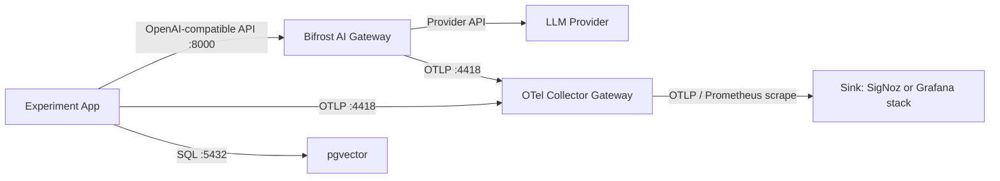

# Shared Infrastructure

Centralized services used by all experiments.

## Architecture



Apps always send telemetry to the OTel gateway. The monitoring sink and optional AI gateway are selected from `.enc`.

## Structure

```
infra/
├── Makefile
├── .enc.example
├── load-config.sh
├── bifrost/
│   ├── docker-compose.yml
│   ├── generate-config.sh
│   ├── up.sh
│   └── README.md
├── postgres/
│   └── docker-compose.yml
├── otel-collector-gateway/
│   ├── docker-compose.yml
│   ├── config.signoz.yaml
│   └── config.grafana.yaml
├── sinks/
│   ├── grafana/
│   │   ├── docker-compose.yml
│   │   ├── loki.yaml
│   │   ├── prometheus.yml
│   │   ├── tempo.yaml
│   │   └── provisioning/
│   └── signoz/
│       ├── bootstrap.sh
│       └── docker-compose.yml (port override)
└── .vendor/                     (gitignored, cloned repos)
```

## Usage

```bash
cp .enc.example .enc
# edit .enc
make config                # print resolved non-secret config
make up                    # starts configured gateway, sink, Postgres, OTel gateway
make down
make clean                 # removes volumes
make status
```

`.enc` accepts either `key: value` or `KEY=value` syntax:

```text
gateway: true
sink: grafana
bifrost_provider: openai
bifrost_api_key: sk-...
```

`sink` selects both the sink Compose stack and the gateway routing config. `gateway: true` starts Bifrost before Postgres and the OTel gateway. Command-line overrides still work for one-off runs, for example `make up SINK=signoz`.

## Ports

| Service | Port | Purpose |
|---------|------|---------|
| Postgres + pgvector | 5432 | Vector store |
| Bifrost | 8000 | OpenAI-compatible AI gateway |
| OTel Gateway (gRPC) | 4417 | Apps send here |
| OTel Gateway (HTTP) | 4418 | Apps send here |
| OTel Gateway self metrics | 8888 | Collector self-metrics scrape target |
| OTel Gateway app metrics | 8889 | Prometheus scrape target for OTLP metrics |
| SigNoz UI | 3301 | Observability UI |
| Grafana UI | 3000 | Grafana dashboards and Explore |
| Prometheus | 9091 | Metrics backend |
| Loki | 3100 | Logs backend |
| Tempo | 3200 | Traces backend |
| Tempo OTLP gRPC | 14317 | Gateway export target |
| Tempo OTLP HTTP | 14318 | Gateway export target |

## First-run (SigNoz)

After first `make up`, open http://localhost:3301 and create an admin account.
The OTLP collector activates after signup. Only needed once (persists across restarts).

## Grafana stack

Run:

```bash
sink: grafana
```

Then run `make up`. Open http://localhost:3000. The default credentials are `admin` / `admin`, and anonymous admin access is enabled for local benchmarking. Datasources are provisioned automatically:

| Datasource | Backend |
|------------|---------|
| Prometheus | Metrics scraped from the gateway's `:8889` exporter |
| Loki | Logs received through Loki's OTLP endpoint |
| Tempo | Traces received through Tempo's OTLP endpoint |

The gateway config for this sink is `otel-collector-gateway/config.grafana.yaml`:

| Signal | Gateway exporter | Backend |
|--------|------------------|---------|
| Traces | `otlphttp/tempo` | Tempo |
| Metrics | `prometheus` | Prometheus scrapes `host.docker.internal:8889` |
| Logs | `otlphttp/loki` | Loki |

## Bifrost gateway

Configure Bifrost in `.enc`:

```text
gateway: true
bifrost_provider: openai
bifrost_api_key: sk-...
```

Then run `make up`. The generated Bifrost config lives under `bifrost/data/config.json`, which is gitignored. Secrets are referenced as environment variables and are not written into config JSON. If `bifrost/data/encryption_key` does not exist, the startup script generates one.

Bifrost runs with a local SQLite config store because current Bifrost server bootstrap requires it for governance routes. The startup script treats `.enc` as source of truth: if the generated config changes, the old `bifrost/data/config.db` is backed up and Bifrost bootstraps a fresh config store.

### Create a Bifrost virtual key

After Bifrost starts, open http://localhost:8000.

1. Go to **Virtual Keys**.
2. Create a new virtual key.
3. Select the provider configured in `.enc`, for example `openai`.
4. Allow the models your experiments will call, for example `openai/gpt-4o-mini` and `openai/text-embedding-3-small`.
5. Copy the generated virtual key.

Use that virtual key in each experiment `.env`:

```bash
CHAT_API_KEY=<bifrost-virtual-key>
CHAT_BASE_URL=http://host.docker.internal:8000/v1
CHAT_MODEL=openai/gpt-4o-mini

EMBED_API_KEY=<bifrost-virtual-key>
EMBED_BASE_URL=http://host.docker.internal:8000/v1
EMBED_MODEL=openai/text-embedding-3-small
```

Bifrost's OTel plugin uses signal-specific OTLP HTTP endpoints. Set the base endpoint in `.enc`:

```text
otel_exporter_otlp_endpoint: http://host.docker.internal:4418
```

The generated config sends traces to `/v1/traces` and metrics to `/v1/metrics`. Override them only when a vendor needs different paths:

```text
otel_exporter_otlp_traces_endpoint: https://example/v1/traces
otel_exporter_otlp_metrics_endpoint: https://example/v1/metrics
```

Point experiment apps at Bifrost:

```bash
CHAT_API_KEY=bifrost-local
CHAT_BASE_URL=http://host.docker.internal:8000/v1
CHAT_MODEL=openai/gpt-4o-mini
```

For embeddings through Bifrost:

```bash
EMBED_API_KEY=bifrost-local
EMBED_BASE_URL=http://host.docker.internal:8000/v1
EMBED_MODEL=openai/text-embedding-3-small
```

Use provider-prefixed model names: `<provider>/<model>`. Bifrost sends GenAI traces and pushed metrics to the same OTel gateway at `host.docker.internal:4418`.

## Adding a new sink

1. Create `sinks/<name>/docker-compose.yml`
2. Add `otel-collector-gateway/config.<name>.yaml`
3. Add `ifeq ($(SINK),<name>)` blocks in the Makefile
4. Add the sink name to `SUPPORTED_SINKS`

## Verify data

```bash
make check-signoz-traces
make check-signoz-logs
make check-signoz-metrics
make check-grafana
make check-bifrost
```
